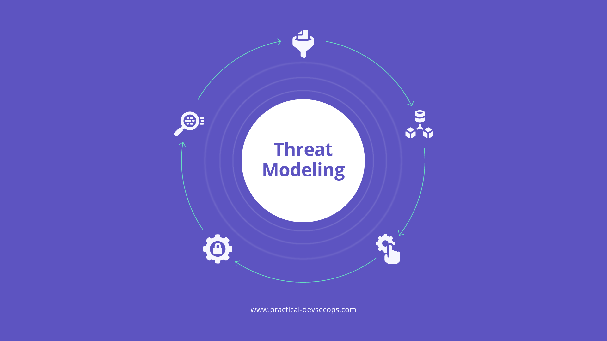

> **TL;DR** - In questa guida imparerai:
> - Come definire correttamente una minaccia (non sono solo le "big tech")
> - Le 4 categorie principali di minacce: fornitori di servizi, sorveglianza di massa, malware e hacker
> - Come proteggerti con crittografia end-to-end, separazione delle identità e compartimentazione
> - Le cattive pratiche da evitare quando costruisci il tuo modello di minaccia

Installare una VPN o passare a Signal non serve a nulla se non sai da chi ti stai proteggendo. Troppi principianti spendono tempo e denaro in strumenti di privacy senza aver prima definito il proprio modello di minaccia, finendo per proteggersi dai rischi sbagliati. Creare un threat model è il primo passo fondamentale: ti permette di capire quali sono le tue reali vulnerabilità e scegliere le contromisure giuste.

Il primo passo che una persona dovrebbe compiere per proteggere la propria privacy e sicurezza è creare un **Threat model**.

## Definizione di una Minaccia {#definizione-di-una-minaccia}

Per creare un threat model (in italiano modello di minaccia), dobbiamo prima definire cos'è un threat. Un errore comune commesso da chi si avvicina al mondo della privacy è considerare come minaccia le "grandi aziende tecnologiche". Questo approccio presenta un problema fondamentale:

> **Perché non ci fidiamo delle "grandi aziende tecnologiche", ma poi spostiamo la nostra fiducia verso le "piccole aziende tecnologiche"? Cosa succede se queste "piccole aziende tecnologiche" si rivelano maligne o crescono esponenzialmente?**

Il modo corretto di definire la minaccia qui è il **"fornitore di servizi"**, non le "grandi aziende tecnologiche".

Generalmente, ci sono quattro minacce principali da cui una persona vorrebbe proteggersi:

1. **Un fornitore di servizi che spia i propri utenti**
2. **Tracciamento e condivisione di dati cross-site/service**, ovvero la "sorveglianza di massa"
3. **Uno sviluppatore di app che spia gli utenti attraverso il suo software maligno**
4. **Un hacker che cerca di accedere ai computer degli utenti**

Una persona tipica includerebbe diverse di queste minacce nel proprio threat model, dando maggiore importanza ad alcune rispetto ad altre.

Ad esempio, uno sviluppatore software potrebbe temere principalmente che un hacker rubi il suo codice sorgente, le chiavi di firma e i segreti; tuttavia, desidererebbe anche la privacy durante la navigazione web. Allo stesso modo, una persona comune potrebbe preoccuparsi principalmente della sorveglianza di massa e dei fornitori di servizi, ma necessiterebbe anche di una buona sicurezza per impedire a un hacker di rubare i suoi dati.

Per i whistleblower, il modello di minaccia è molto più estremo. Oltre a quanto menzionato, hanno bisogno di **anonimato**. Devono non solo nascondere ciò che fanno e i dati che possiedono, evitando di essere hackerati da malintenzionati o governi, ma anche celare la propria identità.

## Privacy dai Fornitori di Servizi {#privacy-dai-fornitori-di-servizi}

Nella maggior parte dei casi, i nostri messaggi "privati", le email e le interazioni sociali sono memorizzati su un server da qualche parte. Il problema evidente è che il fornitore di servizi (o un hacker che ha compromesso il server) può accedere alle tue conversazioni private quando e come vuole, senza che tu lo sappia. Questo vale per molti servizi comuni come gli SMS, Telegram, Discord e altri.

Con la **crittografia end-to-end**, puoi mitigare questo problema criptando le comunicazioni tra te e i tuoi destinatari prima che vengano inviate al server. La riservatezza dei tuoi messaggi è garantita, a patto che il fornitore di servizi non abbia accesso alle chiavi private di entrambe le parti.

In pratica, l'efficacia delle diverse implementazioni di crittografia end-to-end varia. Applicazioni come **Signal** funzionano nativamente sul tuo dispositivo, e ogni copia dell'applicazione è identica in tutte le installazioni. Se il fornitore di servizi inserisse una backdoor nell'applicazione per rubare le tue chiavi private, ciò potrebbe essere rilevato tramite reverse engineering.

Al contrario, implementazioni web-based di crittografia end-to-end, come la webmail di **Proton Mail** o il web vault di **Bitwarden**, si affidano al server che fornisce dinamicamente codice JavaScript al browser per gestire le operazioni crittografiche. Un server malevolo potrebbe prendere di mira un utente specifico e inviargli codice JavaScript dannoso per rubare la sua chiave di crittografia, ed è estremamente difficile per l'utente accorgersene.

**Pertanto, quando ti affidi alla crittografia end-to-end, dovresti preferire le applicazioni native ai client web ogni volta che è possibile.**

Anche con la crittografia end-to-end, i fornitori di servizi possono profilarti attraverso i **metadati**, che solitamente non sono protetti. Pur non potendo leggere i tuoi messaggi, possono comunque osservare con chi comunichi, la frequenza dei messaggi e gli orari in cui sei attivo. La protezione dei metadati è piuttosto rara; se questo ti preoccupa, dovresti consultare attentamente la documentazione tecnica del software che utilizzi per verificare se offre minimizzazione o protezione dei metadati.

## Protezione dal Tracciamento Cross-Site/Service {#protezione-dal-tracciamento-cross-siteservice}

Puoi essere tracciato su siti web e servizi attraverso vari identificatori, tra cui:

- **Il tuo indirizzo IP**
- **I cookie del browser**
- **Il fingerprint (impronta digitale) del tuo browser**
- **I dati che invii ai siti web**
- **La correlazione dei metodi di pagamento**

I tuoi obiettivi dovrebbero essere:

- **Separare le tue identità online**
- **Confonderti tra la massa**
- **Evitare di fornire informazioni identificative il più possibile**

Invece di fare affidamento sulle politiche sulla privacy (promesse che verrebbero sicuramente violate), cerca di **offuscare le tue informazioni** in modo che sia difficile per i vari fornitori correlare i dati e creare un profilo su di te. Questo può includere:

- **Utilizzare strumenti di crittografia come Cryptomator** prima di caricare dati su servizi cloud
- **Usare carte prepagate o criptovalute** per proteggere le informazioni delle tue carte di credito/debito
- **Utilizzare una VPN o TOR** per nascondere il tuo indirizzo IP

> **Una politica sulla privacy dovrebbe essere considerata solo come ultima risorsa**, quando hai esaurito tutte le opzioni per una vera privacy e devi riporre completa fiducia nel tuo fornitore di servizi (dopo aver fatto il possibile per proteggere i tuoi dati puoi prendere in considerazione di valutare cose come la legislazione dei servizi o server che utilizzi, ma non é sicuramente la prioritá).

Ricorda che le aziende possono nascondere la loro proprietà o condividere le tue informazioni con broker di dati, anche se non operano nel settore pubblicitario. Quindi, ha poco senso concentrarsi esclusivamente sull'industria "ad-tech" come minaccia nel tuo threat model. È più logico proteggersi dai **fornitori di servizi nel loro complesso**; così facendo, qualsiasi tipo di minaccia di sorveglianza aziendale di cui la maggior parte delle persone si preoccupa sarà affrontata insieme alle altre.



## Limitare le Informazioni Pubbliche {#limitare-le-informazioni-pubbliche}

Il modo migliore per garantire la privacy dei tuoi dati è semplicemente **non divulgarli**. Eliminare le informazioni personali che trovi online è uno dei primi passi migliori per recuperare la tua privacy.

Nei siti dove condividi informazioni, è fondamentale **controllare le impostazioni della privacy** del tuo account per limitare la diffusione dei dati. Ad esempio, se i tuoi account offrono una "modalità privata", attivala per assicurarti che il tuo profilo non venga indicizzato dai motori di ricerca e non possa essere visualizzato da persone non autorizzate.

Se hai già fornito le tue informazioni reali a diversi siti che non dovrebbero averle, considera l'uso di **tattiche di disinformazione**, come l'invio di informazioni fittizie associate alla stessa identità online, per rendere le tue informazioni reali indistinguibili da quelle false.

## Protezione da Malware e Hacker {#protezione-da-malware-e-hacker}

La sicurezza è fondamentale per garantire la privacy: usare strumenti che sembrano privati è inutile se possono essere facilmente sfruttati da attaccanti per divulgare i tuoi dati in futuro.

Quando si tratta di sicurezza delle applicazioni, generalmente non sappiamo (e a volte non possiamo sapere) se il software che utilizziamo è maligno o potrebbe diventarlo. Anche con gli sviluppatori più affidabili, non c'è garanzia che il loro software non contenga vulnerabilità gravi sfruttabili in seguito.

Per minimizzare i potenziali danni causati da software maligno, dovresti adottare la **sicurezza attraverso la compartimentazione**. Questo può includere:

- **Usare computer diversi per compiti diversi**
- **Utilizzare macchine virtuali** per separare gruppi di applicazioni correlate
- **Adottare un sistema operativo sicuro** con un forte focus sul sandboxing delle applicazioni e sul controllo degli accessi

I sistemi operativi mobili sono generalmente più sicuri dei desktop in termini di sandboxing delle applicazioni. Le app non possono ottenere l'accesso root e possono accedere solo alle risorse di sistema che concedi loro.

I sistemi operativi desktop sono generalmente indietro nel sandboxing adeguato. **ChromeOS** offre proprietà di sandboxing simili ad Android, e **macOS** dispone di un controllo completo dei permessi di sistema e del sandboxing opt-in (per gli sviluppatori) delle applicazioni; tuttavia, questi sistemi operativi trasmettono informazioni identificative ai rispettivi produttori OEM. **Linux** tende a non inviare informazioni ai fornitori di sistema, ma offre una protezione limitata contro exploit e app dannose. Questo può essere parzialmente mitigato con distribuzioni specializzate che utilizzano ampiamente macchine virtuali o container, come **Qubes OS**.

Browser web, client email e applicazioni d'ufficio eseguono spesso codice non affidabile inviato da terze parti. Eseguire più macchine virtuali per separare tali applicazioni dal sistema principale e tra loro è una tecnica utile per impedire che un exploit comprometta l'intero sistema. Tecnologie come **Qubes OS** o **GrapheneOS** forniscono metodi pratici per implementare questa separazione in modo trasparente.

Se sei preoccupato per attacchi fisici, dovresti utilizzare un sistema operativo con un'implementazione di **secure boot** (avvio verificato) sicura, come **Android**, **iOS**, **ChromeOS** o **macOS**. Assicurati che il tuo disco sia criptato e che il sistema operativo utilizzi un **TPM**, **Secure Enclave** o **Secure Element** per limitare i tentativi di inserimento della passphrase di crittografia. Evita di condividere il tuo computer con persone di cui non ti fidi, poiché la maggior parte dei sistemi operativi desktop non cripta i dati separatamente per utente.

## Cattive Pratiche {#cattive-pratiche}

Come principiante, potresti incorrere in alcune cattive pratiche durante la creazione di un threat model, tra cui:

- **Concentrarsi esclusivamente sulle reti pubblicitarie anziché sui fornitori di servizi nel loro complesso**
- **Affidarsi pesantemente alle politiche sulla privacy**
- **Spostare ciecamente la fiducia da un fornitore di servizi a un altro**
- **Fare eccessivo affidamento sulla Badness Enumeration (enumerazione delle minacce) anziché risolvere sistematicamente il problema**
- **Fidarsi ciecamente del software open-source**

Come discusso, focalizzarsi solo sulle reti pubblicitarie e fare affidamento esclusivamente sulle politiche sulla privacy non costituisce un modello di minaccia efficace. Quando cambi fornitore di servizi, identifica il problema di fondo e verifica se il nuovo fornitore offre una soluzione tecnica adeguata.

Ad esempio, potresti non apprezzare **Google Drive** perché dà a Google accesso a tutti i tuoi dati. Il problema qui è la **mancanza di crittografia end-to-end**, che puoi risolvere usando uno strumento di crittografia come **Cryptomator** o passando a un fornitore che la offre nativamente, come **Proton Drive**. Spostarsi ciecamente da Google Drive a un fornitore che non offre crittografia end-to-end non ha senso.

Ricorda che l'enumerazione delle minacce—cioè stilare una lista di attori considerati malevoli (come Google, Amazon, Meta, ecc.) e cercare di bloccare ogni loro attività—non funziona, non può funzionare e non funzionerà mai. Questo approccio è inefficace perché le minacce evolvono costantemente, e focalizzarsi su una lista specifica non ti proteggerà da attori sconosciuti o da nuove tecniche di attacco. Concentra lo sviluppo della tua strategia di difesa non su una lista di nemici ma su un modo generico per poter fermare una serie di attachi (la soluzione non é non dare dati a google, ma non dare dati in generale!).

Un'altra considerazione importante è che il **software open-source** non è automaticamente privato o sicuro. Codice maligno può essere introdotto da sviluppatori del progetto, contributori, sviluppatori di librerie o da chi compila il codice. Inoltre, a volte un software open-source può avere proprietà di sicurezza inferiori rispetto alla sua controparte proprietaria.

Ad esempio, la maggior parte dei desktop Linux tradizionali mancano di default di secure boot, protezione dell'integrità del sistema o controllo completo degli accessi per le app rispetto a macOS. Quando crei un modello di minaccia, è fondamentale valutare le proprietà di privacy e sicurezza di ogni software utilizzato e creare un threat model correlato ai propri bisogni di sicurezza e privacy, invece di fidarsi ciecamente solo perché è open-source.

## Conclusioni {#conclusioni}

Creare un modello di minaccia è un passo fondamentale per proteggere la tua privacy e sicurezza online. Comprendendo le diverse minacce e adottando misure proattive, puoi migliorare significativamente la tua protezione contro sorveglianza, tracciamento e attacchi informatici.

Ricorda, la chiave è essere informati, critici e proattivi nelle tue scelte tecnologiche.

---

Grazie per aver letto questa guida! Se l'hai trovata utile, condividila con amici e colleghi interessati alla sicurezza informatica.

Se desideri supportare il mio lavoro, puoi fare una donazione utilizzando il pulsante qui sotto.



---

## Guide Correlate

- **[De-Google Android: Guida Completa alla Privacy](/android)** - Applica il tuo threat model al telefono con una configurazione de-googled
- **[GrapheneOS: Guida Completa al Miglior OS Privacy](/graphene)** - Il sistema operativo mobile con il miglior livello di sicurezza
- **[VPN Self-Hosted con AdBlock](/vpn)** - Proteggi il tuo traffico di rete con una VPN personale
- **[Usare Bitcoin in Modo Privato](/bitcoin)** - Estendi il tuo modello di minaccia alla privacy finanziaria

