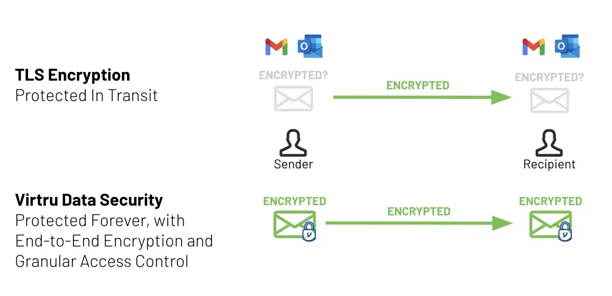
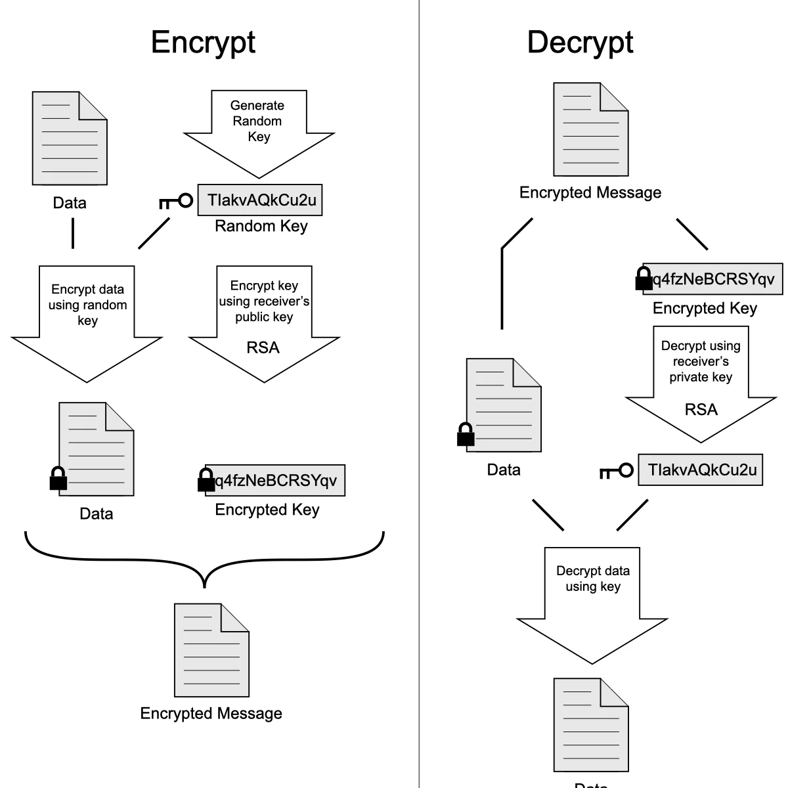
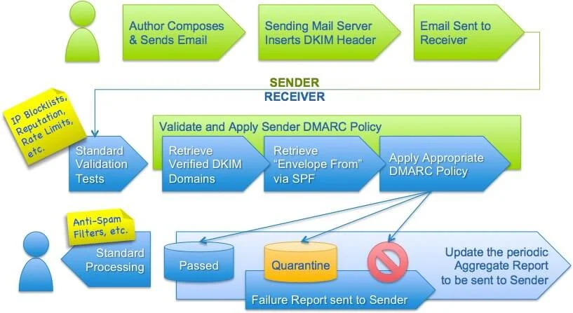

> **TL;DR** - In questa guida imparerai:
> - Come funziona la crittografia delle email e perché STARTTLS non basta
> - Cosa sono SPF, DKIM e DMARC e come proteggono dalla contraffazione
> - Perché l'email è il punto debole della sicurezza di tutti i vostri account
> - Cosa ci riserva il futuro: crittografia end-to-end, DKIM2 e addio alle email in chiaro

La posta elettronica è il pilastro invisibile della vostra vita digitale. Ogni account che create, ogni password che resettate, ogni comunicazione importante... passa quasi sempre dall'email. Ma vi siete mai chiesti quanto sia effettivamente sicura?

La risposta, purtroppo, è: meno di quanto pensiate. L'email è un protocollo nato negli anni '80, quando la sicurezza informatica non era esattamente una priorità. Da allora sono stati aggiunti strati su strati di protezioni, ma il risultato è un sistema complesso, frammentato e spesso mal configurato.

In questa guida analizzeremo insieme lo stato attuale della sicurezza email, dalla crittografia all'autenticazione, e daremo uno sguardo a cosa ci riserva il futuro. Occhi aperti, perché ci sono parecchie sorprese.

## Crittografia delle Email

Partiamo dalle basi: come vengono protette le vostre email durante il trasporto e a riposo? Diciamo che la situazione è... complicata.

### STARTTLS: il lucchetto che si può togliere

STARTTLS è il meccanismo più diffuso per crittografare le email in transito. L'idea è semplice: il client di posta negozia una connessione TLS (crittografata) con il server prima di inviare il messaggio.

Il problema? La fase di negoziazione avviene **in chiaro**. Questo significa che un attaccante posizionato sulla rete può letteralmente rimuovere il comando STARTTLS dal traffico, forzando la connessione a rimanere non crittografata. Si chiama *downgrade attack*, e il vostro client potrebbe non accorgersene affatto.

Pensatela così: è come se bussaste a una porta blindata, ma qualcuno potesse togliere la porta prima che voi entraste, lasciandovi davanti a un'apertura senza protezione.

Inoltre, anche quando STARTTLS funziona correttamente, la crittografia è solo *hop-by-hop*: il messaggio viene decifrato e ri-cifrato ad ogni server intermedio. Non è crittografia end-to-end: ogni server nella catena può leggere il contenuto.



### SMTPS: la versione migliorata

SMTPS (Implicit TLS) risolve il problema del downgrade. Invece di negoziare la crittografia dopo la connessione, parte direttamente con una connessione cifrata, esattamente come fa HTTPS per i siti web.

La porta standard per SMTPS è la **465**, mentre la **587** resta per STARTTLS. In teoria è un miglioramento netto; in pratica, anni di confusione tra porte (25, 465, 587, 2525) hanno creato un bel pasticcio di standardizzazione tra i vari provider.

### POP3S e IMAPS

Anche i protocolli per *scaricare* la posta dai server supportano la crittografia:

- **POP3S** usa TLS sulla porta **995**
- **IMAPS** usa TLS sulla porta **993**

Questi garantiscono che il recupero delle email dal server avvenga in modo cifrato. Bene, ma non risolvono il problema della crittografia del contenuto stesso.

### OpenPGP: potente ma impraticabile

Pretty Good Privacy (PGP) è il nonno della crittografia email. Creato nel 1991 da Phil Zimmermann, è stato poi standardizzato come OpenPGP.

Il concetto è solido: crittografia asimmetrica con chiavi pubbliche e private. Il mittente cifra con la chiave pubblica del destinatario, che decifra con la propria chiave privata. Nessun intermediario può leggere il messaggio.

**Il problema?** La gestione delle chiavi è un incubo. Dovete:
- Generare una coppia di chiavi
- Distribuire la vostra chiave pubblica
- Verificare le chiavi degli altri (i famosi *key signing party*)
- Custodire con estrema attenzione la chiave privata



Se la vostra chiave privata viene compromessa, **tutti i messaggi passati** diventano leggibili. Questo perché OpenPGP non supporta il *forward secrecy*, una proprietà che, a mio parere, nel 2026 dovrebbe essere il minimo sindacale.

Altro punto critico: OpenPGP **non cifra i metadati**. Mittente, destinatario, data, oggetto... restano tutti in chiaro. Un osservatore non legge il contenuto, ma sa esattamente chi parla con chi, quando e su quale argomento.

### S/MIME: meglio dell'UX, peggio del portafoglio

S/MIME usa certificati digitali X.509 (gli stessi del web) per cifrare e autenticare le email. È più user-friendly di PGP perché la gestione dei certificati è parzialmente automatizzata tramite autorità di certificazione (CA).

Il rovescio della medaglia? I certificati costano, scadono e vanno rinnovati. Come PGP, S/MIME non supporta il forward secrecy. In pratica, è usato quasi esclusivamente in contesti aziendali dove l'IT gestisce tutto centralmente.

### Web Key Directory

WKD è una soluzione elegante al problema della distribuzione delle chiavi PGP. Invece di cercare chiavi su server pubblici poco affidabili, il vostro client email interroga direttamente il dominio del destinatario per ottenere la sua chiave pubblica.

È come un elenco telefonico automatico per le chiavi crittografiche. Semplice, decentralizzato, e funziona. Purtroppo l'adozione è ancora limitata.



## Autenticazione delle Email

Se la crittografia protegge il *contenuto*, l'autenticazione protegge l'*identità*. Come fate a sapere che un'email da `banca@esempio.it` arriva davvero dalla vostra banca e non da un truffatore?

### SPF: la lista degli invitati

SPF (Sender Policy Framework) funziona come una lista degli invitati a una festa. Il proprietario di un dominio pubblica un record DNS che elenca tutti i server autorizzati a inviare email per quel dominio.

Quando il server del destinatario riceve un'email, controlla: "Questo server è nella lista degli autorizzati?" Se no, l'email è sospetta.

**I limiti di SPF:**
- Si basa sul DNS, che di per sé non ha meccanismi di autenticazione
- Non verifica il singolo utente, solo il server
- Ha modalità di enforcement opzionali: un dominio può configurare `-all` (rifiuta tutto ciò che non è in lista) oppure `~all` (accetta comunque con un avviso) o addirittura `+all` (accetta tutto). La sicurezza dipende interamente dalla configurazione

### DKIM: la firma digitale

DKIM (DomainKeys Identified Mail) aggiunge una firma crittografica alle email. Il provider genera una coppia di chiavi, pubblica quella pubblica nel DNS, e firma ogni email in uscita con quella privata.

Il server ricevente verifica la firma: se il messaggio è stato alterato durante il trasporto, la firma non corrisponde più. È un sistema efficace per rilevare manomissioni.

**Attenzione però:** le chiavi sono in mano al provider email, non a voi. Il vostro provider potrebbe teoricamente modificare un messaggio prima di firmarlo. Inoltre, DKIM non cifra nulla, verifica solo l'integrità e l'autenticità del dominio.

### DMARC: il buttafuori

DMARC (Domain-based Message Authentication, Reporting and Conformance) è il pezzo che tiene insieme SPF e DKIM. Dice ai server riceventi: "Se un'email non supera i controlli SPF e DKIM, ecco cosa fare."

Le politiche possibili sono:
- **none**: non fare nulla (solo monitoraggio)
- **quarantine**: metti in spam
- **reject**: rifiuta completamente

Un record DMARC ben configurato assomiglia a questo:

```
v=DMARC1; p=reject; adkim=s; aspf=s;
```

Dove `p=reject` dice di rifiutare le email non autenticate, e `adkim=s` / `aspf=s` impongono un controllo rigoroso (*strict*).



### DNSSEC: autenticare il DNS stesso

SPF, DKIM e DMARC si basano tutti sul DNS. Ma il DNS è stato creato negli anni '80 senza alcuna sicurezza. Un attaccante che riesce a manipolare le risposte DNS (cache poisoning) può aggirare tutti questi controlli.

Un studio del 2014 della Carnegie Mellon ha dimostrato che email apparentemente provenienti da Gmail, Yahoo! e Outlook.com potevano essere dirottate attraverso server malevoli. Non proprio rassicurante.

DNSSEC risolve questo problema firmando digitalmente le risposte DNS, creando una catena di fiducia che risale fino alla root zone, gestita dall'IANA. È come un notaio che certifica che ogni risposta DNS è autentica.

### DANE e MTA-STS: forzare la crittografia

Questi due protocolli affrontano lo stesso problema, forzare l'uso di TLS tra i server email, ma con approcci diversi:

- **DANE** si appoggia a DNSSEC e usa record TLSA per legare i certificati TLS ai nomi DNS, bypassando le CA tradizionali
- **MTA-STS** usa HTTPS e la PKI web esistente, simile a come funziona HSTS per i siti web. È più facile da implementare ma introduce una dipendenza aggiuntiva dalle CA

Entrambi sono un passo avanti significativo rispetto alla situazione attuale.

## L'Email come Punto Debole

Questo è il punto che a mio parere merita più attenzione di tutti gli altri.

L'email è diventata il metodo di recupero predefinito per praticamente ogni account online. Password dimenticata? Email. Verifica in due fattori? Email. Cambio di dispositivo? Email.

Questo significa che **la sicurezza di tutti i vostri account dipende dalla sicurezza della vostra email**. Se qualcuno accede alla vostra casella di posta, ha le chiavi del castello.

È una situazione simile alla vulnerabilità del 2FA via SMS, con la differenza che l'email è ancora meno sicura, perché tipicamente non ha crittografia end-to-end.

**Cosa potete fare oggi:**
1. Attivate l'autenticazione a due fattori sull'account email stesso (possibilmente con chiave hardware, non SMS)
2. Dove possibile, sostituite l'email come metodo di recupero con **codici di recupero** salvati offline
3. Usate l'email per quello che è: messaggistica e comunicazioni, non come portachiavi universale

### Client di terze parti e superficie d'attacco

Usare un client email di terze parti (Thunderbird, Apple Mail, ecc.) offre flessibilità, ma aggiunge un altro anello alla catena di fiducia. Ogni client aggiuntivo è un potenziale punto di ingresso per vulnerabilità.

I client email hanno una superficie d'attacco sorprendentemente ampia: molti supportano JavaScript e HTML complesso, rendendoli quasi dei browser web, ma senza lo stesso livello di hardening e scrutinio. E dato che chiunque può inviarvi un'email in qualsiasi momento, il client deve difendersi costantemente da contenuti potenzialmente malevoli.

Consiglio caldamente di disabilitare il caricamento di immagini remote e l'esecuzione di HTML/JavaScript dove possibile. Non è comodo, ma è più sicuro.

## Il Futuro della Sicurezza Email

Fin qui il quadro non è dei più rosei. Ma ci sono sviluppi promettenti all'orizzonte che potrebbero cambiare significativamente le cose.

### Miglioramenti a OpenPGP

Il gruppo di lavoro IETF sta lavorando su aggiornamenti importanti:
- **Crittografia post-quantistica**: protezione contro i futuri computer quantistici
- **Forward secrecy**: finalmente! Se una chiave viene compromessa, i messaggi passati restano protetti
- **Key Transparency**: registri pubblici, verificabili e a prova di manomissione per le chiavi, simili a ciò che WhatsApp ha implementato. Potrebbe rendere la verifica delle chiavi automatica e trasparente
- **Verifica tramite QR code**: come nei messenger moderni, per verificare l'identità dei contatti di persona

### Miglioramenti a S/MIME

Il gruppo LAMPS si concentra sulla crittografia post-quantistica, con schemi a "doppia firma" che combinano crittografia tradizionale e post-quantistica. Un approccio prudente: se uno dei due sistemi viene violato, l'altro protegge comunque.



### DKIM2: stop allo spam di massa

DKIM nella versione attuale ha un problema serio: un attaccante può prendere un'email legittima firmata e reinviarla migliaia di volte da domini diversi, rovinando la reputazione del dominio originale.

DKIM2 risolve questo richiedendo che **ogni hop firmi il messaggio**, permettendo di attribuire l'abuso al punto esatto della catena. Inoltre semplifica lo standard eliminando le opzioni confuse e fissando un set di header da firmare coerente con le best practice.

### DMARCbis: più rigore, meno scappatoie

La nuova evoluzione di DMARC punta a rendere la gestione delle policy più chiara e rigorosa, riducendo alcune ambiguità storiche dello standard attuale. Tra i temi affrontati ci sono una migliore gestione dei sottodomini inesistenti e meccanismi di testing più espliciti, così da limitare alcune tecniche usate per aggirare i controlli.

### Addio alle email in chiaro

Con i protocolli di crittografia del trasporto disponibili ad ogni livello, è fondamentale che i provider lavorino per **eliminare completamente il supporto alle email non crittografate**. La crittografia del trasporto dovrebbe diventare il requisito minimo, non un'opzione.

### Passkey e il futuro dell'autenticazione

L'adozione delle passkey potrebbe finalmente spezzare la dipendenza dall'email per il recupero degli account. Se non avete più bisogno di una password, non avete bisogno di un'email per resettarla.

Questo libererebbe l'email dal suo ruolo improprio di "chiave maestra" e la riporterebbe alla sua funzione naturale: comunicare. Molti servizi che supportano le passkey richiedono ancora un'email, ma la direzione è quella giusta.

### Crittografia end-to-end nativa nell'SMTP

Questo è il traguardo finale. Oggi, provider come Proton Mail cifrano automaticamente le email tra utenti Proton con crittografia end-to-end. Ma è una soluzione proprietaria che funziona solo all'interno del recinto.

Integrare la crittografia E2EE direttamente nel protocollo SMTP significherebbe che **qualsiasi** email, tra **qualsiasi** provider, potrebbe essere cifrata end-to-end per default. Esistono già proposte RFC in questa direzione. Non sarà una passeggiata, ma è il futuro che ci meritiamo.

## Conclusioni

La sicurezza email è un labirinto di protocolli, sigle e compromessi. Ma la buona notizia è che la situazione sta migliorando. DKIM2, DMARCbis, crittografia post-quantistica e E2EE nativa nell'SMTP sono tutti sviluppi concreti, non fantascienza.

**Cosa potete fare oggi, subito:**
1. Verificate che il vostro provider email supporti SPF, DKIM e DMARC con policy rigorose
2. Attivate il 2FA sul vostro account email con una chiave hardware
3. Disabilitate HTML e immagini remote nel client email
4. Sostituite l'email come metodo di recupero con codici offline dove possibile
5. Considerate provider con E2EE integrata come Proton Mail per le comunicazioni sensibili

Se siete arrivati fin qui, complimenti: adesso sapete più di sicurezza email della maggior parte delle persone in circolazione. Bravissimi, siete delle vere tartarughe corazzate! 🐢

Grazie mille per la lettura! Se questa guida vi è stata utile, condividetela con chi potrebbe averne bisogno.

---

## Guide Correlate

- **[Come Creare un Threat Model](/threat-model)** - Il primo passo per proteggere davvero la vostra privacy online
- **[VPN Self-Hosted con Wireguard](/vpn)** - Costruite la vostra VPN personale con ad-blocking integrato
- **[La Guida Definitiva su GrapheneOS](/graphene)** - Il sistema operativo mobile più sicuro al mondo
- **[Privacy su Bitcoin](/bitcoin)** - Come usare Bitcoin senza compromettere la vostra privacy

[](https://btcpay.priorato.org/api/v1/invoices?storeId=2B1STLH5REvhHZBRQuyJNieRTexpeuJ4Usjn4ziEfEfd&currency=EUR)
