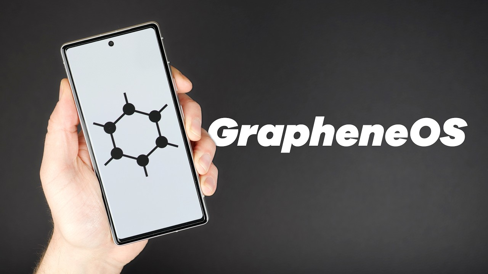

> **TL;DR** - In questa guida imparerai:
> - Perché GrapheneOS è il gold standard della privacy mobile e quali Pixel scegliere
> - Come installare e configurare GrapheneOS da zero
> - Come sfruttare profili utente, sandboxed Play Services e le funzioni di sicurezza avanzate
> - Troubleshooting: risolvere i problemi più comuni con app e servizi

Il tuo smartphone è il dispositivo più intimo che possiedi: conosce i tuoi spostamenti, le tue conversazioni, le tue abitudini. I sistemi operativi stock di Android e iOS condividono costantemente questi dati con Google e Apple. GrapheneOS è l'unica alternativa che offre sicurezza di livello enterprise senza compromettere la tua privacy. Questa guida ti accompagna dalla scelta del dispositivo fino alla configurazione avanzata.

[GrapheneOS](https://grapheneos.org/) è un sistema operativo FOSS (Free and Open Source Software) basato sul [Android
Open Source Project (AOSP)](https://www.android.com/), che si concentra sul miglioramento della privacy e
della sicurezza.

Al momento GrapheneOS Rappresenta il Gold Standard dei sistemi operativi android, questa guida andrá ad
analizzare tutti i vari punti e features del sistema operativo. Se siete interessati ad acquistare dispositivi con
GrapheneOS e set-up di privacy fatti su misura sulle vostre esigenze potete mandarmi un messaggio su
[telegram](https://t.me/turtlecute33) oppure guardare la [lista di servzi](https://t.me/privacyphoneitalia) che offro.

Questo articolo è un tentativo di raccogliere informazioni e conoscenze sulla sicurezza e la privacy mobile, legate al
progetto GrapheneOS, un grazie a [PatrickD](https://x.com/patrickd_de) per aver scritto un articolo su graphene os da
cui questa guida é ispirata.

La scrittura di questa guida é stata lunga e ha portato via tantissimo tempo, la più grande donazione che potete fare é condividerla su **gruppi** e **canali telegram**, **twitter** e social network vari in modo che più gente possibile la veda. Un **grazie di cuore** a chiunque lo fará. Un bottone donazioni é presente a fine guida ma é del tutto secondario in quanto questi contenuti non sono a fini di lucro. Grazie per il supporto, questo sito non richiede nessun vostro dato, non ha analytics, non vi chiede email o registrazioni, condividete la parola per mantenere vivo questo progetto.

## Scelta del Dispositivo

Probabilmente la domanda più comune di chi si avvicina al progetto GrapheneOS per la prima volta è: Perché vengono
supportati ufficialmente così pochi dispositivi, e perché mai tutti sono costosi telefoni Pixel prodotti dalla malvagia
Google?

### Perché solo dispositivi Pixel?

Secondo GrapheneOS, al momento semplicemente non ci sono altre scelte ragionevoli. GrapheneOS non ha alcuna esclusiva
contrattuale per i dispositivi Google, e non perché i Pixel siano incredibilmente sicuri, ma piuttosto perché tutte le
alternative sono decisamente pessime. Il progetto GrapheneOS mantiene una [lista di
requisiti](https://grapheneos.org/faq#future-devices) per i dispositivi attualmente e futuramente supportati, e
purtroppo, al momento solo i Pixel sono in grado di soddisfarli.

I dispositivi Pixel offrono un supporto totale per i sistemi operativi alternativi grazie al
fatto che servono come riferimento per lo sviluppo di Android. Ricevono aggiornamenti regolari e adeguati del firmware e
offrono avanzate funzionalità di sicurezza hardware, come il [memory
tagging](https://discuss.grapheneos.org/d/10507-what-actually-is-the-memory-tagging-feature-and-is-it-worth-turning-on),
che rimangono disponibili anche quando
vengono installati sistemi operativi non stock.

La maggior parte degli altri produttori OEM, invece, offre un supporto per sistemi operativi alternativi parzialmente
funzionante, considerandolo una funzionalità non professionale per hobby. Molti di loro saltano del tutto funzionalità
di sicurezza basilari e non si preoccupano di fornire aggiornamenti adeguati. Per peggiorare le cose, spesso aggiungono
complessità e, con essa, una maggiore superficie di attacco con le loro modifiche al sistema.

In passato, GrapheneOS ha tentato di collaborare con produttori OEM, ma si è rivelato incredibilmente difficile
realizzare un dispositivo con un livello di sicurezza comparabile a quello dei Pixel.

Un supporto esteso ai dispositivi implicherebbe attualmente la compatibilità con dispositivi molto poco sicuri, incapaci
di supportare molte delle funzionalità di sicurezza di GrapheneOS. Inoltre, ciò toglierebbe una quantità significativa
di risorse al lavoro sul miglioramento della privacy e della sicurezza, dato che molte di queste funzionalità sono
specifiche per l'hardware. Tuttavia, se ci fossero altri dispositivi conformi ai requisiti, il progetto GrapheneOS
prevederebbe certamente di supportarli.

### Esistono alternative?

Esistono vari sistemi operativi alternativi per dispositivi Android che si concentrano sulla privacy e sulla sicurezza,
o che offrono almeno un supporto più ampio ai dispositivi. Tuttavia, nessuno di questi
può essere considerato una vera alternativa in quanto le funzionalitá di sicurezza di quest'ultimi hanno sempre grandi
lacune.

La critica più basilare che il team di GrapheneOS muove a quasi tutti questi progetti riguarda il grande ritardo o, in
alcuni casi, la totale omissione di importanti patch di sicurezza di cui godono gli utenti della variante completamente
open source di Android (AOSP).

[LineageOS](https://lineageos.org/) è uno di questi, anche se va detto che il focus di questo progetto è sulla longevità
dei dispositivi e sulla compatibilità ampia piuttosto che sulla sicurezza. Tuttavia, manca di un sistema di avvio
verificato, rendendo banale l'accesso fisico non autorizzato. Il progetto [/e/OS](https://e.foundation/e-os/) si
presenta come un ecosistema mobile completamente "deGoogled" focalizzato sulla privacy, ma si basa sulle fragili
fondamenta di Lineage. e/OS include applicazioni e servizi che offrono agli utenti una sensazione discutibile di
privacy, mentre questi stessi servizi sono invasivi e mal costruiti.

Il possibile maggiore "concorrente" di GrapheneOS, [CalyxOS](https://calyxos.org/), non solo è regolarmente in ritardo
con le patch, ma ha anche indotto gli utenti in errore fornendo livelli di patch di sicurezza Android inaccurati.
Inoltre, ha implementato funzionalità di sicurezza con gravi difetti, come la funzione di cancellazione d'emergenza che
non eliminava in modo affidabile i dati compromettenti come previsto.

> Per ulteriori informazioni sui vari sistemi operativi basati su Android, potete consultare questa tabella comparativa
> creata da terze parti: <https://eylenburg.github.io/android_comparison.htm>

Poi c'è [CopperheadOS](https://copperhead.co/android/), il nome con cui GrapheneOS era precedentemente conosciuto. Non
entrerò
nei dettagli del dramma dietro la presa di controllo ostile e la successiva separazione dall'azienda che doveva
finanziare il progetto. È però degno di nota che questa azienda ora vende CopperheadOS come fork closed source (che
personalmente sconsiglio fortemente).

Infine, [Purism](https://puri.sm/) con il suo hardware personalizzato, prodotto negli Stati Uniti,
promette il controllo sulla privacy con funzionalità come (discutibili) interruttori hardware. Il team di GrapheneOS
è fortemente contrario alla scelta dei componenti di sicurezza hardware adottati per i loro dispositivi e al processo
complicato richiesto per aggiornamenti firmware e microcode. Il dispositivo Librem 5 è quasi interamente basato su
hardware e firmware closed source, anche se molte persone sono state indotte a credere il contrario. GrapheneOS accusa
questi progetti di fare marketing vuoto con parole d'ordine che inducono gli utenti a fidarsi di hardware e software
obsoleti e vulnerabili. Arrivano persino a dire che gli utenti farebbero meglio a utilizzare un iPhone (in modalità
Lockdown) come la seconda migliore opzione per privacy e sicurezza dopo GrapheneOS.

Non fraintendete: il progetto GrapheneOS non afferma in alcun modo che il suo sistema operativo sia impenetrabile, ma si
concentra sulla sostanza
piuttosto che sul branding e sul marketing. Questo diventa abbastanza chiaro confrontando il [sito
web](https://grapheneos.org/) di GrapheneOS con quelli di altri progetti: GrapheneOS è un progetto apertamente
tecnico, che personalmente apprezzo molto perché mi risparmia il dover scavare tra il marketing per trovare i fatti
tecnici. D'altra parte, posso certamente capire come questo sia piuttosto intimidatorio per l'utente medio.

### I dispositivi Google possono essere considerati affidabili?

Abbiamo visto che GrapheneOS supporta attualmente solo i dispositivi Pixel, poiché sono gli unici a disporre di misure
di sicurezza hardware sufficienti. Tutto chiaro, ma non
sarebbe inutile se questi dispositivi avessero delle backdoor?

Come accennato, i Pixel di Google servono come
dispositivi di riferimento per lo sviluppo di Android, portando molti esperti a lavorare su di essi. Inoltre, Google è
stato molto aperto alla ricerca sulla sicurezza esterna, grazie alla quale i Pixel hanno ricevuto grande attenzione in
questo campo. In queste circostanze, sarebbe piuttosto difficile nascondere backdoor nei dispositivi.

Un altro
argomento è che sarebbe molto più semplice attaccare le catene di approvvigionamento di piccole aziende che
esternalizzano la loro produzione, piuttosto che compromettere la produzione globale di iPhone o Pixel senza essere
scoperti. Gli utenti di dispositivi così diffusi beneficiano di un alto livello di controllo e attenzione a cui questi
dispositivi sono sottoposti. Inoltre, è importante notare che le fughe di notizie provenienti da aziende forensi,
specializzate nell'accedere agli smartphone e spesso ingaggiate dai governi, non forniscono alcuna prova
dell'esistenza di backdoor intenzionalmente inserite. Tuttavia, alcuni scelgono di non utilizzare nulla prodotto da
Google per principio. Per ottenere questo, dovrebbero però fare affidamento sui prodotti Apple, dato che Google gioca
un ruolo enorme nello sviluppo di molti progetti open source, incluso il kernel Linux stesso.

La missione di
GrapheneOS non è interamente focalizzata sull'idea di evitare una specifica azienda a tutti i costi, ma piuttosto di
ottenere la migliore privacy e sicurezza possibile con i migliori strumenti disponibili.

### Quale Pixel scegliere?

Per la massima sicurezza, è fortemente consigliato utilizzare un Pixel di ottava o nona generazione. Questi dispositivi
sono
considerati significativamente più sicuri grazie alle funzionalità hardware che GrapheneOS può sfruttare, come il
memory tagging. La nona generazione include un modulo radio cellulare ulteriormente migliorato e più efficiente,
quindi se prevedete di utilizzarlo con una SIM, potrete beneficiare di una maggiore sicurezza e durata della batteria.
I Pixel 9 Pro offrono 16 GB di RAM, particolarmente utili se intendete utilizzare GrapheneOS con più profili utente (i
vantaggi di questa funzione saranno spiegati più avanti).

La nona generazione è attualmente in vantaggio anche in
termini di kernel Linux rafforzato, ma l'ottava generazione dovrebbe essere presto aggiornata, rendendo entrambe le
generazioni molto simili in termini di sicurezza. Tenendo questo in mente, un Pixel 8a rappresenta il dispositivo
economico ideale, con qualche compromesso sulle prestazioni. In ogni caso, entrambe le generazioni riceveranno 7 anni
di supporto completo.

> È possibile consultare una tabella sulla durata del supporto per ciascun dispositivo al seguente link:
> <https://grapheneos.org/faq#device-lifetime>

I dispositivi Pixel di sesta e settima generazione hanno ancora alcuni anni di supporto, il che li rende una scelta
buona se già ne possedete uno e desiderate continuare a usarlo. Tuttavia, non è consigliabile acquistare un nuovo
dispositivo di queste generazioni. Tenete anche presente che ci sono varie funzionalità di sicurezza che GrapheneOS
può utilizzare solo con l'hardware delle generazioni più recenti.

Tutto ciò che è più vecchio è considerato "End-Of-Life" e il progetto GrapheneOS sconsiglia fortemente di continuare a
usarli, indipendentemente dal sistema operativo utilizzato. Questo vale anche se GrapheneOS fornisce ancora un
supporto esteso per alcuni di essi, che è semplicemente pensato per ridurre i rischi e dare agli utenti il tempo di
migrare a un dispositivo pienamente supportato. Ad esempio, non ci sono più patch firmware o supporto per i driver del
Pixel 5a, e c'è persino una vulnerabilità nota di esecuzione di codice remoto non risolta che potrebbe essere
sfruttata per prendere il controllo del dispositivo.

| Modello            | RAM     | Storage (GB)     | Processore   | Profili utente contemporanei |
|--------------------|---------|------------------|--------------|------------------------------|
| Pixel 9 Pro Fold   | 16 GB   | 256-512          |  Tensor G4   |    14                           |
| Pixel 9 Pro XL     | 16 GB   | 128-1024         |  Tensor G4   |    14                           |
| Pixel 9 Pro        | 16 GB   | 128-1024         |  Tensor G4   |    14                           |
| Pixel 9            | 12 GB   | 128-256          |  Tensor G4   |    10                           |
| Pixel 8 Pro        | 12 GB   | 128-1024         |  Tensor G3   |    10                           |
| Pixel 8            | 8 GB    | 128-256          |  Tensor G3   |    6                            |
| Pixel 8a           | 8 GB    | 128-256          |  Tensor G3   |    6                            |



## Installazione

Esistono diversi modi di installare GrapheneOS: Acquistando telefoni con il sistema operativo pre-installato,
manualmente da linea di comando oppure tramite il web installer. Tutte le guide e le documentazioni su come farlo sono
disponibili sul sito ufficiale di GrapheneOS nella sezione "install".

## Protezione Contro Manomissioni

### Hash della Chiave di Avvio Verificato

Supponendo che ora siate fieri possessori di un dispositivo Pixel con una nuova installazione di GrapheneOS, potreste
rimanere sorpresi dall'avviso che appare all'avvio del dispositivo. Verrá mostrata una schermata nera che avvisa che il
sistema operativo non é più quello originale e in basso viene mostrata una stringa di
caratteri, che é un hash
crittografico che consente di verificare che la versione di GrapheneOS installata sia autentica:

| Dispositivo | Impronta Digitale della Chiave di Avvio Verificato |
| ---------------- | ------------------------------------------------------------------ |
| Pixel 9 Pro Fold | `af4d2c6e62be0fec54f0271b9776ff061dd8392d9f51cf6ab1551d346679e24c` |
| Pixel 9 Pro XL | `55d3c2323db91bb91f20d38d015e85112d038f6b6b5738fe352c1a80dba57023` |
| Pixel 9 Pro | `f729cab861da1b83fdfab402fc9480758f2ae78ee0b61c1f2137dd1ab7076e86` |
| Pixel 9 | `9e6a8f3e0d761a780179f93acd5721ba1ab7c8c537c7761073c0a754b0e932de` |
| Pixel 8a | `096b8bd6d44527a24ac1564b308839f67e78202185cbff9cfdcb10e63250bc5e` |
| Pixel 8 Pro | `896db2d09d84e1d6bb747002b8a114950b946e5825772a9d48ba7eb01d118c1c` |
| Pixel 8 | `cd7479653aa88208f9f03034810ef9b7b0af8a9d41e2000e458ac403a2acb233` |
| Pixel Fold | `ee0c9dfef6f55a878538b0dbf7e78e3bc3f1a13c8c44839b095fe26dd5fe2842` |
| Pixel Tablet | `94df136e6c6aa08dc26580af46f36419b5f9baf46039db076f5295b91aaff230` |
| Pixel 7a | `508d75dea10c5cbc3e7632260fc0b59f6055a8a49dd84e693b6d8899edbb01e4` |
| Pixel 7 Pro | `bc1c0dd95664604382bb888412026422742eb333071ea0b2d19036217d49182f` |
| Pixel 7 | `3efe5392be3ac38afb894d13de639e521675e62571a8a9b3ef9fc8c44fd17fa1` |
| Pixel 6a | `08c860350a9600692d10c8512f7b8e80707757468e8fbfeea2a870c0a83d6031` |
| Pixel 6 Pro | `439b76524d94c40652ce1bf0d8243773c634d2f99ba3160d8d02aa5e29ff925c` |
| Pixel 6 | `f0a890375d1405e62ebfd87e8d3f475f948ef031bbf9ddd516d5f600a23677e8` |

Gli hash variano a seconda del modello di dispositivo, e la lista sopra è stata copiata dalla [pagina del
web installer](https://grapheneos.org/install/web#verified-boot-key-hash). Anche se improbabile, è possibile che
l'infrastruttura server di GrapheneOS venga compromessa e che gli attaccanti abbiano sostituito sia i file del
sistema operativo usati durante l'installazione sia l'elenco degli hash delle chiavi. Potete confrontare gli hash
mostrati sul vostro dispositivo con la tabella sopra per assicurarvi di aver installato una versione
legittima di GrapheneOS.

### Auditor App

GrapheneOS include l'Auditor App, un altro modo per convalidare l'autenticità e l'integrità del sistema operativo,
assicurandosi che non ci siano state manomissioni. Potete eseguire una verifica manuale con un secondo dispositivo che
abbia installato l'Auditor App. Non è necessario che sia un altro dispositivo con GrapheneOS: potete [trovare l'app
sul Play Store di Google](https://play.google.com/store/apps/details?id=app.attestation.auditor.play&hl=en).

  <figure style="width: 48%; margin: 0;">
    
    <figcaption style="font-size: 0.9em; color: #666; margin-top: 8px;">
      Screenshot: Menu dell'app Auditor. Seleziona "Auditee" sul dispositivo GrapheneOS che desideri verificare e
      "Auditor" sul dispositivo secondario con cui stai eseguendo la verifica. Segui semplicemente le istruzioni
      visualizzate per eseguire un audit del dispositivo e del sistema operativo.
    </figcaption>
  </figure>

  <figure style="width: 48%; margin: 0;">
    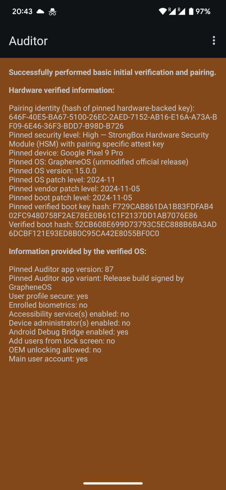
    <figcaption style="font-size: 0.9em; color: #666; margin-top: 8px;">
      Risultati dell'audit visualizzati sul dispositivo secondario. Lo sfondo è rosso a causa della verifica
      dell'auditee per la prima volta. Nel prossimo audit sarà verde, dimostrando che il nostro dispositivo non è stato
      manomesso. I risultati mostrano che il dispositivo esegue una versione non modificata di GrapheneOS.
    </figcaption>
  </figure>

Questa verifica può essere automatizzata utilizzando il sito [attestation.app](https://attestation.app/) che fa parte
del progetto GrapheneOS. Dopo esservi registrati sul sito e aver associato il vostro dispositivo, riceverete un'email
di avviso se il dispositivo non riesce a fornire attestazioni valide in tempo.

  <figure style="width: 48%; margin: 0;">
    
    <figcaption style="font-size: 0.9em; color: #666; margin-top: 8px;">
      Dopo aver impostato la configurazione desiderata, seleziona "Abilita verifica remota" sul dispositivo GrapheneOS
      che desideri verificare e scansiona il codice QR mostrato dal sito web di attestazione.
    </figcaption>
  </figure>

  <figure style="width: 48%; margin: 0;">
    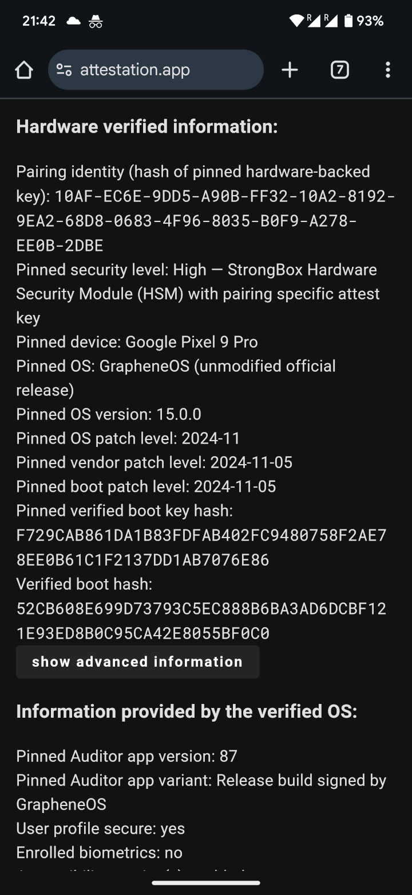
    <figcaption style="font-size: 0.9em; color: #666; margin-top: 8px;">
      Se il dispositivo in fase di audit ha una connessione Internet, i risultati dell'audit saranno visualizzati sul
      sito web di attestazione dopo un ricaricamento.
    </figcaption>
  </figure>

Purtroppo, al momento non è possibile ospitare un proprio server di attestazione remota, poiché l'uso di questa
funzione richiederebbe modifiche all'Auditor App.

## Hardening Attraverso le Impostazioni

GrapheneOS si difende dalle vulnerabilità di sicurezza con tre approcci fondamentali: riduce la quantità di
"superficie" (cioè funzionalità/codice attivi) esposta agli attaccanti, rende lo sfruttamento delle vulnerabilità il
più difficile possibile e isola i componenti tra loro (sandbox) per ridurre l'impatto di eventuali exploit. Poiché
tali misure influenzano la facilità d'uso e le prestazioni del dispositivo, GrapheneOS consente agli utenti di
scegliere le proprie preferenze e personalizzare l'esperienza d'uso tramite tantissime impostazioni
in modo da creare il set-up più adatto alle proprie esigenze.

### La Schermata di Blocco

I dati degli utenti sono archiviati in modo crittografato con una chiave derivata, tra le altre cose, dal metodo di
blocco dello schermo scelto. Questi metodi non possono essere semplicemente aggirati con attacchi brute force, grazie
ai ritardi imposti dall'hardware "secure element". Grazie a questa misura, anche un PIN casuale di 6 cifre offre un
alto livello di sicurezza. Se non volete dipendere dalla sicurezza del "secure element", potete utilizzare password
lunghe fino a 128 caratteri.

Lo sblocco tramite pattern è stato rimosso da GrapheneOS poiché rappresenta una versione molto peggiore del PIN e
incoraggia scelte di pattern non sicure. In alternativa, dovreste utilizzare almeno un PIN di 6 cifre e considerare di
attivare la funzione di scrambling del PIN, che aumenta la difficoltà per un osservatore di scoprire la combinazione
tramite impronte digitali o altri canali.

È possibile configurare lo Sblocco con Impronta Digitale, ma per una sicurezza ottimale dovreste considerare di
limitarlo all'autenticazione all'interno delle app (disattivando quindi _"Usa per sbloccare lo schermo"_). Il team di
GrapheneOS ha appena introdotto  di un sistema di sblocco a 2 fattori con impronta digitale, che richiederà
sia una scansione dell'impronta che il PIN/password.

Se avete una eSIM o, soprattutto, una SIM fisica, ha senso configurare un PIN per la SIM, che però dovrebbe essere
diverso da quello usato per lo sblocco.

  <figure style="width: 48%; margin: 0;">
    
    <figcaption style="font-size: 0.9em; color: #666; margin-top: 8px;">
      Pagina delle impostazioni per configurare lo sblocco del dispositivo. Si trova in Impostazioni &raquo; Sicurezza e Privacy &raquo; Sblocco dispositivo.
    </figcaption>
  </figure>

  <figure style="width: 48%; margin: 0;">
    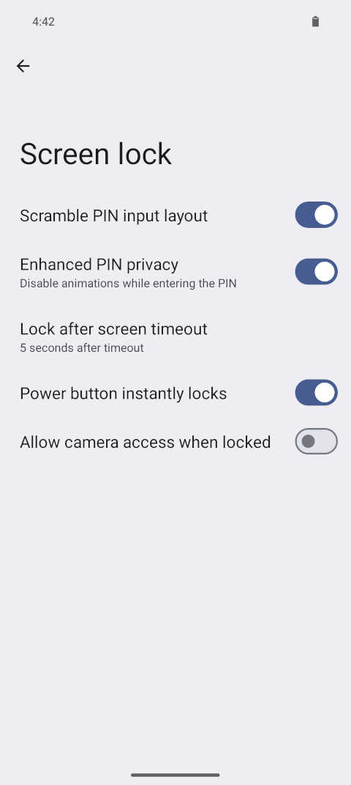
    <figcaption style="font-size: 0.9em; color: #666; margin-top: 8px;">
      Impostazioni della schermata di blocco. Potreste considerare di disabilitare l'accesso alla fotocamera mentre il dispositivo è bloccato per ridurre ulteriormente la superficie d'attacco.
    </figcaption>
  </figure>

Infine, GrapheneOS offre la possibilità di impostare una password o un PIN di emergenza. Una volta configurato,
utilizzarlo ovunque sia richiesto un PIN o una password di sblocco, anche nei profili utente secondari, cancellerà
irreversibilmente ogni dato sul dispositivo (e le eSIM installate). Quando viene attivato, le informazioni necessarie per la
decrittazione vengono eliminate e il dispositivo si spegne. Al prossimo avvio verrà rilevato un file system non valido
e il dispositivo potrà essere configurato nuovamente come se fosse stato resettato alle impostazioni di fabbrica.
Notare che ciò non cancella i dati crittografati stessi, poiché ciò richiederebbe troppo tempo e darebbe agli
attaccanti l'opportunità di interrompere il processo.

### Riavvio Automatico

Un dispositivo appena avviato che non è stato ancora sbloccato ha i dati utente completamente crittografati. L'uso continuato dopo il primo sblocco porta spesso all'accumulo di dati non crittografati nella memoria
temporanea del dispositivo, una vulnerabilità sfruttata da aziende forensi. La funzione di Riavvio Automatico è stata
introdotta per proteggere contro l'estrazione di dati non crittografati.

Sebbene sia possibile per le applicazioni mettere i dati sensibili "al sicuro" quando il dispositivo si blocca, spetta
agli sviluppatori implementare effettivamente questa funzionalità, cosa che raramente accade. Anche gli sviluppatori
del messenger Signal, focalizzato sulla privacy, hanno mostrato scarso interesse nell'implementare questa
funzionalità, lasciandola a fork come Molly la possibilitá di gestirla meglio. Riavviando automaticamente il dispositivo dopo un
certo periodo di tempo, esso ritorna a uno stato di "prima del primo sblocco" (BFU).

Il timer di riavvio inizia ogni volta che il dispositivo si blocca e si resetta con un sblocco riuscito. Di default,
il timer è impostato su 18 ore, con il valore minimo disponibile, e più sicuro, di 10 minuti. Notare che il timer
inizierà solo se il dispositivo è stato sbloccato almeno una volta dall'ultimo riavvio.

Con il valore predefinito di 18 ore, il timer sarà annullato durante un uso costante per evitare impatti
sull'esperienza utente. Grazie agli aggiornamenti molto frequenti di GrapheneOS che richiedono comunque riavvii
regolari, questa funzione ha anche un'utilità secondaria, ovvero l'installazione di quest'ultimi se il telefono sta fermo in un cassetto. Se causa ancora riavvii troppo frequenti, il timer può
essere aumentato fino a 78 ore o persino disabilitato completamente - anche se GrapheneOS sconsiglia fortemente questa
opzione.

Notare che se prevedete di utilizzare profili utente secondari, questa funzione può risultare particolarmente
fastidiosa, poiché tutte le sessioni utente verranno chiuse e il dispositivo si resetterà tornando all'utente
predefinito (Owner). Un buon frame orario da impostare potrebbe essere o 4 o 8 ore in base al livello di sicurezza che cercate.

### Restrizioni USB

Quando le aziende forensi tentano di violare gli smartphone, preferiscono farlo tramite l'interfaccia USB, che ha una
vasta superficie di attacco a causa delle numerose funzioni offerte. I dispositivi Pixel offrono un controllo a
livello hardware sulla porta USB-C, una funzionalità non ancora utilizzata nemmeno dalla versione stock di Android, ma
che è un aspetto fondamentale per il progetto GrapheneOS.

  <figure style="width: 48%; margin: 0;">
    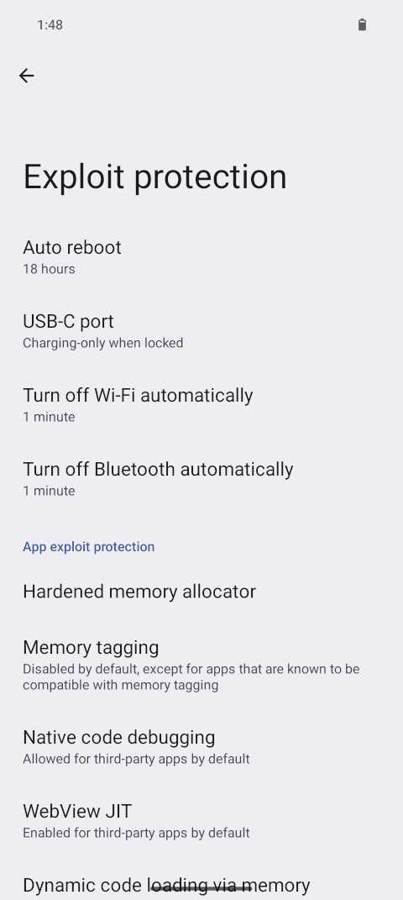
    <figcaption style="font-size: 0.9em; color: #666; margin-top: 8px;">
      Molte di queste opzioni per ridurre la superficie d'attacco si trovano in Impostazioni &raquo; Sicurezza e Privacy &raquo; Protezione contro exploit.
    </figcaption>
  </figure>

  <figure style="width: 48%; margin: 0;">
    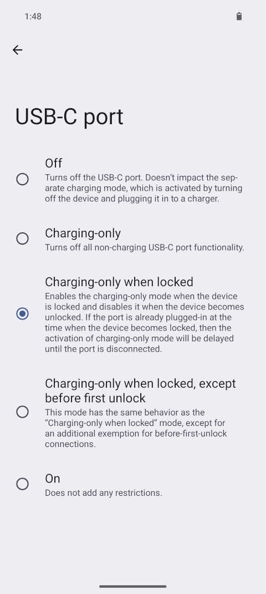
    <figcaption style="font-size: 0.9em; color: #666; margin-top: 8px;">
      Le varie opzioni disponibili per controllare la porta USB-C saranno applicate sia a livello software che hardware.
    </figcaption>
  </figure>

Per impostazione predefinita, GrapheneOS disabilita le nuove connessioni USB-C non appena il dispositivo è bloccato.
In altre parole, è possibile collegarsi e utilizzare dati USB-C mentre il dispositivo è sbloccato, ma una volta
bloccato e scollegato, rifiuterà nuove connessioni. Questa misura include la disattivazione delle modalità alternative
USB-C come DisplayPort.  
L'opzione più sicura, ma anche la più scomoda, è disabilitare completamente la porta USB-C mentre il sistema operativo
è in esecuzione. Questo bloccherá anche eventuali vulnerabilità presenti nella logica di alimentazione del dispositivo (in caso ce ne fossero),
ma richiederà di spegnere l'impostazione per ogni volta che vorrete ricaricare il dispositivo.

### Superficie di Attacco Wireless

Con l'USB fuori dai giochi, rimangono i vettori di attacco wireless come Wi-Fi, Bluetooth e rete cellulare. Tuttavia,
accedere a un dispositivo tramite uno di questi metodi sarà molto più difficile e complesso. L'isolamento dei
componenti hardware è diventato la norma nei dispositivi mobili. I Pixel hanno chip separati per ognuna di queste
radio, e se lo desiderate, potreste rimuovere i chip singolarmente e il dispositivo continuerebbe a funzionare.

Anche se non abilitato di default, è possibile impostare un timer per disattivare automaticamente Wi-Fi e
Bluetooth. Il timer inizia non appena non c'è più una connessione attiva. Il progetto GrapheneOS sta pianificando di
estendere questa funzione anche all'NFC in futuro.

La questione della connettività cellulare è molto più complessa. Innanzitutto, 5G, SMS, MMS e chiamate funzionano
generalmente bene su GrapheneOS come farebbero con Android stock. GrapheneOS aggiunge vari interruttori che tentano
ancora una volta di ridurre la superficie d'attacco, anche se a seconda del vostro operatore e del paese in cui vi
trovate, potreste dover sperimentare per vedere cosa funziona.

> Potete utilizzare eSIM con GrapheneOS, ma poiché richiede funzionalità proprietarie di Google, è completamente
> disabilitata di default. In passato, abilitare il supporto eSIM richiedeva Google Play, ma ora non è più così, e
> l'uso delle eSIM non condivide alcun dato con Google. Notare che, mentre un wipe tramite PIN/password di emergenza
> cancella anche le eSIM, lo stesso non vale per un normale reset di fabbrica.

Il progetto GrapheneOS raccomanda di utilizzare l'opzione LTE-only quando possibile. LTE, talvolta chiamato 4G o 5Ge,
è molto più moderno dei protocolli 2G e 3G, ma anche meno complesso e più stabile rispetto al nuovo protocollo 5G.
Notare che, sebbene possa rendere alcune forme di intercettazione più difficili, l'unico scopo della modalità LTE-only
è disabilitare una quantità enorme di codice legato sia a questi protocolli legacy che a quelli di ultima generazione.

### Privacy Cellulare

LTE e 5G offrono una forma di crittografia, ma questa è principalmente destinata alla protezione dei dati trasmessi sulla rete stessa e
non alla protezione della vostra privacy. Indipendentemente dalla modalità utilizzata, dovreste evitare chiamate
telefoniche tradizionali e SMS tramite rete cellulare, e invece utilizzare piattaforme di messaggistica con crittografia end-to-end come
Signal e SimpleX.

Il sistema telefonico tradizionale è storicamente insicuro e non progettato per proteggere la privacy degli utenti.
Può essere immaginato come un giardino recintato dove, una volta ottenuto lo status di parte fidata con accesso, si
ottiene una quantità significativa di informazioni e controllo sulla rete. Questo accesso può essere acquistato per
poche migliaia di dollari al mese e consente di intercettare telefonate, SMS e, in alcuni casi, persino tracciare
approssimativamente la posizione di una persona. Per farlo, un attaccante ha bisogno dell'identificatore IMSI univoco
della vostra SIM card, che spesso può essere trovato semplicemente conoscendo il vostro numero di telefono. Con
questo, l'attaccante sarebbe in grado di intercettare un SMS di autenticazione a due fattori senza che il vostro
telefono dia alcuna indicazione che tale SMS sia stato inviato.

Quando il vostro telefono si autentica con la rete cellulare, lo fa fornendo informazioni sia sulla vostra SIM card
che sull'hardware radio cellulare del dispositivo. Se avete acquistato sia il telefono che la SIM in modo anonimo,
state essenzialmente utilizzando uno pseudonimo persistente. Poiché vengono condivise informazioni hardware,
sostituire solo la SIM non è sufficiente per ottenere una nuova identità.

A questo punto, potreste considerare l'uso di un dispositivo esterno, come un hotspot mobile dedicato, come alternativa ad inserire una scheda SIM nel vostro dispositivo. Sebbene ciò aumenti la vostra privacy,
peggiorerà la vostra sicurezza poiché questi dispositivi tipicamente hanno un isolamento hardware molto peggiore e
sono molto indietro sugli aggiornamenti rispetto all'uso della radio cellulare isolata interna del
vostro Pixel, questo renderebbe molto più facile per un attaccante prendere il controllo del dispositivo dedicato e avere una superficie d'attacco enorme per attaccare il vostro telefono.

Alcuni di questi dispositivi cellulari dedicati consentono di falsificare l'IMEI, cioè modificare l'identificatore
hardware a un valore arbitrario. Questo vi permetterebbe di riutilizzare lo stesso dispositivo dedicato e
semplicemente cambiare il valore IMEI insieme a una nuova SIM card per ottenere una nuova identità sulla rete.
Tuttavia, dovreste sapere che l'IMEI non è l'unico identificatore hardware specifico che le radio cellulari
trasmettono e, inoltre, esistono modi per creare "impronte digitali" di questi dispositivi che potrebbero consentire
di ri-identificarli anche con identificatori modificati. Nel peggiore dei casi, potreste persino attirare molta
attenzione su di voi se la falsificazione è troppo evidente.

Il progetto GrapheneOS non raccomanda l'uso di un dispositivo secondario per la comunicazione cellulare, ma se proprio
volete farlo, sarebbe meglio utilizzare un altro dispositivo Pixel con GrapheneOS installato. Notare che, se
condividete Internet cellulare tramite Wi-Fi, è possibile che qualcuno nelle vicinanze tracci i vostri spostamenti
rilevando i segnali del vostro punto di accesso Wi-Fi.

**Che dire della modalità aereo?**

La modalità aereo è l'unico modo per disabilitare completamente le capacità di trasmissione, ricezione e tracciamento
della radio cellulare del dispositivo. Una volta attivata la modalità
aereo, è possibile riattivare il Wi-Fi senza riaccendere la radio cellulare. Se intendete utilizzare il vostro Pixel
solo come dispositivo Wi-Fi, potreste considerare di rimuovere il toggle rapido (il pulsante per la modalità aereo
visibile scorrendo verso il basso dalla barra di stato) per evitare di riattivarlo accidentalmente.

Dovreste essere consapevoli che la rete cellulare non è l'unico modo in cui i servizi dell'operatore possono essere
utilizzati. Esistono infatti chiamate e messaggi tramite Wi-Fi. Per impedire alla SIM di autenticarsi con l'operatore
e utilizzare i suoi servizi di rete tramite altre connessioni Internet, è necessario disabilitare la SIM stessa.

I dispositivi più recenti dispongono di sistemi di tracciamento offline speciali progettati per localizzare i
dispositivi smarriti. GrapheneOS non supporta e non supporterà mai questi sistemi. Se volete essere assolutamente certi,
potreste considerare di conservare il dispositivo in una borsa di Faraday quando non lo utilizzate.

**Che dire delle SIM solo dati?**

In termini di privacy, non cambia molto se utilizzate una SIM solo dati: siete comunque autenticati sulla rete
cellulare. Tuttavia, non avere messaggi e chiamate riduce la superficie di attacco per eventuali exploit. GrapheneOS
potrebbe in futuro aggiungere opzioni per disabilitare queste funzionalità, trasformando praticamente le SIM normali
in equivalenti solo dati.

**Che dire dell'uso di una VPN?**

L'uso di una VPN non ha alcuna influenza su chiamate o messaggi basati sull'operatore. Queste funzioni non passeranno
attraverso la VPN, nemmeno se utilizzate una connessione Wi-Fi invece della rete cellulare. Sono invece strumenti utili per difendersi da altri tipi di attacchi e per aggiungere layer di protezione di privacy tra voi ed eventuali attaccanti esterni. Scegliete sempre fornitori VPN di cui vi fidate o valutate di usare una VPN self-hosted (ho scritto [una guida](https://turtlecute.org/vpn) su come crearsela da soli ma volendo offro anche [un servizio](https://t.me/privacyphoneitalia/12) in cui le creo io per voi).

**Che dire della modalità risparmio dati?**

Abilitare il risparmio dati globale (cioè in tutti i profili utente) impedirà alle app di utilizzare i dati cellulari
in background. Le app che utilizzano servizi in primo piano, ovvero quelle che rimangono attive in primo piano tramite
una notifica permanente o usate dall'utente, sono escluse da questa restrizione. È inoltre possibile limitare l'uso dei dati mobili per
singola app. Non é quindi un modo veramente utile per migliorare la sicurezza del dispositivo.

**Che dire dell'uso senza SIM?**

Se non avete una SIM card e non siete in modalità aereo, il vostro dispositivo si collegherà comunque alla rete
cellulare ma non si autenticherà e non condividerá alcun identificatore hardware. Potrete comunque effettuare
chiamate di emergenza e ricevere avvisi di emergenza.

>Notare che effettuare una chiamata di emergenza condividerà gli identificatori radio del vostro dispositivo.

**Che dire degli avvisi di emergenza?**

Gli avvisi di emergenza vengono inviati tramite la rete cellulare a tutti i telefoni connessi, anche se non hanno una
SIM. Normalmente, solo la modalità aereo impedisce di riceverli. Poiché GrapheneOS non è soggetto alle normative
locali, fornisce opzioni per disattivare persino gli avvisi di "priorità presidenziale". Gli avvisi di emergenza non permettono comunque di tracciare o rubare dati agli utenti.

### Protezione contro gli exploit delle app

Finora abbiamo discusso come proteggere il dispositivo dalle minacce esterne, ma è altrettanto importante garantire
che nessuna delle applicazioni installate possa compromettere il sistema dall'interno. Le app su Android funzionano
sempre isolate nella propria sandbox, limitando le risorse a cui possono accedere a quelle per cui hanno ottenuto il
permesso. Le app dannose potrebbero richiedere e utilizzare autorizzazioni per scopi non correlati alla loro
funzionalità principale; altre potrebbero tentare di uscire dalla loro sandbox. Spesso l'app stessa non è
intenzionalmente dannosa, ma presenta una vulnerabilità o un attacco subito sui suoi stessi server che poi si riflette sugli utilizzatori dell'app.

Nella sezione "**Protezione contro gli exploit delle app**" delle impostazioni, è possibile trovare varie misure che
aumentano la difficoltà per un'app di uscire dalla propria sandbox. Molte di queste non sono abilitate di default per
le app installate dall'utente, poiché potrebbero causare crash o malfunzionamenti. Tuttavia, è preferibile abilitarle
globalmente e poi disattivarle selettivamente per le app che riscontrano problemi.

Ci sono altre misure sempre attive in modo implicito. Una di queste è l'uso della compilazione ahead-of-time invece
della compilazione just-in-time. Questo migliora la durata della batteria, le prestazioni di molte app e rappresenta
un'importante funzione di sicurezza. Ha tuttavia uno svantaggio: le installazioni e gli aggiornamenti delle app
richiedono molto più tempo rispetto ad Android stock.

  <figure style="width: 48%; margin: 0;">
    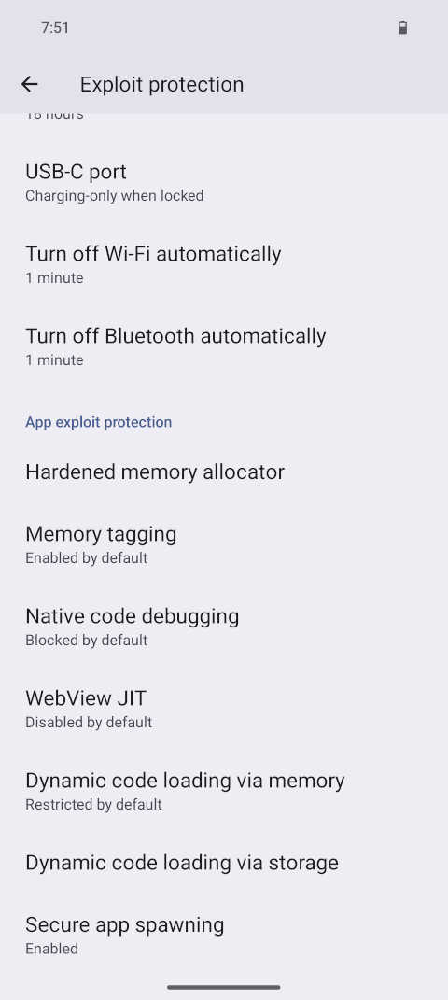
    <figcaption style="font-size: 0.9em; color: #666; margin-top: 8px;">
      Screenshot della sezione 'Protezione contro exploit delle app' in Impostazioni &raquo; Sicurezza e Privacy &raquo; Protezione contro exploit. Tutte le impostazioni predefinite sono state impostate al livello più restrittivo.
    </figcaption>
  </figure>

  <figure style="width: 48%; margin: 0;">
    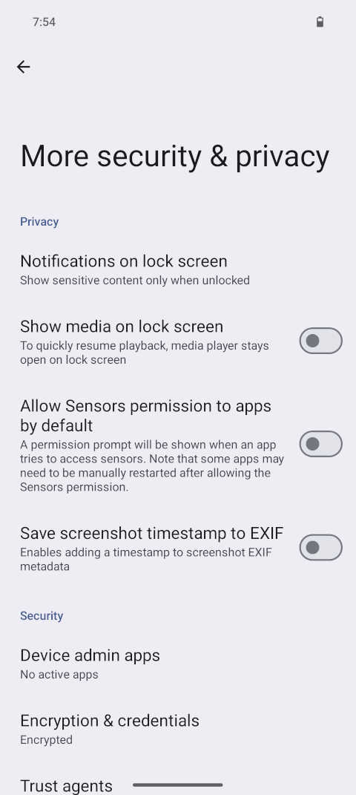
    <figcaption style="font-size: 0.9em; color: #666; margin-top: 8px;">
      Screenshot di Impostazioni &raquo; Sicurezza e Privacy &raquo; Maggiore sicurezza e privacy. Con 'Mostra media sulla schermata di blocco' e 'Consenti l'autorizzazione ai sensori per le app per impostazione predefinita' disabilitati.
    </figcaption>
  </figure>

### Permessi

In Android stock, i permessi esistono solo per accedere a Camera, Microfono, Sensori del corpo e Riconoscimento delle
attività. L'accesso a accelerometro, giroscopio, bussola, barometro, termometro e altri sensori viene semplicemente
concesso alle app per impostazione predefinita senza richiedere un consenso esplicito. GrapheneOS aggiunge un'opzione
per impedire l'accesso a questi sensori per impostazione predefinita. Anche questa misura può causare crash nelle
applicazioni che si aspettano di ricevere dati validi da questi sensori, motivo per cui non è attiva da subito per tutte le app in una nuova
installazione di GrapheneOS. Abilitandola, riceverete una notifica ogni volta che un'app tenta di accedere a uno di
questi sensori e potrete concedere questo permesso selettivamente.

Un altro permesso che Android stock concede implicitamente a tutte le applicazioni è l'accesso alle funzioni di rete.
Questo include la rete locale del dispositivo (localhost), che attualmente è un metodo noto per bypassare l'isolamento
dei profili utente, consentendo alle app di profili diversi di comunicare tra loro. In GrapheneOS vi verrà chiesto se
volete concedere questo permesso durante l'installazione di un'app. Quando il permesso di rete non è concesso,
GrapheneOS simula la mancanza di connessione alla rete, generalmente gestita dalle app in modo indolore.

Proprio come potete disabilitare le protezioni contro gli exploit delle app su base individuale, potete rimuovere
permessi dalle app secondo il vostro giudizio. Fate attenzione però a non rimuovere permessi dalle app di sistema
installate di default, poiché questo potrebbe causare problemi imprevisti.

Particolarmente fondamentali da gestire in maniera accurata sono i permessi di rete (da dare solo alle app che lo necessitano. Se un app non dovrebbe comunicare con internet toglietegli questo permesso), localizzazione (accesso gps), memoria interna (accesso ai file), fotocamera e microfono. Dalle impostazioni é possibile vedere i vari permessi delle app, é importantissimo revisionarli occasionalmente.

### Accesso limitato (storage scope)

Ci sono app popolari che richiedono permessi piuttosto invasivi, come l'accesso a tutti i contatti o a tutti i file
sul dispositivo. La funzione di scoping di Graphene consente di selezionare un sottoinsieme di contatti o file ai
quali concedere l'accesso, mentre l'app in questione crederà di avere accesso a tutto.

Per impostazione predefinita, gli scoping dei contatti agiscono come se l'elenco dei contatti fosse vuoto e gli utenti
possono poi concedere diversi tipi di accesso a contatti specifici o gruppi di contatti. L'accesso ai dati è
piuttosto granulare, consentendo di condividere con l'app solo i dati specifici scelti invece delle informazioni
complete sui contatti.

Gli utenti possono abilitare gli scoping dello storage invece di concedere il permesso di accesso completo allo
storage alle app. Questo comporta che l'applicazione non possa vedere alcun file creato da altri software, a meno che l'utente non
specifichi esplicitamente file o directory per cui dovrebbe essere consentito l'accesso completo.

Il progetto GrapheneOS sta pianificando di aggiungere funzionalità simili di accesso delimitato per altre aree, come
Posizione, Fotocamera e Microfono.

### Interruttori Microfono e Fotocamera

Anche se disponibili in Android stock, potrebbe essere utile notare che esistono interruttori per disabilitare
l'accesso al microfono e alla fotocamera. Questi sono disponibili anche come toggle rapidi scorrendo verso il basso
dalla barra di stato.

Anche se potrebbe sembrare utile disabilitare l'accesso a questi globalmente e attivarli solo quando necessario,
potrebbe risultare molto scomodo se desiderate scattare rapidamente una foto (ad esempio, tramite la scorciatoia di
doppia pressione del pulsante di accensione) o rispondere a una chiamata mentre il telefono è ancora bloccato. In
questi casi, dovreste prima sbloccare il telefono e abilitare l'accesso appropriato, il che potrebbe richiedere così
tanto tempo che chi sta chiamando potrebbe decidere di riagganciare. In alternativa, potreste lasciare l'accesso a
microfono e fotocamera abilitato a livello di sistema e negare questi permessi a livello di singola app: Lasciandoli
abilitati per le app di telefono e fotocamera, impostando tutte le altre su 'Chiedi ogni volta'.

Se siete certi che non avrete mai bisogno di questi sensori, potreste anche acquistare dispositivi con microfoni e telecamera rimossi anche se mediamente i prezzi sono ESTREMAMENTE più alti in quanto il rischio di danneggiare parti durante la rimozione dei sensori é molto alta.

### Aggiornamenti di Sistema

Il download e l'installazione degli aggiornamenti di sistema di GrapheneOS avvengono automaticamente e senza
interruzioni in background. Tuttavia, è necessario un riavvio per renderli effettivi, ma questo processo è sicuro
grazie al rollback automatico nel caso in cui il primo avvio del sistema operativo aggiornato fallisca.

I riavvii automatici dopo un aggiornamento sono possibili ma disabilitati di default, poiché potrebbero verificarsi
nel bel mezzo di una chiamata. Se desiderate evitare che gli aggiornamenti vengano scaricati utilizzando i dati
mobili, è consigliabile modificare l'impostazione _"Reti consentite"_ su _"Solo reti non a consumo"_. Alcuni utenti
hanno segnalato che gli aggiornamenti possono consumare molta batteria e causare surriscaldamento del dispositivo,
soprattutto se si è fuori casa. È possibile attivare l'opzione _"Richiedi che il dispositivo sia in carica"_ per
evitare tali situazioni.

  <figure style="width: 48%; margin: 0;">
    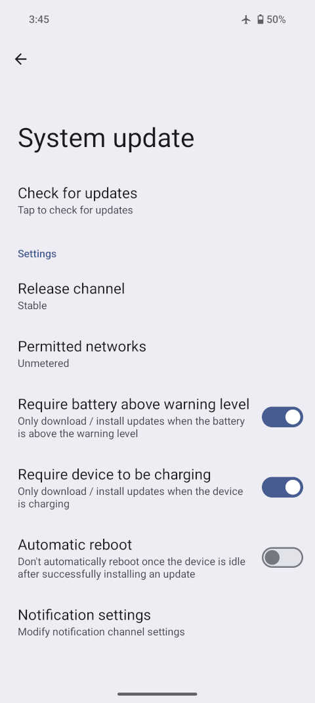
    <figcaption style="font-size: 0.9em; color: #666; margin-top: 8px;">
Screenshot: Impostazioni &raquo; Sistema &raquo; Aggiornamenti di sistema.
    </figcaption>
  </figure>

  <figure style="width: 48%; margin: 0;">
    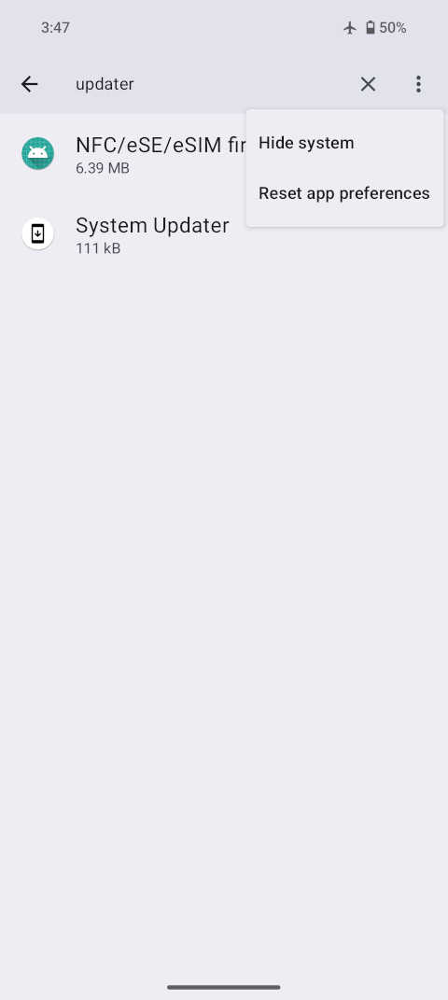
    <figcaption style="font-size: 0.9em; color: #666; margin-top: 8px;">
Se lo desiderate, potete disabilitare completamente gli aggiornamenti automatici del sistema andando su Impostazioni &raquo; App &raquo; Tutte le app, selezionando i 3 puntini per mostrare le app di sistema, e cercando l'app 'System Updater'. Disabilitatela per impedire al dispositivo di controllare nuovi aggiornamenti di sistema.
    </figcaption>
  </figure>

È possibile disabilitare completamente gli aggiornamenti automatici disattivando l'app _"System Updater"_. Tuttavia,
il progetto GrapheneOS sconsiglia fortemente questa scelta, poiché non ricevereste patch di sicurezza e privacy per
risolvere vulnerabilità o migliorare il sistema.

Alcuni potrebbero preoccuparsi che un futuro aggiornamento possa introdurre una backdoor. Esistono diverse misure per
prevenire aggiornamenti dannosi: devono avere una firma crittografica valida, verificata sia dal client di
aggiornamento che dal meccanismo di avvio verificato. Inoltre, attacchi come i downgrade sono prevenuti localmente.

Il progetto GrapheneOS sostiene inoltre che la legislazione esistente può colpire solo singoli utenti e non può
costringere al rilascio di aggiornamenti dannosi per tutti i dispositivi GrapheneOS. Poiché il client di aggiornamento
non fornisce informazioni identificabili univoche sui dispositivi quando richiede aggiornamenti, GrapheneOS non può
conformarsi a richieste governative di inviare aggiornamenti con backdoor a utenti specifici. Tuttavia, il server di
aggiornamento può vedere l'indirizzo IP del richiedente, che può essere oscurato utilizzando una VPN o Tor.

### Backup

GrapheneOS include [Seedvault](https://github.com/seedvault-app/seedvault) integrato in _Impostazioni &raquo; Sistema
&raquo; Backup_ come soluzione per creare backup o trasferire dati da un dispositivo a un altro. Tenete presente che
se utilizzate profili utente secondari, dovrete configurarlo separatamente per ciascun profilo. Alcune app, come
Signal o Molly, utilizzano un tipo di crittografia del database dell'applicazione che può essere eseguito solo tramite
queste app stesse. Se intendete utilizzare una chiavetta USB per archiviare i backup, una pratica comune è creare
inizialmente il backup nella memoria interna del dispositivo e spostarlo sulla chiavetta solo dopo che il processo è
completato.

C'è anche un problema noto per cui il backup dei file utente potrebbe non includere tutti i vostri file. Pertanto, non
dovreste affidarvi a Seedvault per il backup di tutti i file importanti. È consigliabile eseguire un backup separato
dei file importanti, ad esempio sul laptop tramite connessione USB (_Usa USB per 'Trasferimento file'_). Anche in
questo caso, dovrete stabilire la connessione per ogni profilo separatamente. Il progetto GrapheneOS spera di
sostituire Seedvault con una soluzione migliore e più affidabile in futuro, anche se al momento ci sono altre
priorità.

## Profili Utente Secondari

I profili utente simulano l'avere telefoni separati per consentire a più utenti di condividere lo stesso dispositivo o per creare compartimentalizzazione nel telefono del utente.
Nel seguito esploreremo come utilizzare questa funzione per isolare le app tra loro e compartimentare i dati
dell'utente. Prima di ciò, va notato che l'isolamento fornito dalla sandbox delle app e la compartimentazione offerta
dagli "scope" di accesso prima trattati saranno già sufficienti per molti utenti.

In una nuova installazione di GrapheneOS, i profili multipli sono disabilitati per impostazione predefinita. Anche
così, quando sbloccate il telefono dopo l'avvio, accederete al profilo "Proprietario", ovvero "L'utente che è
proprietario del dispositivo". Il profilo Proprietario non deve essere confuso con qualcosa di simile a un utente
privilegiato "root" in Linux. Sebbene il Proprietario abbia un maggiore controllo amministrativo sul dispositivo
rispetto ad altri utenti, le app normali hanno lo stesso accesso sia nel Proprietario sia in qualsiasi altro profilo
utente.

Ogni utente è crittografato con le proprie chiavi protette dal rispettivo metodo di blocco. Il profilo Proprietario è
speciale in quanto non memorizza solo i dati del Proprietario, ma anche dati sensibili del sistema operativo a livello
globale. Per questo motivo, è sempre necessario sbloccare il profilo Proprietario prima di poter utilizzare qualsiasi
altro profilo utente. Il profilo Proprietario e le app che vi funzionano continueranno a essere attivi in background
mentre utilizzate un altro profilo. Tuttavia, il profilo Proprietario non ha accesso ai dati memorizzati negli altri
profili.

  <figure style="width: 48%; margin: 0;">
    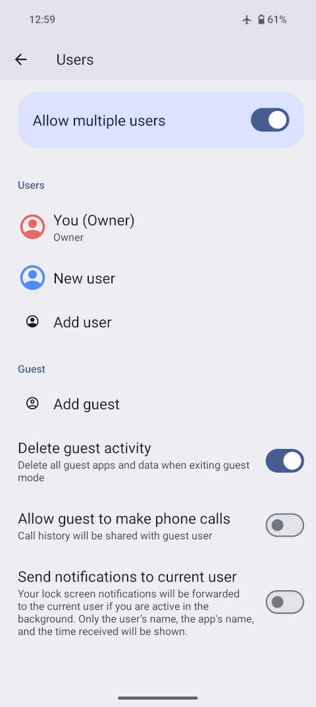
    <figcaption style="font-size: 0.9em; color: #666; margin-top: 8px;">
Screenshot: Impostazioni &raquo; Sistema &raquo; Utenti.
    </figcaption>
  </figure>

  <figure style="width: 48%; margin: 0;">
    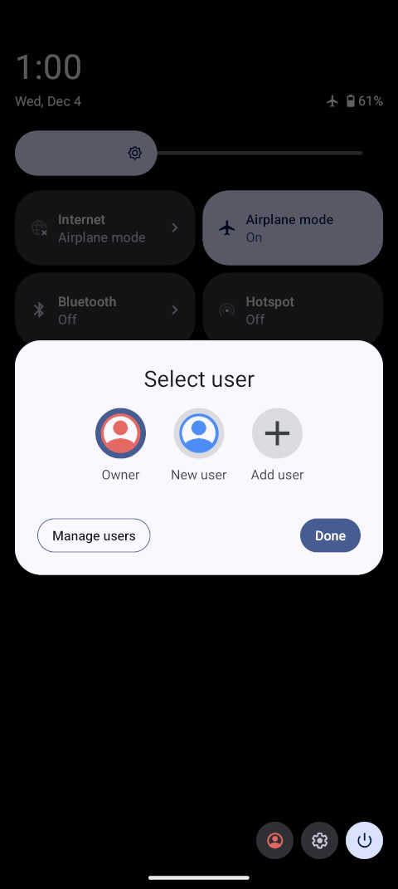
    <figcaption style="font-size: 0.9em; color: #666; margin-top: 8px;">
Screenshot: Interfaccia rapida per cambiare utente, accessibile scorrendo verso il basso dalla barra di stato e toccando l'icona utente in basso a destra.
    </figcaption>
  </figure>

### Notifiche tra Profili

Come visibile nello screenshot sopra, è interessante notare che potete ricevere notifiche da un altro profilo in
esecuzione in background. Sebbene la notifica indichi solo in quale profilo è avvenuta e quale app l'ha generata, si
tratta di un'aggiunta di GrapheneOS che migliora significativamente l'esperienza utente con i profili utente
secondari.

### Esempi di Uso

Prima di continuare con i diversi tipi di profili utente disponibili, discutiamo i vantaggi dell'utilizzo di profili
multipli rispetto all'uso del solo profilo Proprietario.

Innanzitutto, dopo aver configurato un nuovo utente, vi ritroverete con un telefono che appare come se fosse appena
stato avviato per la prima volta. Nessuna delle app utente che avete già installato sarà presente, tutto sarà vuoto.
Questo può essere molto utile se desiderate accedere a utenti diversi della stessa applicazione. Ad esempio, se volete
utilizzare un messenger con più account ma l'app non supporta questa funzione, potete semplicemente installarla due
volte in profili diversi.

Separare le app tra profili diversi impedirà loro di comunicare facilmente tra loro. Ad esempio, c'è l'app principale
di Facebook ma anche l'app separata di Facebook Messenger. Se entrambe le app sono d'accordo, possono utilizzare
qualcosa di simile alla comunicazione tra processi per scambiare informazioni - ma solo se entrambe sono in esecuzione
nello stesso profilo utente.

Se avete app in esecuzione in background nel vostro profilo Proprietario, saranno sempre attive a meno che non le
interrompiate manualmente. Se avete applicazioni che utilizzate raramente, ha senso installarle in un profilo utente
secondario. Una volta terminato, potete tenere premuto il pulsante di accensione e vi verrà offerta la possibilità di
terminare la sessione di quell'utente. Questo assicurerà che tutte le app di quel profilo vengano interrotte e i loro
dati messi a riposo e completamente crittografati.

Potete anche creare e utilizzare profili utente solo temporaneamente per poi eliminarli immediatamente. Poiché le app
installate in un profilo non sono consapevoli dell'esistenza degli altri, potete utilizzare i profili come la modalità
incognito di un browser. Il file system di un profilo è completamente isolato dagli altri profili, e anche se potreste
configurare uno scopo di storage per ottenere lo stesso risultato, non sarà necessario farlo poiché il vostro profilo
temporaneo sarà vuoto.

Come discusso sopra, la funzione di Riavvio Automatico è stata aggiunta per garantire che i dati siano messi a riposo
e che non vi siano dati non crittografati disponibili per le aziende forensi. Se utilizzate un profilo utente
secondario invece del Proprietario per il vostro uso regolare, questo problema sarà molto meno presente: mentre
mettere i dati del Proprietario a riposo richiede un riavvio, mettere a riposo i dati di un utente secondario richiede
semplicemente di terminare la sua sessione.

La funzione più utile dei profili é comunque quella di creare ambienti compartimentalizzati con trade-offs di privacy e sicurezza differenti e con set-up di rete diversi. É possibile per esempio creare un profilo tutto sotto tor grazie ad applicazioni come [invizible pro](https://invizible.net/en/downloads/), uno sotto VPN con [Wireguard](https://download.wireguard.com/android-client/) e uno totalmente clearnet avendo 3 threat model differenti.

### Numero di Profili Utente

GrapheneOS aumenta il limite sul numero di profili utente secondari da 4 a 32, uno dei quali è sempre riservato per
l'utente ospite. Tuttavia, poter creare così tanti profili utente non significa che tutti possano essere eseguiti
contemporaneamente, poiché ciò influirebbe negativamente sulle prestazioni del dispositivo. GrapheneOS scala il numero
massimo di utenti concorrenti in base alla quantità di RAM integrata nel dispositivo.

| | Pixel 9 Pro Fold | Pixel 9 Pro XL | Pixel 9 Pro | Pixel 9 | Pixel 8 Pro | Pixel 8 & 8a |
| ------- | ---------------- | -------------- | ----------- | ------- | ----------- | ------------ |
| RAM | 16 GB | 16 GB | 16 GB | 12 GB | 12 GB | 8 GB |
| Profili | 14 | 14 | 14 | 10 | 10 | 6 |

### Profili Utente: Configurazioni Avanzate

Se avete profili utente per casi d'uso in cui non è mai necessario che quel profilo rimanga attivo in background,
potete disattivare l'opzione _"Consenti esecuzione in background"_ modificando quel profilo tramite il profilo
Proprietario. In questo modo, non dovrete esplicitamente terminare la sessione dell'utente, poiché semplicemente
passando a un altro profilo, quello precedente sarà messo a riposo, riasparmiando così RAM, CPU e batteria.

  <figure style="width: 48%; margin: 0;">
    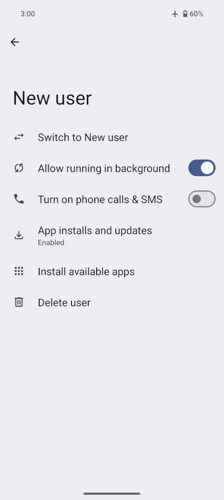
    <figcaption style="font-size: 0.9em; color: #666; margin-top: 8px;">
Toccare un utente in Impostazioni &raquo; Sistema &raquo; Utenti per modificarlo.
    </figcaption>
  </figure>

  <figure style="width: 48%; margin: 0;">
    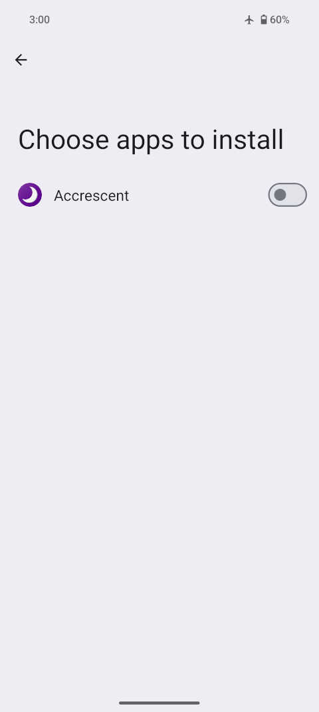
    <figcaption style="font-size: 0.9em; color: #666; margin-top: 8px;">
Il profilo Proprietario può installare le sue app in altri profili utente.
    </figcaption>
  </figure>

### Installazione di App tra Profili

Potreste rimanere sorpresi di scoprire che i profili utente possono aggiornare le app di altri profili e che il
profilo Proprietario può installare le sue app in un altro profilo. Non avevamo detto che i file system di ciascun
profilo sono completamente isolati? Beh, sì, ma non è come se ogni profilo funzionasse su un sistema operativo
completamente indipendente, il codice delle applicazioni puó essere condiviso tra profili usando dei layer di comunicazione che rendono più comode molte funzionalitá.

Oltre a la clonazione delle app tra profili é anche possibile installare store di download applicazioni all'interno dei vari profili singolarmente.

### Svantaggi

Ci sono alcune scomodità nell'uso attivo dei profili utente secondari. Ad esempio, la funzione di Riavvio Automatico
causerà la fine di tutte le sessioni utente, obbligandovi a sbloccare prima il profilo Proprietario. Questo significa
anche che tutte le app di quei profili verranno forzatamente fermate e non riceverete notifiche finché non accederete
di nuovo a quel profilo. Supponendo che non abbiate impostato un tempo troppo breve per i Riavvii Automatici, questo
non dovrebbe accadere troppo spesso.

Come menzionato, i file system dei profili sono completamente isolati, il che significa che non c'è un modo nativo
per, ad esempio, condividere un meme visto sui social media in un profilo tramite un messenger in un altro profilo.
Soluzioni comuni includono la sincronizzazione di file basata su cloud, come [Cryptomator](https://cryptomator.org/),
o avere un app di messaggistica con cui scambiarvi i file anche se potrebbe non essere ideale lato privacy. Potreste configurare una sincronizzazione locale dei file utilizzando app come
[Syncthing](https://github.com/Catfriend1/syncthing-android) o un'app server+client FTP, ma solitamente sono fastidiose
da configurare. 

Se state installando app in profili secondari che richiedono la verifica tramite SMS, potreste dover temporaneamente
abilitare _"Attiva chiamate telefoniche e SMS"_ per quell'utente.

### Spazio Privato

La funzione di spazio privato è una recente aggiunta ad Android. Tecnicamente, si tratta semplicemente di un profilo
utente secondario annidato all'interno del profilo Proprietario: Quando lo spazio è bloccato, l'utente del profilo
privato è fermato, e quando lo spazio è sbloccato, il profilo utente è avviato. Ad eccezione della clipboard condivisa
con il Proprietario, è separato allo stesso modo di un profilo utente secondario.

Il vantaggio di usare uno spazio privato rispetto a un profilo utente secondario è che l'interfaccia utente, in luoghi
come notifiche e impostazioni, sarà "fusa" mentre lo spazio è sbloccato. Questo significa che se c'è una notifica
dallo spazio privato, sarà completamente visualizzata nel profilo Proprietario (rispetto ai profili secondari normali,
dove viene mostrato solo il nome dell'app e dell'utente). Sebbene ciò lo renda leggermente meno isolato rispetto a un
utente dedicato, gli spazi privati possono essere molto più convenienti.

Rispetto ai 31 profili secondari disponibili, un dispositivo può avere solo uno spazio privato e deve sempre far parte
del Proprietario. Il progetto GrapheneOS sta considerando modifiche per migliorare gli spazi privati. Va notato che
l'utente dello spazio privato non è elencato nell'interfaccia di gestione utenti, il che significa che funzionalità
come l'installazione di app del Proprietario nello spazio privato non sono disponibili. Inoltre, bloccare lo spazio
privato non elimina le chiavi di crittografia come farebbe la chiusura della sessione di un profilo secondario.

Uno svantaggio degli spazi privati, rispetto ai profili utente completi, è che non è possibile concedere loro accesso
a _"chiamate telefoniche e SMS"_. Questo impedisce la verifica tramite SMS e limita l'uso di alcune app.

### Profili di Lavoro

I profili di lavoro sono simili agli spazi privati in termini di esperienza utente. Sono stati originariamente
progettati per implementazioni BYOD (Bring Your Own Device) aziendali, motivo per cui è necessario un’app di gestione
dispositivo separata per crearli. Quest’app, e attraverso essa l'azienda a cui appartiene, ha il controllo e la
proprietà dei dati all'interno del profilo di lavoro. Tuttavia, ci sono app di gestione locali, come
[Shelter](https://f-droid.org/en/packages/net.typeblog.shelter/), che permettono la creazione e gestione di un profilo
di lavoro senza un proprietario esterno. In ogni caso, dovrete sempre fidarvi di un'app di terze parti per utilizzare
i profili di lavoro, a meno che non programmiate la vostra o che verifichiate il codice di Shelter che é comunque open source.

Gli spazi privati hanno un'isolamento migliore, una crittografia più robusta e un'integrazione dell'interfaccia utente
migliore con il profilo Proprietario. Le app di gestione dei profili di lavoro possono consentire molta comunicazione
tra il profilo Proprietario e il profilo di lavoro annidato. Ad esempio, i profili di lavoro non bloccano la
comunicazione delle applicazioni tra profili, il che può aumentare la comodità ma influire negativamente sulla privacy
e sulla sicurezza. 

Generalmente sono strumenti comodi e utili, se potete farne a meno é un toccasana per sicurezza e privacy ma sono un opzione ideale in caso di bisogno di compartimentalizzare due "identitá" che avete bisogno di usarte contemporaneamente.

### VPN

Per l'uso delle VPN, la best practice generale è che ogni utente dovrebbe avere una connessione VPN separata per
ottenere un indirizzo IP di uscita distinto. Per questo motivo, tutti i profili (inclusi i profili di lavoro e gli
spazi privati) hanno la propria configurazione VPN per design. Questo impedisce a una parte esterna di collegarli
insieme in base allo stesso indirizzo IP di uscita.

Potete impedire a un profilo di accedere direttamente a Internet abilitando i toggle _"VPN sempre attiva"_ e _"Blocca
connessioni senza VPN"_. GrapheneOS ha apportato molti miglioramenti ad Android per prevenire leak di dati,
cioè bypass delle connessioni VPN.

Al momento, il progetto GrapheneOS raccomanda solo l'uso delle app ufficiali di WireGuard (usabile su tutte le VPN commerciali e self-hosted) e Mullvad.

## Applicazioni

Una nuova installazione di GrapheneOS include un numero minimo di applicazioni, e ci sono diversi motivi per questo:
includere più app nel sistema operativo aumenterebbe la superficie d'attacco sin dall'inizio. GrapheneOS preferisce
lasciare agli utenti la scelta delle app da installare, in base al loro giudizio personale. Il progetto è focalizzato
su miglioramenti significativi alla privacy e alla sicurezza, e includere più app nel sistema operativo andrebbe
probabilmente contro tale obiettivo. Inoltre, GrapheneOS evita di integrare app e servizi di terze parti, poiché pochi
di essi sarebbero realmente in linea con i suoi valori e obiettivi.

Tra le poche app disponibili, GrapheneOS include il proprio 'App Store'. Questo repository è principalmente destinato
alla distribuzione delle applicazioni sviluppate direttamente dal progetto GrapheneOS e di versioni rinforzate di app
open-source. La lista delle app disponibili sarà volutamente mantenuta minima, mentre le app di terze parti dovrebbero
cercare di essere incluse in Accrescent, lo store ufficialmente approvato di GrapheneOS, installabile tramite l'app store di Graphene.

### Applicazioni Preinstallate

Tra le poche app preinstallate in GrapheneOS, circa la metà proviene dall'Android Open Source Project (AOSP) con
modifiche minori, e sono piuttosto primitive in termini di funzionalità e esperienza utente. Molte app AOSP erano
ottime 10+ anni fa, quando l'interfaccia utente di Android era più semplice e le aspettative più basse. Nel tempo,
Google le ha sostituite con versioni più moderne per il sistema stock, abbandonando le versioni open-source.
GrapheneOS prevede di rinnovarle o sostituirle, anche se spesso ci sono problemi di licenza con le alternative
possibili.

Se preferite le versioni di Google di app come Camera, Galleria e Tastiera, potete passare a queste senza abilitare la
raccolta invasiva di statistiche d'uso né caricare le foto sui loro servizi. Alcune app di Android stock, come
l'editor di screenshot (Markup) e il Termometro (per i Pixel con sensore appropriato), sono presenti nel GrapheneOS
App Store, poiché non disponibili nel Play Store.

Da notare come tutte le app stock di graphene sono comunque di alta qualitá e ottimizzate per sicurezza e privacy: per esempio la camera stock rimuove i metadati dalle foto che scattate e le app hanno tutte solo i minimi permessi richiesti per il funzionamento.

### Fotocamera

L'app Fotocamera inclusa in GrapheneOS è stata già modernizzata, è focalizzata su privacy e sicurezza ed è
probabilmente migliore rispetto alle alternative open-source o alla maggior parte delle app a pagamento. Include
modalità per catturare immagini, video e scannerizzare codici QR/barcode. Supporta HDR+, modalità Notte, zoom
multi-camera, EIS, ecc. Non c'è perdita in termini di qualità delle foto rispetto al sistema operativo stock Android.

Tuttavia, non offre l'intera gamma di funzionalità dell'app 'Pixel Camera' stock. La Pixel Camera, precedentemente
Google Camera, può sfruttare appieno tutte le fotocamere disponibili e l'hardware di elaborazione delle immagini su
GrapheneOS. Per ridurre la superficie d'attacco, l'accesso diretto all'hardware da parte delle app di Google è
controllato tramite un toggle aggiuntivo. Il toggle _'Accesso speciale agli acceleratori hardware per le app Google'_
è abilitato di default ma non concede accessi aggiuntivi ai dati.

In caso vogliate foto di qualitá più alta potete installare la google cam e disattivare l'accesso ad internet per l'applicazione.

### Galleria

GrapheneOS prevede di sostituire completamente l'attuale app Galleria, ma al momento non è disponibile alcuna app
con licenza accettabile e capacità di editing delle immagini adeguata. Se cercate un'alternativa open-source valida,
GrapheneOS consiglia [IacobIonut01/Gallery](https://github.com/IacobIonut01/Gallery/blob/main/README.md) e
[Aves](https://github.com/deckerst/aves/blob/develop/README.md). Personalmente trovo ottima anche tutta la suite di app tra cui anche la galleria di [Fossify](fossify.org), se cercate app stock alternative open source queste sono tutte ottime.

### Tastiera

La tastiera predefinita di GrapheneOS è essenzialmente la Gboard di Google del 2014. Un tempo era un progetto
open-source con alcuni componenti chiusi, ma è diventata completamente closed-source e ribattezzata Gboard. Mancano
alcune funzionalità come lo scorrimento sulla barra spaziatrice per muovere il cursore, la modalità ad una mano, una
migliore gestione delle emoji e, soprattutto, la scrittura swipe.

La moderna Gboard di Google è sicuramente una delle tastiere migliori al momento. Usarla va bene fintanto che non si
opta per statistiche d'uso e altre opzioni invasive. Ricordate che le tastiere attive hanno accesso a tutto il testo
digitato, al testo in modifica e ai contenuti degli appunti in ogni momento.

Se cercate un'alternativa open-source, valutate [HeliBoard](https://github.com/Helium314/HeliBoard) che é al momento secondo me la miglior tastiera open source android. Ci sono anche altre alternative come floris o futo che peró trovo ancora molto acerbe. 

Un opzione potrebbe essere anche usate la GBoard togliendole i permessi di rete anche se personalmente tendo a sconsigliare questa opzione.

### Browser Vanadium

GrapheneOS include il subprogetto Vanadium, basato su Chromium con miglioramenti per la privacy e la sicurezza. È
utilizzato sia come browser predefinito del sistema operativo che da altre app che necessitano di visualizzare
contenuti web. Il progetto consiglia di usare il browser così com'è; estensioni o modifiche aggiuntive potrebbero solo
farvi distinguere di più, rendendovi più facilmente tracciabili. Per impedire ai siti web di accedere ai sensori
standard, potete disattivare il permesso _'Sensori'_ per l'app del browser.

É un browser di altissima qualitá consigliatissimo come utilizzo di tutti i giorni. Su dispositivi mobili evitate assulutamente i browser basati su firefox in quanto garantiscono livelli di sicurezza molto minori.

## Compatibilità delle App

Attualmente, solo un sottoinsieme molto ristretto di app Android non è compatibile con GrapheneOS. Queste sono
specificamente app che utilizzano il Play Integrity API, che richiede che il sistema operativo sia ufficialmente
certificato da Google. Questo colpisce principalmente app bancarie/finanziarie, giochi competitivi basati sulla
posizione come Ingress, oltre a alcuni casi strani come l'app McDonald's, Authy e l'app Uber per conducenti.
Implementando questa funzione, queste app scelgono di vietare l'uso di sistemi operativi alternativi e modificati.

Ciò impedisce anche i pagamenti NFC tramite Google Pay. Una soluzione semplice a questa limitazione è utilizzare un
Pixel o Galaxy Smart Watch associato a GrapheneOS. Fortunatamente, ci sono altri servizi, come quelli forniti da
banche europee, che offrono il tap-to-pay funzionante su GrapheneOS. Per gli Stati Uniti, si spera che Curve Pay sarà
presto disponibile.

Anche se GrapheneOS fornisce lo stesso modello di sicurezza standard di Android stock, Google certifica i sistemi
operativi non in base alla sicurezza, ma al fatto che siano stati concessi in licenza. Esistono modi per aggirare
alcune di queste restrizioni, ma probabilmente sarebbero bloccati col tempo e rappresenterebbero solo una soluzione
temporanea. Secondo il progetto GrapheneOS, l'unica soluzione permanente è un'azione regolatoria o legale basata sul
fatto che si tratta di un comportamento altamente anticoncorrenziale e illegale. Personalmente trovo tutta questa faida un problema inutile in quanto si possono utilizzare mezzi di pagamento migliori come Bitcoin o Cash.

### Dipendenza dai Play Services

Un altro aspetto della compatibilità delle app di Graphene è che alcune applicazioni dipendono dai Play Services di
Google, spesso per messaggi e social media. Molte app si affidano al Firebase Cloud Messaging (FCM) di Google per
ricevere notifiche. Alcune app possono ripiegare su propri meccanismi di push o polling frequente, ma ciò richiede
spesso l'esecuzione dell'app con un servizio in primo piano.

Un esempio è Signal, che utilizza il proprio meccanismo di push quando FCM non è disponibile. Tuttavia, ci sono
segnalazioni di prestazioni scarse e inefficienza (consumo eccessivo di batteria). In alternativa, il client
[Molly](https://molly.im/) è spesso raccomandato per l'uso senza Play Services.

Per le app che dipendono strettamente dai Play Services, avete la possibilità di installare e utilizzare i Google Play
Services ufficiali limitati al sandbox delle app standard. Grazie al livello di compatibilità, Google Play non
riceverà alcun accesso speciale o privilegi su GrapheneOS. Fornisce una compatibilità quasi completa, fatta eccezione
per un piccolo sottoinsieme di funzionalità non ancora portate o non implementabili a causa della loro natura
intrinsecamente privilegiata. Il Play Store e i suoi servizi sono completamente disponibili, inclusi gli acquisti
in-app e i controlli delle licenze di app/contenuti. Può installare, aggiornare e disinstallare app come al solito,
purché autorizzato come sorgente di app e con consenso per ogni azione.

Per utilizzare il livello di compatibilità, installate 'Google Play services' dal GrapheneOS App Store. Questo
installerà anche il Play Store, che è una dipendenza dei Play Services (non disabilitate l'app store, altrimenti i
servizi smetteranno di funzionare). L'uso del Play Store richiede l'accesso a un account Google, ma non è necessario
accedere se state installando i Play Services solo per motivi di compatibilità delle app. Inoltre, alcune app, come
Signal, devono essere installate _dopo_ i Google Play Services sandboxed per funzionare correttamente.

Dopo aver installato i Play Services, riceverete una notifica _"Permesso opzionale mancante"_ dal livello di
compatibilità. Toccandola, vi verrà chiesto se volete consentire ai Google Play Services di funzionare sempre in
background, mantenendo aperta una connessione al server FCM di Google per notifiche affidabili, ma riducendo la durata
della batteria. Accettando, l'uso in background verrà impostato su 'Non ottimizzato'. Lasciandolo su 'Ottimizzato' si
limiterà fortemente l'uso in background in base a quanto viene utilizzato, mentre disabilitarlo impedirà quasi
totalmente l'uso in background. Scegliete in base all'importanza delle notifiche push tramite FCM per voi.

Se volete evitare
Google il più possibile, è meglio installarli in un profilo che non intendete utilizzare come principale. Ad esempio,
se pensate di utilizzare il dispositivo con un solo profilo, sarebbe meglio installare i Play Services nello spazio
privato del profilo Proprietario. É comunque possibile installare in maniera selettiva i play service dentro i vari prrofili utente, di lavoro o spazi privati.

### Android Auto

Se avete connesso il vostro telefono Android alla vostra auto, probabilmente conoscete Android Auto. Originariamente
richiede accessi privilegiati, ma il livello di compatibilità sandboxed di GrapheneOS lo rende utilizzabile con un
livello di privilegi ridotto. Potete installare e utilizzare le versioni ufficiali di Android Auto, ma deve essere
installato tramite il GrapheneOS App Store. 

Dopo l'installazione, aprite _Impostazioni &raquo; App &raquo; Sandboxed Google Play &raquo; Android Auto_ e abilitate
almeno _"Consenti permessi per Android Auto cablato"_. Se non funziona solo con questo toggle, potrebbe essere
necessario abilitare anche i permessi wireless. Permessi aggiuntivi per il reindirizzamento dell'audio, delle chiamate
telefoniche e delle notifiche ad Android Auto possono essere concessi a vostra discrezione. Notate che attualmente
Android Auto non funziona da uno spazio privato o profilo di lavoro.

### Obtainium e App Verifier

In Android, i file dei pacchetti scaricati per installare o aggiornare un'applicazione sono firmati
crittograficamente. Una volta installata un'app, il firmatario del pacchetto di installazione viene memorizzato, il che
significa che tutti i futuri pacchetti che tentano di aggiornarla devono avere la firma dello stesso developer.
Questo principio è chiamato Trust-On-First-Use (TOFU) e garantisce che gli aggiornamenti futuri di un'applicazione non
possano provenire da fonti dannose.

Tuttavia, questo non garantisce che il pacchetto utilizzato per la prima installazione provenga effettivamente dalla
fonte che pensavate. Qui, gli store di app giocano un ruolo utile stabilendo chi dovrebbe essere il vero firmatario di
un'app tramite i metadati dello store stesso, prima ancora di scaricare il pacchetto dell'app. D'altra parte, uno
store di app aggiunge un'altra terza parte di cui fidarsi, ed è qui che Obtainium può essere utile come mitigazione.

[Obtainium](https://github.com/ImranR98/Obtainium) vi consente di ottenere app Android e mantenerle aggiornate
direttamente dalla fonte, ad esempio dalla pagina delle release di GitHub. Combinandolo con
[AppVerifier](https://github.com/soupslurpr/AppVerifier) potete garantire che il pacchetto che state per installare
provenga effettivamente dallo sviluppatore reale dell'applicazione. Questo rende la gestione delle app più
decentralizzata senza sacrificare una caratteristica importante di sicurezza offerta dagli store di app. Tuttavia, il
progetto GrapheneOS sostiene che la soluzione più decentralizzata sarebbe sostituire Obtainium con app che si
aggiornano autonomamente.

  <figure style="width: 48%; margin: 0;">
    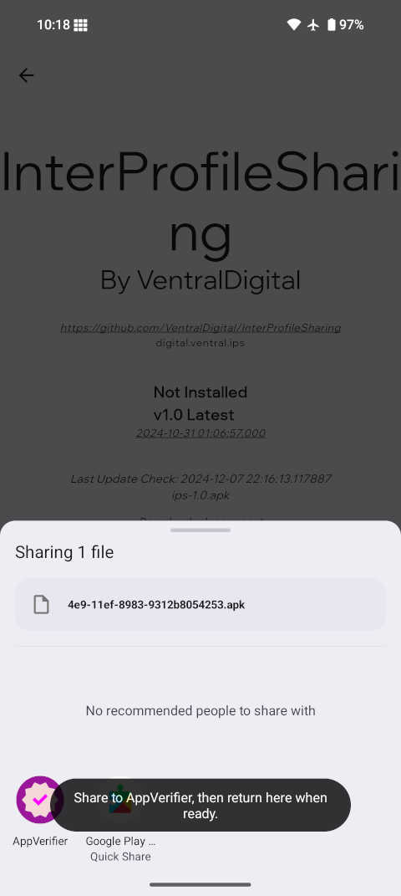
    <figcaption style="font-size: 0.9em; color: #666; margin-top: 8px;">
In Obtainium è possibile cercare pacchetti di app da varie fonti come GitHub e GitLab. Dopo averli scaricati, Obtainium ci chiederà di condividere il pacchetto con AppVerifier prima di procedere con l'installazione effettiva. Da notare che, prima di installare Obtainium stesso, è possibile scaricare il suo pacchetto e verificarlo con AppVerifier, che può essere ottenuto da Accrescent.
    </figcaption>
  </figure>

  <figure style="width: 48%; margin: 0;">
    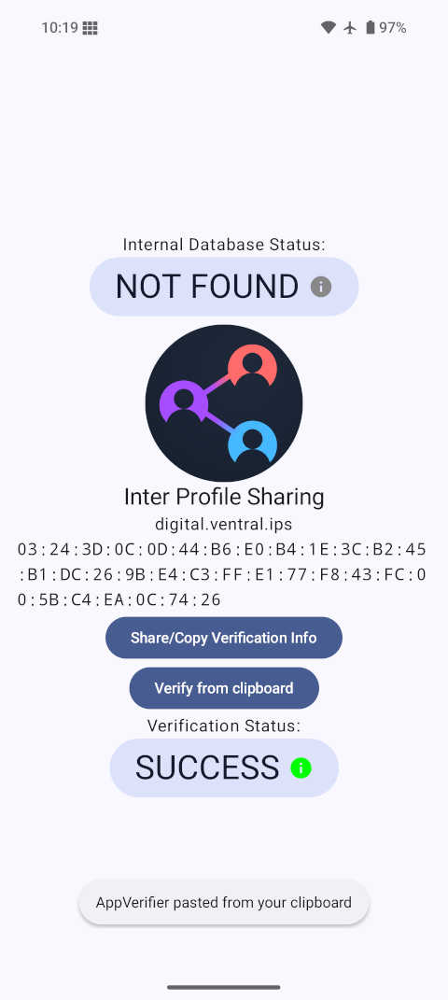
    <figcaption style="font-size: 0.9em; color: #666; margin-top: 8px;">
È possibile che la chiave di firma non sia ancora stata aggiunta al database interno di AppVerifier. In tal caso, cercatela sulla pagina del progetto e copiatela negli appunti. Una volta ottenuta, tornate su AppVerifier per verificare se il firmatario/certificato della pagina corrisponde a quello con cui il progetto è stato firmato.
    </figcaption>
  </figure>

### Accrescent

[Accrescent](https://accrescent.app/) è uno store di app con un approccio orientato alla sicurezza, guidato da un
contributore del progetto GrapheneOS. È disponibile nel GrapheneOS App Store, anche se Accrescent è ancora nelle prime
fasi di sviluppo e contiene attualmente solo una piccola selezione di applicazioni. Il progetto GrapheneOS intende
delegare ad Accrescent l'hosting sicuro di un'ampia gamma di applicazioni di terze parti, sia closed-source che
open-source, mentre il repository di app del sistema operativo sarà limitato alle applicazioni di prima parte e,
possibilmente, a un piccolo numero di fork utili di terze parti leggermente modificati e rinforzati.

Anche se si spera che Accrescent diventi uno dei migliori modi per ottenere app su GrapheneOS, manca ancora di
finanziamenti e contributori per espandersi significativamente. Il progetto GrapheneOS sta attivamente supportando
questo sviluppo come alternativa a F-Droid, criticato molte volte per il suo approccio problematico alla sicurezza.

Accrescent protegge adeguatamente il download e l'installazione iniziale attraverso metadati firmati, senza necessità
di utilizzare AppVerifier o controllare manualmente l'impronta della chiave, anche se è ancora possibile farlo dopo
l'installazione se desiderato.

### F-Droid

[F-Droid](https://f-droid.org/) è noto per essere un repository esclusivo di applicazioni Android open-source. Il
progetto GrapheneOS ha espresso critiche verso F-Droid e non lo raccomanda come store per le
applicazioni di terze parti. Il motivo principale è che F-Droid compila la maggior parte delle app direttamente dal
codice sorgente su infrastrutture obsolete, i cui pacchetti risultanti vengono poi firmati
crittograficamente da loro, sollevando preoccupazioni per un futuro compromesso di massa degli utenti F-Droid.

Un vantaggio dei pacchetti firmati dagli sviluppatori è che richiede il compromesso della chiave di firma per creare
un pacchetto dannoso con una firma valida. Questo è probabilmente più difficile che introdurre modifiche dannose al
codice sorgente su piattaforme come GitHub, che F-Droid potrebbe utilizzare per compilare e firmare pacchetti alla
cieca.

Generalmente non cé uno store perfetto per scaricare le app, il client per F-Droid [Droidify](https://droidify.eu.org/) fixa alcune delle problematiche di questo store di applicativi ed é per questo raccomandato rispetto al client originale.

Purtroppo non cé al momento una soluzione definitiva per scaricare le app su graphene, come leggerete dopo ogni scelta porta vantaggi di sicurezza, privacy o comoditá introducendo a sua volta altri problemi. Usate la soluzione che più si addice ai vostri bisogni.

### Play Store & Aurora Store

Attualmente, l'app ufficiale del Google Play Store rimane il metodo più sicuro (ma non privacy) per installare app closed-source,
soprattutto rispetto a siti mirror come [APKPure](https://apkpure.com/apkpure-app.html), che hanno copie di tutti i
pacchetti di applicazioni del Play Store - spesso usati per bypassare restrizioni regionali. Per ribadire, le app Play
Store e Play Services di Google sono trattate come app regolari senza privilegi speciali su GrapheneOS, e la decisione
di separarle in un profilo secondario è a discrezione dell'utente.

L'[Aurora Store](https://f-droid.org/en/packages/com.aurora.store/) è un client alternativo per il repository del
Google Store. Consente di evitare di installare l'app Play Store ufficiale e offre la possibilità di utilizzare un
account Google anonimo condiviso con altri utenti di Aurora. Il progetto GrapheneOS sconsiglia l'uso di Aurora a causa
della sua sicurezza più debole e del fatto che alcune app potrebbero risentire della sua fonte. È sempre possibile
creare un account non identificabile con un numero di telefono usa e getta nel Play Store ufficiale invece di
utilizzare l'opzione anonima poco affidabile di Aurora.

C'è una critica sul fatto che l'uso di molte app, servizi e infrastrutture di Google possa contraddire lo scopo di
usare GrapheneOS. A questo proposito, il progetto chiarisce che lo scopo di GrapheneOS non è evitare specificamente
Google, ma fornire un alto livello di privacy e sicurezza - anche per chi non vuole fare grandi sacrifici in termini
di esperienza utente. Il lavoro continuo per fornire un livello di compatibilità completamente funzionale per i
servizi di Google non è una caratteristica banale, ma una in cui GrapheneOS sta investendo molte risorse. In ogni
caso, una nuova installazione di GrapheneOS è completamente priva di Google, e la scelta di utilizzare il livello di
compatibilità o evitarlo è completamente vostra.

### Riflessione sui vari store
Personalmente trovo obtanium un ottima app che peró purtroppo pecca sul fatto che non permette agli utenti di "scoprire" nuove app ma solo di scaricare app specifiche. 

Parlando di droidify, aurora e google secondo me sono tutte scelte generalmente valide in base ai trade-off dell'utente. Il vantaggio di droidify é di non richiedere account ed essere distribuito su vari repositpory aggiungibili anche custom. Aurora é un ottima via di mezzo tra privacy e sicurezza anche se il modo più stabile e sicuro di usarlo é collegandoci un account google creato con dati falsi (l'app é opensource e quindi non richiede di installare nulla collegato al nulla sul nostro dispositivo).

Il play store di google é la soluzione più sicura ma con i maggiori trade-offs di privacy richiesti (permessi, dipendenze, account e dati personali). Se cercate altissima sicurezza questo rimane il metodo più restistente ad attacchi esdterni. A mio parere tutti gli store soddisfano richieste di mercato divcerse.

## Problemi e Risoluzioni

### Problemi di Geolocalizzazione

Determinare la posizione è un altro servizio fornito originariamente dai Play Services di Google. Invece, GrapheneOS
reindirizza le richieste di posizione al sistema operativo, che utilizza esclusivamente la localizzazione satellitare
(GNSS), richiedendo la ricezione del segnale satellitare. Ciò può risultare inaffidabile in situazioni in cui il cielo
è oscurato, ad esempio da un soffitto di cemento, causando molte lamentele sulle app basate sulla posizione non
funzionanti correttamente su GrapheneOS.

Se avete un operatore cellulare e una connessione Internet, il dispositivo dovrebbe poter utilizzare il georilevamento
satellitare assistito (A-GNSS) richiedendo informazioni sulle torri cellulari vicine (SUPL) e sugli stati/orbite
attuali dei satelliti (PSDS). Questi migliorano notevolmente la velocità di acquisizione della posizione. Di default,
GrapheneOS utilizza server proxy propri per prevenire l'associazione delle richieste SUPL/PSDS con il vostro indirizzo
IP.

Potete opzionalmente attivare la scansione Wi-Fi e Bluetooth in _Impostazioni &raquo; Posizione &raquo; Servizi di
localizzazione_. Questo permetterà alle app e ai servizi con il permesso _"Dispositivi vicini"_ di scansionare reti
Wi-Fi e dispositivi Bluetooth vicini anche quando Wi-Fi e Bluetooth sono disattivati, migliorando potenzialmente le
funzionalità basate sulla posizione. Il progetto GrapheneOS sta lavorando a una propria implementazione di questo,
inizialmente come proxy per i server di Apple e successivamente come database proprietario.

Se avete installato i Play Services sandboxed e volete utilizzare il servizio di localizzazione di rete di Google per
fornire stime di posizione più accurate, prima dovete disattivare l'opzione _"Reindirizza richieste di posizione al
sistema operativo"_ in _Impostazioni &raquo; App &raquo; Sandboxed Google Play_. Successivamente, dovrete modificare
l'autorizzazione di posizione dei Play Services impostandola su _"Consenti sempre"_ e abilitare _"Usa posizione
precisa"_. Per consentire l'uso della scansione di rete, è necessario anche concedere il permesso _"Dispositivi
vicini"_ (i toggle per la scansione Wi-Fi e Bluetooth menzionati sopra devono essere già attivati). Infine, tornate a
_Impostazioni &raquo; App &raquo; Sandboxed Google Play_, toccate su _"Google Location Accuracy"_ e abilitate
l'opzione _"Migliora l'accuratezza della posizione"_.

L'opzione per il reindirizzamento non è globale, quindi potreste considerare di configurare un profilo utente
secondario esclusivamente per utilizzare i servizi di localizzazione invasivi di Google, da utilizzare solo quando
avete problemi di geolocalizzazione.

### Crash/App non funzionante

Come già accennato, non è sorprendente che alcune applicazioni su GrapheneOS si blocchino o rifiutino di funzionare
correttamente, ma questo è quasi sempre risolvibile. Prima di tutto, provate i passaggi standard come la cancellazione
della cache dell'app, l'arresto forzato e il riavvio dell'applicazione, il riavvio del telefono o la reinstallazione
dell'app. 

Soluzioni specifiche per GrapheneOS includono disattivare alcune misure di protezione dagli exploit,
reinstallare l'applicazione al di fuori di uno spazio privato (Proprietario o altri profili secondari), oppure
reinstallare l'app in un profilo che dispone dei Play Services sandboxed. A volte le app iniziano a bloccarsi perché
l'applicazione (ad esempio lo store delle app) da cui sono state installate non è più abilitata o installata, o si
rifiutano di funzionare correttamente perché non sono state installate dalla fonte prevista.

### L'app si rifiuta di installarsi

I motivi tipici di questo problema sono stati spiegati sopra: state tentando di installare un'applicazione già
disponibile in una versione più recente o proveniente da una fonte diversa in un altro profilo utente.

### Richiedere supporto

GrapheneOS ha una comunità molto attiva ed è reattiva sui social media. I luoghi più semplici per cercare soluzioni
già esistenti ai vostri problemi sono probabilmente il forum su
[discuss.grapheneos.org](https://discuss.grapheneos.org/) e il loro [server
Discord](https://discord.com/invite/grapheneos). GrapheneOS ha anche comunità su
[Twitter/X](https://x.com/i/communities/1530455827949273094), [Telegram](https://t.me/GrapheneOS) e
[Matrix](https://matrix.to/#/%23community:grapheneos.org).

## Donazioni

Se questa guida ti é stata utile puoi farmi una donazione cliccando il tasto qua sotto. Come detto ad inizio guida se puoi condividi questo articolo con amici, parenti, social media e gruppi telegram, questa rimane una donazione sempre apprezzatissima <3

Se hai domande puoi contattarmi al mio profilo telegram [@Turtlecute33](https://t.me/turtlecute33) o tramite email a turtlecute@proton.me. Grazie della lettura!



---

## Guide Correlate

- **[De-Google Android: Guida Completa alla Privacy](/android)** - Configurazione completa per qualsiasi telefono Android de-googled
- **[Come Creare un Threat Model](/threat-model)** - Definisci le tue minacce prima di scegliere gli strumenti di difesa
- **[VPN Self-Hosted con AdBlock](/vpn)** - Proteggi il traffico del tuo GrapheneOS con una VPN personale
- **[Tutorial Nodo Tor](/tor)** - Naviga in modo anonimo e contribuisci alla rete Tor

