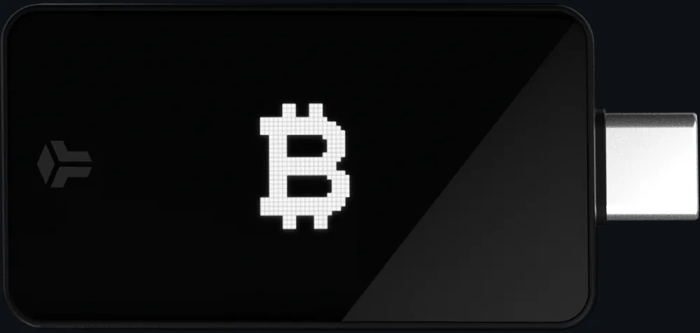
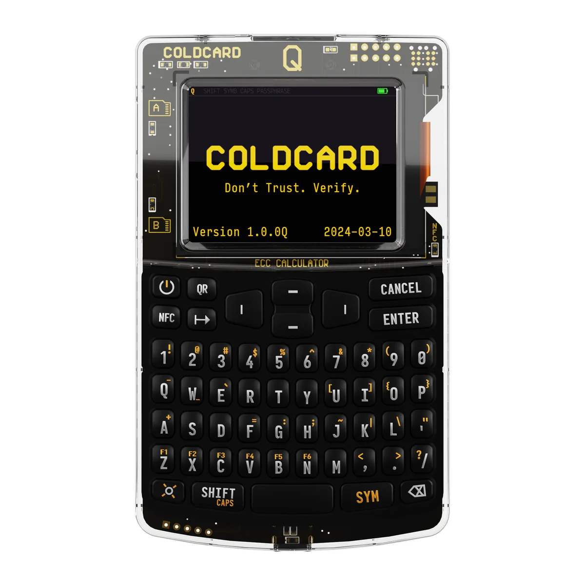

> **TL;DR** - In questa guida imparerai:
> - Quali sono i requisiti veri di un buon hardware wallet (open source, secure element, privacy)
> - Perché il mio setup vincitore non è nemmeno un hardware wallet, ma un vecchio PC Linux
> - Pro, contro e voti onesti di BitBox02, Coldcard e degli altri device sul mercato
> - Come comprare e usare il device senza vanificare la privacy con tracce fisiche

Le tue chiavi private sono il tuo Bitcoin. Chi le controlla controlla i sats, punto. Un hardware wallet serve a una cosa sola: tenere quelle chiavi lontane da un computer connesso a Internet, dove malware, screen logger e attacchi remoti fanno strage. Ma il mercato è pieno di device che promettono sicurezza e in cambio ti chiedono di fidarti ciecamente di un produttore, leggono i tuoi saldi sui loro server, o nascondono il codice. In questa guida vi spiego i requisiti che contano davvero e poi vi do il mio podio personale, con voti onesti e senza peli sulla lingua.

Premessa doverosa: qui si parla **solo di Bitcoin**. Non di "cripto", non di token, non di NFT. Un buon device per me è un device che fa una cosa e la fa benissimo, e quella cosa è custodire e firmare Bitcoin.

## I Requisiti di un Buon Hardware Wallet {#requisiti style="color: white;"}

Prima di guardare i nomi, mettiamoci d'accordo su cosa rende buono un device. A mio parere i criteri sono tre: quanto è aperto, quanto è sicuro e privato, e con cosa è compatibile.

### Il più open source possibile (e il dilemma del secure element) {#open-source}

La regola d'oro è semplice: **non fidatevi, verificate**. Un firmware open source significa che chiunque può leggere il codice che gira sul device, controllare che non ci siano backdoor e, nei casi migliori, ricompilarlo e verificare (build riproducibili) che il file installato corrisponda esattamente al sorgente pubblico. Senza questo, state semplicemente sperando che il produttore sia onesto.

Qui però arriva il dilemma più frainteso del settore: **un hardware wallet non può essere open source al 100%**. Il motivo è il secure element.

Il secure element è un chip specializzato (i nomi che girano sono ATECC608 di Microchip, ST33 di STMicro, Infineon OPTIGA) progettato per resistere all'estrazione fisica del seed: se un attaccante vi ruba il device e prova a leggerlo con strumenti da laboratorio (decapping del chip, glitching, analisi del consumo energetico), il secure element rende la vita molto difficile. Il problema è che questi chip:

1. Si comprano **sotto NDA**. I datasheet completi e il set di comandi sono coperti da accordi di riservatezza con il produttore del silicio. Chi firma quell'NDA non può legalmente pubblicare le parti di codice che parlano col chip.
2. Eseguono un **firmware proprietario** scritto in fabbrica, che il produttore del wallet non vede mai in chiaro.
3. Basano le difese anti-manomissione **sulla segretezza**: griglie metalliche di protezione che si accorgono se qualcuno prova ad aprire il chip, sensori che rilevano i tentativi di glitch, protezioni contro i side-channel. Pubblicarne i dettagli significherebbe consegnare all'attaccante la mappa delle difese.

Da qui nascono due filosofie, due modelli di minaccia diversi:

- **Senza secure element** (Jade, SeedSigner, vecchi Trezor): il device è 100% aperto e auditabile, ogni riga verificabile. Ma il seed vive nella memoria flash di un microcontrollore generico, vulnerabile all'estrazione fisica da parte di chi ha accesso al device e attrezzatura da laboratorio. La difesa è solo software (PIN con limite tentativi, passphrase, wipe).
- **Con secure element** (Coldcard, BitBox02, Ledger): forte resistenza all'attacco fisico, ma quel chip è una scatola nera di cui dovete fidarvi a livello di produzione e supply chain.

I device fatti bene mitigano il problema in modo intelligente: **il secure element fa solo da cassaforte, non da cervello**. Tutta la logica del wallet (derivazione delle chiavi, parsing delle transazioni, firma) gira nel firmware aperto e riproducibile sul microcontrollore principale; il chip si limita a custodire il seed e a rilasciarlo solo dopo il PIN corretto. Il Coldcard usa addirittura **due secure element di produttori diversi**, così una backdoor dovrebbe esistere contemporaneamente in più chip indipendenti. Il BitBox02 ne abbina uno solo a un firmware Apache 2.0 con build riproducibili.

> **La morale:** non esiste un vincitore assoluto tra "tutto aperto ma estraibile" e "scatola nera ma blindata". Difendono minacce diverse. Senza secure element vi fidate del codice e temete il cacciavite; con secure element vi fidate del chip e non temete nulla di fisico. Scegliete in base al vostro modello di minaccia, non agli slogan.

### Qualità e features di sicurezza e privacy {#sicurezza-privacy}

Oltre all'apertura del codice, un buon device dovrebbe offrire:

- **Generazione del seed sul device** con vera entropia, e meglio ancora la possibilità di aggiungere la vostra (lancio di dadi). Se non vi fidate nemmeno di quello, generatelo a mano: ho una guida apposta per [generare un seed coi dadi](/seed).
- **PIN con limite di tentativi e wipe automatico**: dopo N errori il device si azzera. È questo che rende inutile un furto.
- **Verifica on-device dell'indirizzo**: lo schermo del device deve mostrarvi indirizzo e importo, così un malware sul computer non può dirottare i fondi mostrandovi numeri falsi.
- **Build riproducibili e firmware firmato**: la garanzia che giri davvero il codice pubblicato.
- **Niente telemetria, niente "phone home"**: il device e la sua app non devono spifferare i vostri saldi a nessun server.
- **Supporto al vostro nodo**: per la privacy on-chain è fondamentale poter collegare il wallet al **vostro** Electrum/nodo, possibilmente via Tor, invece di interrogare i server del produttore.

Features avanzate che fanno la differenza per gli utenti esigenti: **passphrase BIP39** (la 25ª parola, per plausible deniability), **PIN di emergenza/decoy** che mostrano un wallet civetta, e **air-gap**, di cui parlo tra poco.

### Compatibilità con wallet e terze parti {#compatibilita}

Un device non vive da solo: dialoga con un software companion sul computer o sul telefono. E qui c'è una regola che per me è quasi non negoziabile: **il device deve funzionare bene con wallet di terze parti**, non solo con l'app del produttore.

Perché? Perché l'app ufficiale del produttore spesso è il punto debole della privacy (vedi Ledger), mentre un wallet indipendente come **Sparrow** vi dà coin control, etichette UTXO, connessione al vostro nodo, Tor e standard aperti. Nelle mie guide Sparrow è il filo conduttore, ed è il companion che consiglio caldamente per quasi tutti i device di questa lista. Un hardware wallet che vi ingabbia nella sua app proprietaria, a mio parere, parte già con una bocciatura sulla privacy.

Il meccanismo che rende tutto questo possibile si chiama **PSBT** (Partially Signed Bitcoin Transaction): il wallet watch-only sul computer prepara la transazione non firmata, il device la firma in isolamento, e la transazione firmata torna indietro per essere trasmessa. Questo standard è ciò che permette anche i setup air-gapped, dove il device non tocca mai un computer connesso.

{{< cta type="inline" title="Il device protegge la chiave. Ma la tua privacy on-chain?" text="Un hardware wallet blinda il seed, però ogni transazione che fai racconta comunque una storia: importi, collegamenti tra indirizzi, da dove arrivano i sats. La Guida Privacy Bitcoin riparte da dove finisce questa guida e ti insegna a custodire e spendere i tuoi satoshi senza farti tracciare. Hai già fatto il passo difficile scegliendo il device giusto: non fermarti a metà strada." url="https://shop.priorato.org" button="Scopri la Guida Privacy Bitcoin" icon="₿" >}}

## La Privacy Inizia dall'Acquisto {#privacy-acquisto style="color: white;"}

Prima ancora di accendere il device, c'è un capitolo che quasi nessuno tratta: **come lo comprate**. Perché potete avere il setup più blindato del mondo, ma se l'avete ordinato con carta di credito, spedito a casa vostra, intestato al vostro nome, avete già detto al mondo "io possiedo Bitcoin".

Ecco i principi che seguo, in ordine di importanza:

- **Hardware generico batte hardware brandizzato Bitcoin.** Questo è il motivo numero uno per cui amo il setup con il vecchio PC: un laptop usato non dice niente di voi. Un pacco con scritto "Coldcard" o "BitBox" sopra, o anche solo la traccia di un ordine, vi marchia come possessori di sats agli occhi del corriere, del rivenditore, di chi mette le mani su una fuga di dati. Quando potete scegliere componenti comuni e neutri, fatelo.
- **Pagate in Bitcoin o in contanti.** Quasi tutti i produttori seri (Coldcard, BitBox) accettano pagamento in BTC, spesso con uno sconto. Ai meetup e alle conferenze Bitcoin trovate spesso banchetti dove comprare il device in contanti, di persona, senza nessuna traccia digitale. È il metodo migliore.
- **Niente tracce fisiche.** Evitate la spedizione all'indirizzo di casa intestato a voi. Un punto di ritiro, un indirizzo alternativo, l'acquisto di persona: qualsiasi cosa spezzi il legame "questo Bitcoiner abita qui" è oro.
- **Diffidate dei rivenditori dubbi.** Comprate dal sito ufficiale del produttore o da rivenditori fidati. I device manomessi durante la spedizione (supply chain attack) sono rari ma reali: i sigilli anti-manomissione esistono per questo, controllateli sempre.

Ricordate che la privacy è una catena: non ha senso blindare le chiavi e poi farsi schedare alla cassa. Occhi aperti fin dal primo passo.

## Il Mio Podio {#podio style="color: white;"}

Bene, basta teoria. Ecco i tre setup che consiglio davvero, in ordine. Vi anticipo subito la sorpresa: il mio numero uno non è nemmeno un hardware wallet.

### 🥇 Vincitore: un Vecchio PC Linux Air-Gapped {#pc-linux}

Sì, avete letto bene. Il setup che a mio parere offre la massima sovranità non si compra in un negozio: è un vecchio laptop che avete in un cassetto, trasformato in un firmatario offline. Niente vendor di cui fidarsi, niente chip proprietari, hardware completamente generico (e quindi anonimo all'acquisto), e tutte, dico tutte, le features di Sparrow a disposizione. Costo: zero.

Il modello è lo stesso di un hardware wallet air-gapped, solo che il "device" è un PC che non tocca mai più Internet. Ecco come si costruisce:

1. **Tagliate la rete.** L'obiettivo è che questo PC non si colleghi mai più a niente. La via più sicura è rimuovere fisicamente la scheda Wi-Fi/Bluetooth (di solito un modulo M.2 o mini-PCIe) ed eventuali modem cellulari: così non potete più collegarvi nemmeno per sbaglio. Ma non è obbligatorio aprire il laptop: va benissimo anche disabilitare le radio e disinstallare i relativi driver/firmware dal sistema, basta avere la disciplina di non riattivarli mai. La porta Ethernet, ovviamente, resta scollegata per sempre.
2. **Cifrate tutto il disco con LUKS.** Installate una distro Linux (Debian va benissimo) con crittografia dell'intero disco LUKS al momento dell'installazione, con una passphrase robusta. Così, anche se vi rubano il laptop, il wallet è inutilizzabile: il furto fisico non è un problema, perché senza la passphrase il disco è un mattone cifrato. Se volete approfondire l'hardening, date un'occhiata alla mia [guida sull'hardening di Linux](/linux-hardening).
3. **Installate Sparrow offline** (verificando la firma GPG del pacchetto da un'altra macchina). Questo PC custodirà il seed e non vedrà mai una rete.
4. **Generate o importate il seed** sul PC offline. Per la massima paranoia, generatelo coi dadi seguendo la [guida apposita](/seed).
5. **Esportate l'xpub** (la chiave pubblica estesa, che non può spendere nulla) su una chiavetta USB.
6. **Sul vostro PC online**, aprite un secondo Sparrow in modalità **watch-only** importando l'xpub, e collegatelo al **vostro nodo** Bitcoin via Tor. Questo wallet vede i saldi e prepara le transazioni, ma non può firmare.
7. **Firma air-gapped via PSBT:** quando volete spendere, Sparrow online crea la transazione non firmata (PSBT), la salvate su USB (o la mostrate come QR animato), la portate sul PC offline, la firmate, riportate indietro la transazione firmata e la trasmettete dal wallet online. Il seed non lascia mai la macchina offline.

In alternativa, per chi vuole l'amnesia totale, c'è la variante **Tails OS**: un sistema che gira interamente in RAM e non scrive nulla sul disco, così un'eventuale infezione non sopravvive al riavvio. Con lo storage persistente cifrato di Tails non dovete nemmeno re-inserire il seed ogni volta.

**Il punto di forza, oltre al costo zero, è la privacy dell'acquisto:** non avete comprato un "device Bitcoin", avete riusato un laptop qualunque. Nessun ordine tracciabile, nessun profiling. E avete eliminato la fiducia in qualsiasi produttore di hardware.

Onestà sui contro, perché non sarà una passeggiata: la configurazione è **un po' più difficile** di un hardware wallet pronto all'uso, e la quantità di software di cui vi dovete fidare (un intero sistema operativo Linux più Sparrow) è molto più grande del firmware minimale di un device dedicato. Non è il setup per la nonna. Ma se siete disposti a metterci le mani, per me è il re indiscusso della sovranità.

### 🥈 BitBox02: l'Esperienza Completa e Facile {#bitbox02}

*Il BitBox02 Bitcoin-only: la mia raccomandazione per chi vuole un device serio senza complicazioni.*

Se non volete smanettare con Linux e cercate un hardware wallet vero, comprato e pronto, il **BitBox02 in edizione Bitcoin-only** (della svizzera BitBox, ex Shift Crypto) è la mia scelta numero uno. È il device che consiglio alla maggior parte delle tartarughe.

Perché lo amo:

- **Firmware pienamente open source** (licenza Apache 2.0) con **build riproducibili**: è l'unica del podio commerciale con una licenza open senza asterischi.
- **Edizione Bitcoin-only**: niente codice per altre cripto, superficie d'attacco ridotta. Bloccata in fabbrica, non si può convertire.
- **UX pulita e davvero facile**, sia con l'app BitBoxApp sia con Sparrow. È il device più adatto a chi non è tecnico.
- **Privacy curata**: Tor integrato nell'app, supporto al vostro nodo, nessuna telemetria. Architettura a doppio chip (secure element ATECC608B più microcontrollore col firmware aperto).

Il limite, perché ce n'è uno e ve lo dico chiaro: il BitBox02 è **solo USB-C**, niente air-gap, niente QR, niente microSD. Per chi vuole il massimo isolamento (il device che non tocca mai un computer) questo è un compromesso. Per la stragrande maggioranza degli utenti, in cambio di un'esperienza eccellente e di un firmware totalmente aperto, è un compromesso che vale la pena. Resta saldamente il mio numero due. Prezzo: circa 149 euro. Sito ufficiale: [bitbox.swiss](https://bitbox.swiss).

### 🥉 Coldcard: per Smanettoni e Massimo Controllo {#coldcard}

*Il Coldcard Q, con tastiera QWERTY e scanner QR. Accanto, la più essenziale Mk5: features senza compromessi per i tecnici.*

Il **Coldcard** (della canadese Coinkite) è il device dei tecnici, di chi vuole controllo totale e la lista di features più lunga del mercato. Esiste in due varianti che vale la pena distinguere:

- **Coldcard Mk5** (circa 190 euro): l'essenziale. Erede della storica Mk4 da marzo 2026, mantiene lo stesso cuore di sicurezza ma con schermo Gorilla Glass, tastiera e case migliorati (e trasparente, così potete ispezionare l'interno a caccia di impianti). USB-C, microSD, NFC (disattivabile), air-gap completo via PSBT su microSD. Niente fotocamera/QR, e il tastierino resta in stile calcolatrice.
- **Coldcard Q** (circa 250 euro): l'ammiraglia. **Tastiera QWERTY completa**, **scanner QR integrato**, doppio slot microSD, NFC, e **batterie AAA per operare totalmente wireless e air-gapped**. È il Coldcard che non tocca mai un computer.

Cosa lo rende speciale:

- **Bitcoin-only per natura**: Coinkite non fa firmware per altre cripto.
- **Doppio secure element di produttori diversi** (Microchip + Maxim): per compromettere il device servirebbe una backdoor in più chip indipendenti insieme.
- **Features di sicurezza estreme**: PIN trappola e wallet civetta (decoy), con l'opzione di azzerare il device a un PIN sbagliato, Seed XOR (dividere il seed in più parti), passphrase BIP39, multisig robusto, resina epossidica anti-manomissione e un LED di allarme cablato al secure element.
- **Air-gap nativo** e compatibilità totale con Sparrow, Electrum, Specter, Nunchuk.

Una nota tecnica a margine sull'open source: il firmware Coldcard è **verificabile e con build riproducibili**, ma la licenza è Creative Commons NonCommercial, quindi tecnicamente non è "open source" nel senso stretto OSI (a differenza dell'Apache 2.0 del BitBox). In pratica potete comunque leggere e verificare ogni riga di codice, che è ciò che conta per la sicurezza, ma è giusto saperlo.

Il vero contro è la **curva di apprendimento**: il Coldcard è potente ma ostico, pensato per chi sa cosa sta facendo. Non è il primo device che metterei in mano a un principiante. Sito ufficiale: [coldcard.com](https://coldcard.com).

## I Voti del Podio {#voti style="color: white;"}

Ecco la mia pagella, da 1 a 5 pallini. Legenda: **Facilità** (più pallini = più facile da usare), **Features**, **Privacy**, **Compatibilità** con wallet terzi, **Costo** (più pallini = più economico/conveniente).

<table style="table-layout:fixed;width:100%">
<colgroup>
<col style="width:28%">
<col style="width:14.4%">
<col style="width:14.4%">
<col style="width:14.4%">
<col style="width:14.4%">
<col style="width:14.4%">
</colgroup>
<thead>
<tr><th style="text-align:left">Setup</th><th style="text-align:center">Facilità</th><th style="text-align:center">Features</th><th style="text-align:center">Privacy</th><th style="text-align:center">Compat.</th><th style="text-align:center">Costo</th></tr>
</thead>
<tbody>
<tr><td style="text-align:left">🥇 PC Linux air-gapped</td><td style="text-align:center">●●○○○</td><td style="text-align:center">●●●●●</td><td style="text-align:center">●●●●●</td><td style="text-align:center">●●●●●</td><td style="text-align:center">●●●●●</td></tr>
<tr><td style="text-align:left">🥈 BitBox02 BTC-only</td><td style="text-align:center">●●●●●</td><td style="text-align:center">●●●○○</td><td style="text-align:center">●●●●●</td><td style="text-align:center">●●●●○</td><td style="text-align:center">●●●●○</td></tr>
<tr><td style="text-align:left">🥉 Coldcard Mk5</td><td style="text-align:center">●●○○○</td><td style="text-align:center">●●●●●</td><td style="text-align:center">●●●●●</td><td style="text-align:center">●●●●○</td><td style="text-align:center">●●●○○</td></tr>
<tr><td style="text-align:left">🥉 Coldcard Q</td><td style="text-align:center">●●●○○</td><td style="text-align:center">●●●●●</td><td style="text-align:center">●●●●●</td><td style="text-align:center">●●●●○</td><td style="text-align:center">●●○○○</td></tr>
</tbody>
</table>

In sintesi: il PC Linux vince su tutto tranne la facilità (il prezzo della massima sovranità). Il BitBox02 è il più facile e ben bilanciato. I Coldcard sono i più ricchi di features ma chiedono impegno e, nel caso della Q, anche un buon budget.

## Gli Altri Device: Menzioni e Bocciature {#altri style="color: white;"}

Il podio è il podio, ma il mercato è pieno. Ecco la mia opinione sugli altri, senza diplomazia.

### SeedSigner: la Menzione d'Onore {#seedsigner}

Subito sotto il podio metto il **SeedSigner**, e con affetto. È un firmatario **fai-da-te** costruito con componenti comunissimi (un Raspberry Pi Zero senza radio, una fotocamera, uno schermino), per circa 50-65 euro di pezzi. È **totalmente open source**, **stateless** e air-gapped via QR: non memorizza nulla, il seed vive solo in RAM mentre è acceso e sparisce allo spegnimento. Funziona con Sparrow, Specter, Nunchuk.

L'idea è geniale: hardware generico (massima privacy all'acquisto, esattamente la filosofia di questa guida) e nessun seed da rubare quando è spento. Il contro, che lo tiene fuori dal podio, è la scomodità: essendo stateless dovete avere **sempre il seed a portata di mano** e re-inserirlo a ogni transazione. Un'ottima idea fatta con hardware comune, ma vivere col seed sempre in mano non è per tutti.

### Jade: Bella Idea, Software Pessimo {#jade}

Il **Blockstream Jade** ha l'hardware economico (ESP32, circa 79 euro) e un'architettura open source interessante, con un "secure element virtuale" basato su un blind oracle (che potete anche auto-ospitare) al posto di un chip fisico. Sulla carta non male.

Nella pratica, però, la mia esperienza è negativa. Il problema è l'usabilità, a tutti i livelli: sia il **wallet companion Blockstream Green** sia **l'hardware stesso** sono, a mio parere, davvero poco intuitivi, con una **pessima UI/UX**. Macchinoso, poco curato, con un'esperienza d'uso che frustra invece di accompagnare. Sì, potete usare il Jade con Sparrow via QR e migliorare le cose, ma un device si giudica anche dall'ecosistema con cui te lo vendono. Non lo consiglio.

### Ledger: Hardware Ottimo, Privacy Pessima {#ledger}

Sul **Ledger** sono netto: l'**hardware è ottimo**. Il secure element ST33 è di livello bancario, certificato EAL6+, tra i migliori in circolazione per resistenza fisica. Se il criterio fosse solo "quanto è robusto il chip", Ledger sarebbe in alto.

Ma il punto, per me, è la **privacy, ed è qui che Ledger crolla**. La Ledger app (Ledger Live) **legge l'xpub e interroga i server di Ledger di default**, collegando i vostri indirizzi alla loro infrastruttura. Aggiungeteci il disastro di **Ledger Recover**, il servizio che ha dimostrato che il firmware chiuso *può* estrarre il seed dal secure element (cosa che per anni avevano lasciato credere impossibile), e le ripetute fughe di dati dei clienti (l'ultima confermata a gennaio 2026 tramite un fornitore terzo). È inoltre **multi-coin**, non Bitcoin-only, e il firmware critico è chiuso.

Tradotto: hardware eccellente, ma per la privacy va usato in un modo solo. **Mai con la Ledger app, sempre con Sparrow (o un altro wallet di terze parti) puntato al vostro nodo.** È l'app ufficiale a leggere l'xpub e a fare da tramite verso i loro server; spostando la gestione su Sparrow quel problema di privacy sparisce. L'unica vera scocciatura è che per aggiornare le app interne del device siete comunque costretti a tirare fuori Ledger Live ogni tanto, ma per l'uso quotidiano (ricevere, firmare, controllare i saldi) restate su Sparrow. Resta il fatto che vi fidate comunque di un firmware chiuso.

### Trezor: con Riserve Forti {#trezor}

Il **Trezor Safe** in modalità Bitcoin-only ha un aspetto tecnicamente notevole: usa un secure element Infineon OPTIGA Trust M **senza NDA**, quindi più auditabile della media. Bello sulla carta, e lo cito proprio per questo.

Ma ho due riserve che me lo tengono lontano dal podio. Primo, un **passato di problemi fisici**: i vecchi modelli (One, T) avevano il seed estraibile in pochi minuti con accesso al device. Da ridimensionare, però: l'attacco richiedeva accesso fisico e strumenti da laboratorio, ed era **completamente arginabile con una passphrase BIP39** (che non vive sul device, quindi il seed estratto da solo non basta), e i modelli Safe lo hanno poi risolto alla radice col secure element. Insomma, una situazione gestibile più che un disastro, ma una fama da cattivo storico che fatica a scrollarsi di dosso. Secondo, il **companion Trezor Suite di default poco privato**, che interroga i propri server per i saldi, lo stesso peccato originale di Ledger. Va assolutamente usato col vostro nodo o con Sparrow, mai con le impostazioni di fabbrica. Migliorato negli anni, ma non è il primo nome che mi viene in mente.

### Passport e gli Altri {#passport}

La **Foundation Passport** (Batch 2, Bitcoin-only, circa 199 dollari, ora affiancata dal nuovo Passport Prime più orientato a una "piattaforma di sicurezza" generale) è una soluzione meno comune ma curata: air-gapped via QR e microSD, firmware GPLv3, secure element Microchip, app companion Envoy ma anche compatibilità con Sparrow e Specter. Un device elegante e valido, se vi piace l'estetica e non vi spaventa il prezzo.

Esistono poi parecchie altre soluzioni di nicchia. Sappiate che ci sono, ma a mio parere il vero gioco si fa tra le opzioni di cui sopra: per la maggior parte di voi, il podio basta e avanza.

{{< cta type="inline" title="Sei arrivato fin qui: ora costruisci tutta la cassaforte" text="Scegliere il device è il primo mattone. Generare il seed in modo inattaccabile, gestire gli UTXO e spendere senza farti tracciare sono i mattoni successivi. Il Bundle Completo mette insieme la Guida Privacy Bitcoin e la Guida Privacy Digitale a un prezzo più conveniente delle due separate: tutto il percorso, dalla chiave privata alla vita digitale, in un colpo solo." url="https://shop.priorato.org" button="Scopri il Bundle Completo" icon="🛡️" >}}

## Quale Scegliere: il Verdetto per Profilo {#verdetto style="color: white;"}

Ricapitolando, perché un consiglio è utile solo se calza addosso:

- **Vuoi la massima sovranità e non ti spaventa la riga di comando?** Il vecchio PC Linux air-gapped con LUKS e Sparrow. Costo zero, privacy massima, nessun vendor.
- **Vuoi un device serio, facile e pronto all'uso?** BitBox02 Bitcoin-only. La scelta giusta per la maggioranza delle tartarughe.
- **Sei tecnico e vuoi controllo e features senza compromessi?** Coldcard (Mk5 per risparmiare, Q per il top dell'usabilità tecnica).
- **Vuoi spendere il minimo e divertirti col fai-da-te?** SeedSigner.

E qualunque cosa scegliate: comprate in Bitcoin o in contanti, preferite hardware generico quando potete, usate Sparrow col vostro nodo, e generate il seed con cura.

## Conclusioni {#conclusioni style="color: white;"}

Facciamo il punto del viaggio: ora sapete cosa rende davvero buono un hardware wallet (apertura del codice, il giusto compromesso sul secure element, privacy e compatibilità), conoscete il mio podio con voti onesti, sapete perché il setup vincitore non si compra ma si costruisce, e avete capito che la privacy inizia dal momento dell'acquisto, non dopo.

La mia ricetta personale, se vi serve da bussola: **PC Linux air-gapped** se volete la sovranità totale, **BitBox02** se volete la via facile e ben fatta, **Coldcard** se siete tecnici e volete tutto. Il resto del mercato esiste, ma sapere cosa evitare (Ledger sulla privacy, Green su Jade) vale quanto sapere cosa scegliere.

Bravissimo eroe, sei arrivato fino in fondo: ora fai parte di quella minoranza di tartarughe che custodisce i propri sats come si deve, senza delegare la fiducia a nessuno. Grazie mille per la lettura! Se questa guida ti è stata utile, condividila con chi tiene ancora i Bitcoin su un exchange.



---

## Guide Correlate

- **[Generare un Seed Bitcoin con i Dadi](/seed)** - Crea le tue chiavi private con entropia reale, prima ancora di metterle sul device
- **[Usare Bitcoin in Modo Privato](/bitcoin)** - Nodo, wallet, UTXO e transazioni: la privacy dopo aver messo al sicuro le chiavi
- **[Comprare Bitcoin Senza KYC](/no-kyc)** - Riempi il tuo nuovo hardware wallet con sats che nessuno ha collegato alla tua identità
- **[Hardening di Linux](/linux-hardening)** - Blinda il sistema che userai come firmatario air-gapped
