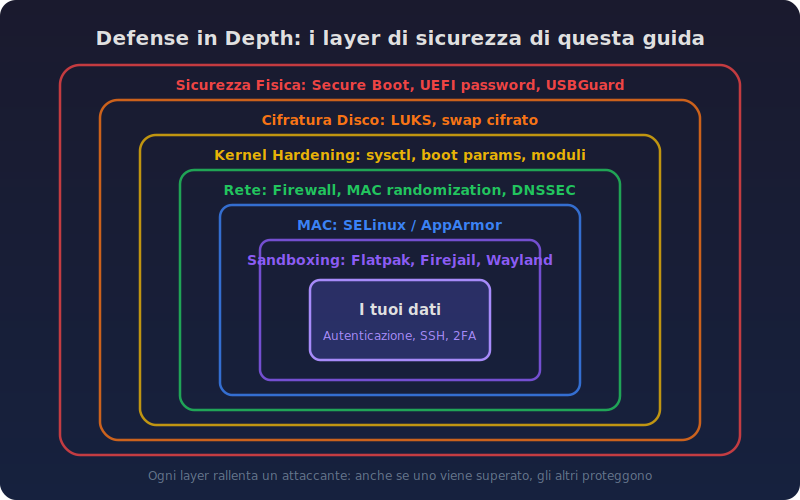
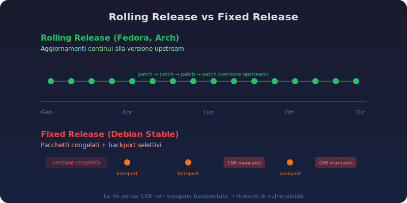
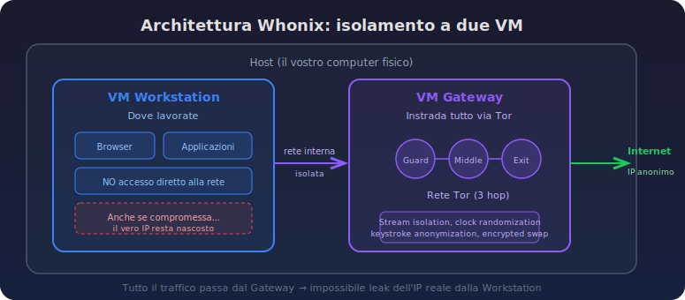
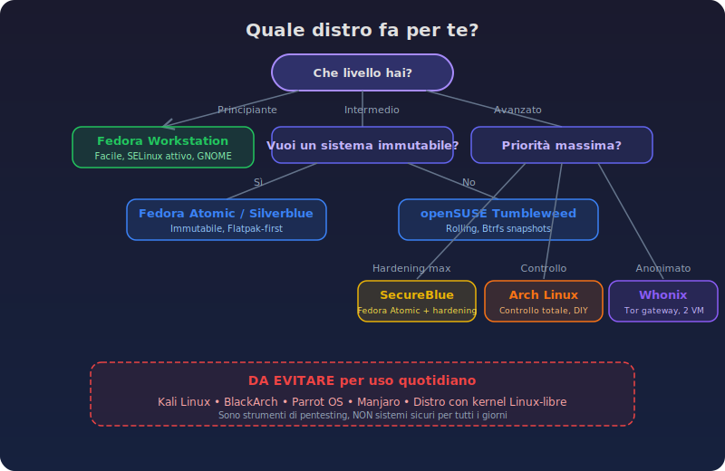
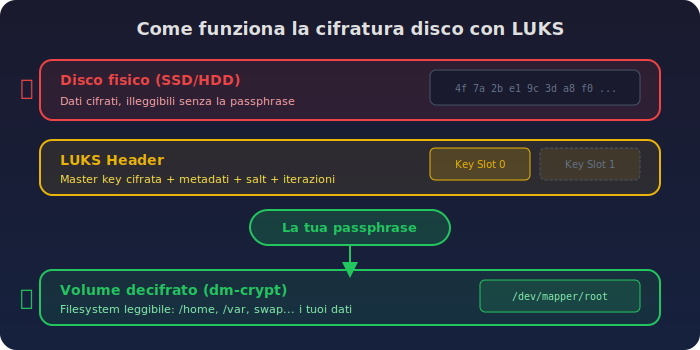
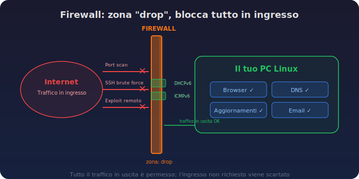
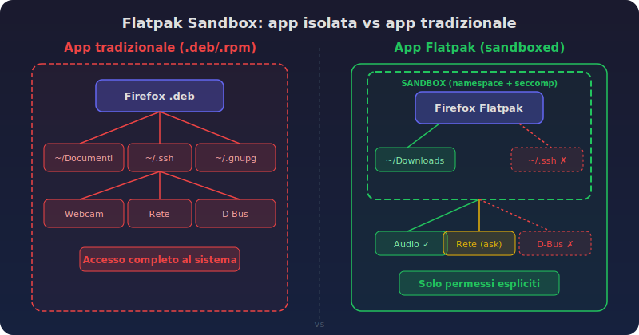
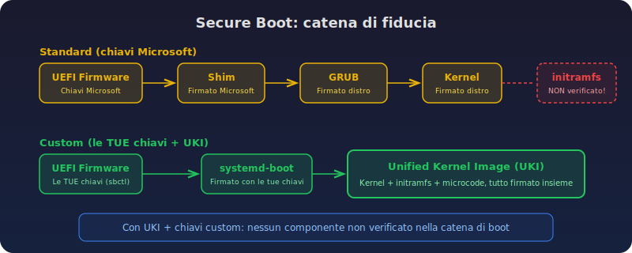

> **TL;DR** - In questa guida imparerai:
> - Come scegliere la distribuzione Linux giusta per le tue esigenze di sicurezza e privacy
> - Come configurare cifratura disco, firewall e hardening del kernel fin dall'installazione
> - Come isolare le applicazioni con Flatpak, Firejail e sandboxing avanzato
> - Come verificare che il tuo sistema sia effettivamente protetto con test pratici

Il mondo Linux è spesso dipinto come un paradiso di sicurezza: basta installare una distro qualsiasi e magicamente sei al sicuro da tutto. La realtà è un po' diversa. Un sistema Linux desktop, senza le giuste configurazioni, può essere sorprendentemente vulnerabile. La buona notizia? Con le conoscenze giuste e un po' di pazienza potete trasformare il vostro setup in una vera fortezza.

Questa guida vi accompagnerà passo dopo passo: dalla scelta della distribuzione giusta fino alla configurazione di ogni aspetto di sicurezza. Non sarà una passeggiata, ma alla fine avrete un sistema di cui potrete fidarvi davvero.

Ricordate che la sicurezza è un processo, non un prodotto. Non esiste il setup perfetto, ma esiste il setup *giusto per voi*. Ogni sezione di questa guida presenta pro e contro, così potete decidere cosa ha senso nel vostro caso specifico.

La guida è aperta a miglioramenti e consigli. Se volete contribuire, segnalare errori o proporre aggiunte, fate una pull request su [GitHub](https://github.com/Turtlecute33/Turtlecute.org) e supportate lo sviluppo di queste guide con una [donazione](https://btcpay.priorato.org/api/v1/invoices?storeId=2B1STLH5REvhHZBRQuyJNieRTexpeuJ4Usjn4ziEfEfd&currency=EUR).



## Perché usare Linux per la sicurezza? {#perche-linux style="color: white;"}

Prima di tutto: perché dovreste usare Linux? Non per partito preso, ma per ragioni concrete.

### Trasparenza e controllo

Linux è open source. Questo significa che il codice sorgente è visibile, verificabile e modificabile da chiunque. Quando Microsoft o Apple dicono "non raccogliamo i tuoi dati", dovete fidarvi sulla parola. Con Linux, potete verificare. Non è una garanzia assoluta (nessuno legge milioni di righe di codice per hobby), ma la possibilità di audit è un vantaggio enorme.

Il controllo è totale: decidete voi cosa gira sul vostro sistema, quali servizi sono attivi, cosa comunica con l'esterno. Nessun aggiornamento forzato, nessuna telemetria nascosta, nessun bloatware preinstallato.

### I limiti da conoscere

Occhi aperti: Linux desktop non è automaticamente più sicuro di Windows o macOS. Anzi, in alcuni aspetti è *meno* protetto out of the box:

- **Sandboxing delle applicazioni**: macOS e Windows hanno meccanismi di isolamento delle app molto più maturi. Su Linux desktop tradizionale, un'applicazione ha accesso quasi completo al vostro sistema
- **Secure Boot**: l'implementazione su Linux è ancora in fase di maturazione rispetto a Windows
- **Driver e firmware**: il supporto hardware può essere più limitato, e driver non ufficiali possono introdurre vulnerabilità
- **Superficie d'attacco del desktop**: X11 (il vecchio protocollo grafico, ormai rimpiazzato da Wayland sulla maggior parte delle distro) era un colabrodo dal punto di vista della sicurezza, dato che qualsiasi finestra poteva registrare lo schermo, catturare input e iniettare comandi in altre finestre

Detto questo, Linux vi dà gli strumenti per risolvere tutti questi problemi. È solo che dovete configurarli voi. Ed è esattamente quello che faremo in questa guida.

## Scelta della distribuzione Linux sicura {#scelta-distro style="color: white;"}

La scelta della distribuzione è il fondamento di tutto. Una scelta sbagliata qui può rendere inutile tutto il lavoro successivo. Vediamo i criteri che contano davvero.

### Rolling release vs fixed release

Questo è un punto su cui c'è molta confusione. Molti pensano che le distribuzioni "stabili" (come Debian stable) siano più sicure perché cambiano meno. In realtà è spesso il contrario.

Le distribuzioni fixed release (come Debian) congelano le versioni dei pacchetti e applicano solo patch di sicurezza tramite backport. Il problema? Non tutte le fix di sicurezza ricevono un CVE (un identificativo ufficiale), e quindi non vengono mai portate nella distribuzione. Inoltre, il processo di backporting può esso stesso introdurre bug. Debian stessa ha avuto casi in cui una patch backportata ha creato vulnerabilità (il famoso caso DSA-1571 con OpenSSL).

Le distribuzioni rolling o semi-rolling (come Fedora, openSUSE Tumbleweed, Arch) aggiornano i pacchetti alla versione upstream. Questo significa che ricevete le fix di sicurezza come le ha scritte lo sviluppatore originale, senza modifiche intermedie.



**Il mio consiglio**: se avete paura degli aggiornamenti frequenti, scegliete una distribuzione che offra meccanismi di rollback (come Fedora con dnf history o openSUSE con Btrfs snapshots). Così avete il meglio di entrambi i mondi: pacchetti aggiornati e la possibilità di tornare indietro se qualcosa si rompe.

### Desktop environment: perché GNOME

A mio parere il miglior desktop environment dal punto di vista della sicurezza è **GNOME**, e il motivo è uno: **Wayland**.

La buona notizia è che ormai la maggior parte delle distribuzioni principali (Fedora, Ubuntu, openSUSE, ecc.) usa Wayland come protocollo grafico di default. Wayland è il successore di X11 e risolve uno dei problemi di sicurezza più gravi del desktop Linux: con il vecchio X11, qualsiasi finestra poteva registrare lo schermo, catturare i tasti premuti e iniettare input in altre finestre, rendendo praticamente inutile qualsiasi tentativo di sandboxing.

Con Wayland le applicazioni sono isolate tra loro a livello grafico. GNOME in particolare implementa un sistema di permessi per i protocolli privilegiati (come la cattura dello schermo): le app devono chiedere il permesso e l'utente deve autorizzarle esplicitamente.

**!ATTENZIONE!** Se per qualche motivo state ancora usando un desktop environment con X11 (alcune distro meno aggiornate o configurazioni custom), molte delle protezioni descritte in questa guida (specialmente il sandboxing) saranno significativamente meno efficaci. Verificate di star usando Wayland con il comando `echo $XDG_SESSION_TYPE` (deve restituire `wayland`).

### Distribuzioni consigliate

Dopo aver analizzato decine di distribuzioni, ecco quelle che consiglio in base a diversi profili di utente.

#### Fedora Workstation: la scelta bilanciata

Fedora è una distribuzione semi-rolling: il kernel e i pacchetti chiave vengono aggiornati frequentemente, mentre GNOME segue il ciclo di release ufficiale. Ogni versione è supportata per circa un anno, con nuove release ogni sei mesi.

**Perché Fedora:**
- Approccio "upstream first": le patch sono minime e sensate
- Tra le prime ad adottare tecnologie moderne (Wayland, PipeWire)
- Il package manager `dnf` supporta rollback e undo delle operazioni
- SELinux attivo e in modalità enforcing di default
- Community enorme e documentazione eccellente

**Contro:**
- Richiede una reinstallazione (o upgrade) ogni 6-12 mesi per restare supportati
- Alcuni pacchetti proprietari richiedono repository aggiuntivi (RPM Fusion)

#### Fedora Atomic Desktops: il futuro immutabile

Le varianti Atomic di Fedora (Silverblue per GNOME, Kinoite per KDE) usano un approccio immutabile: il sistema base è in sola lettura e gli aggiornamenti vengono scaricati come immagini complete prima di essere applicati.

Questo significa che un aggiornamento non può fallire a metà lasciandovi con un sistema rotto. Se qualcosa va storto, un singolo riavvio vi riporta allo stato precedente. Le applicazioni si installano principalmente via Flatpak (sandboxate) o container (Toolbox/Distrobox).

**Contro:**
- Flusso di lavoro diverso dal Linux tradizionale (richiede adattamento)
- Alcuni software non disponibili come Flatpak richiedono workaround
- La dipendenza da GRUB impedisce l'uso di Unified Kernel Images (limitando il Secure Boot avanzato)

#### SecureBlue: hardening automatico

SecureBlue è basato su Fedora Atomic e aggiunge un layer di hardening significativo:

- **Trivalent**: un browser Chromium hardened con le patch di GrapheneOS Vanadium
- **Hardened Malloc**: l'allocatore di memoria di GrapheneOS applicato a tutto il sistema
- Configurazioni di sicurezza del kernel pre-applicate
- Blacklist di moduli kernel non necessari

È la distribuzione che vi consiglio se volete il massimo della sicurezza con il minimo sforzo di configurazione manuale. L'unico trade-off è che dovete fidarvi di un progetto aggiuntivo oltre a Fedora.

#### openSUSE Aeon: rolling e immutabile

L'alternativa rolling release nel mondo immutabile. Usa Btrfs con snapshot transazionali: gli aggiornamenti vengono applicati a uno snapshot e attivati solo al riavvio, con la possibilità di tornare indietro in qualsiasi momento.

Ha un set di pacchetti base minimale (riduce la superficie d'attacco) e il sistema è montato in sola lettura.

#### Whonix: per l'anonimato

Se il vostro obiettivo è l'anonimato (non solo la privacy), Whonix è il riferimento. Funziona come due macchine virtuali: una Workstation dove lavorate e un Gateway che instrada tutto il traffico attraverso Tor.

Anche se un malware compromette la Workstation, non può scoprire il vostro vero indirizzo IP perché tutto il networking passa dal Gateway. Include anche keystroke anonymization, boot clock randomization, swap cifrato e parametri kernel hardened.



**Contro:**
- Basato su Debian (pacchetti più vecchi)
- Richiede virtualizzazione (prestazioni ridotte)
- Non adatto come sistema operativo principale



### Distribuzioni da evitare

Alcune distribuzioni sono spesso consigliate per motivi sbagliati:

- **Kali Linux, BlackArch, Parrot OS**: sono strumenti per penetration testing, *non* sistemi sicuri per uso quotidiano. Hanno tool offensivi preinstallati e spesso girano come root. Usarli come desktop quotidiano è come guidare un'ambulanza per andare a fare la spesa
- **Distribuzioni con kernel Linux-libre**: rimuovono le mitigazioni di sicurezza per il microcode proprietario e sopprimono gli avvisi di vulnerabilità CPU. Per motivi ideologici sacrificano la vostra sicurezza concreta
- **Manjaro**: tiene indietro i pacchetti rispetto ad Arch senza un vero vantaggio di stabilità, creando una finestra di vulnerabilità inutile

## Installazione sicura di Linux con cifratura disco {#installazione style="color: white;"}

Ok, avete scelto la vostra distribuzione. Ora vediamo come installarla nel modo corretto fin dall'inizio. Alcune di queste configurazioni non possono essere fatte dopo, quindi occhi aperti e attenzione al massimo!

### Cifratura completa del disco (LUKS)

È fondamentale abilitare la cifratura completa del disco durante l'installazione. Con LUKS (Linux Unified Key Setup) tutti i dati sul vostro disco vengono cifrati: se qualcuno ruba il vostro laptop, senza la password non potrà leggere nulla.

**!ATTENZIONE!** Se non abilitate la cifratura durante l'installazione, dovrete fare il backup di tutti i dati e reinstallare da zero. Non è possibile cifrare un disco già in uso senza perdere i dati.

Durante l'installazione, quando arrivate al partizionamento:

1. Scegliete l'opzione di cifratura del disco (su Fedora si chiama "Encrypt my data")
2. Impostate una passphrase lunga e complessa (questa è la chiave del vostro regno)
3. Se il vostro installer lo supporta, usate l'opzione `--integrity` con cryptsetup per avere cifratura autenticata

Per chi vuole il massimo: la cifratura autenticata verifica che i dati non siano stati manomessi, non solo che siano illeggibili. È un layer di protezione aggiuntivo contro attacchi fisici sofisticati.



### Swap cifrato

Lo swap è un'area del disco usata come memoria aggiuntiva quando la RAM è piena. Il problema? Può contenere dati sensibili (password, chiavi di cifratura, documenti aperti) in chiaro.

Le opzioni sono due:

- **Swap cifrato**: configuratelo durante il partizionamento insieme a LUKS
- **ZRAM**: usa la RAM compressa invece del disco. Fedora lo usa di default ed è l'opzione preferibile, più veloce e nessun dato sensibile finisce su disco

### Partizionamento con opzioni di mount sicure

Per un hardening aggiuntivo, potete configurare opzioni di mount restrittive su alcune partizioni:

| Partizione | Opzioni | Effetto |
|-----------|---------|---------|
| `/boot` | `nodev,noexec,nosuid` | Impedisce esecuzione di codice nella partizione di boot |
| `/boot/efi` | `nodev,noexec,nosuid` | Protegge la partizione EFI |
| `/var` | `nodev,nosuid` | Limita i permessi sulla partizione dei dati variabili |

> **Attenzione!** Non aggiungete `noexec` a `/home` o `/root` perché romperebbe Flatpak e Snap. Allo stesso modo, evitate `noexec` su `/var/tmp` se usate Arch (le build AUR fallirebbero).

Queste opzioni non sono infallibili (`noexec` è relativamente facile da aggirare), ma aggiungono un layer di difesa in profondità che può bloccare attacchi automatizzati.

### Username e hostname generici

Un dettaglio che molti trascurano: il vostro username e hostname vengono trasmessi in vari modi sulla rete e possono essere usati per identificarvi.

- Usate un username generico come `user` invece del vostro nome
- Impostate l'hostname a `localhost`:

```bash
sudo hostnamectl hostname "localhost"
```

## Hardening post-installazione: aggiornamenti e configurazione base {#post-installazione style="color: white;"}

Installazione completata, disco cifrato, partizioni configurate. Ora inizia il vero lavoro di hardening.

### Aggiornamenti e microcode

Prima di tutto, aggiornate il sistema:

```bash
# Fedora
sudo dnf upgrade --refresh

# Debian/Ubuntu
sudo apt update && sudo apt upgrade -y

# Arch
sudo pacman -Syu
```

Poi assicuratevi di avere il microcode della CPU installato. Il microcode è firmware che corregge bug e vulnerabilità direttamente nel processore. Senza di esso, siete vulnerabili a tutta una serie di attacchi hardware (Spectre, Meltdown e compagnia).

```bash
# Fedora (incluso di default)
# Verificate con:
dnf list installed | grep microcode

# Debian
sudo apt install intel-microcode   # per CPU Intel
sudo apt install amd64-microcode   # per CPU AMD

# Arch
sudo pacman -S intel-ucode   # per CPU Intel
sudo pacman -S amd-ucode     # per CPU AMD
```

### Aggiornamenti firmware

Molti dispositivi hanno firmware aggiornabile che può contenere fix di sicurezza. Usate `fwupd`:

```bash
sudo fwupdmgr refresh
sudo fwupdmgr update
```

### Disabilitare la telemetria

Alcune distribuzioni raccolgono dati anonimi sull'uso. Anche se le intenzioni sono buone, meno dati condividete e meglio è:

```bash
# Fedora — disabilita il conteggio installazioni
echo "countme=false" | sudo tee -a /etc/dnf/dnf.conf

# openSUSE — svuota l'identificativo anonimo
sudo truncate -s 0 /var/lib/zypp/AnonymousUniqueId
```

### Configurare umask restrittivo

L'umask controlla i permessi di default dei nuovi file. Il valore di default (`022`) crea file leggibili da tutti gli utenti del sistema. Con `077`, solo il vostro utente può leggere i file che create:

```bash
# Aggiungete a /etc/profile o /etc/bash.bashrc
umask 077
```

> **Attenzione!** Su openSUSE questo può rompere Snapper. Su Ubuntu, i file dei repository in `/etc/apt/sources.list.d/` devono avere permessi 644, non 600. Verificate dopo l'applicazione.

## Hardening della rete: firewall, DNS e MAC randomization {#rete style="color: white;"}

La rete è uno dei vettori di attacco più comuni. Vediamo come blindarla.

### MAC address randomization

Il MAC address è un identificativo unico della vostra scheda di rete. Ogni volta che vi connettete a un WiFi, il router lo vede e può tracciare la vostra presenza. Randomizzandolo, ogni connessione appare come un dispositivo diverso.

Create il file `/etc/NetworkManager/conf.d/00-macrandomize.conf`:

```ini
[device]
wifi.scan-rand-mac-address=yes

[connection]
wifi.cloned-mac-address=random
ethernet.cloned-mac-address=random
```

Poi riavviate NetworkManager:

```bash
sudo systemctl restart NetworkManager
```

### Firewall

Un firewall è assolutamente obbligatorio. La configurazione che consiglio è restrittiva: blocca tutto il traffico in ingresso tranne quello esplicitamente autorizzato.

#### Fedora/openSUSE (firewalld)

```bash
# Imposta la zona di default a "drop" (blocca tutto)
sudo firewall-cmd --set-default-zone=drop

# Permetti ICMPv6 (necessario per il funzionamento di IPv6)
sudo firewall-cmd --add-protocol=ipv6-icmp --permanent

# Permetti DHCPv6 (necessario per ottenere l'indirizzo IPv6)
sudo firewall-cmd --add-service=dhcpv6-client --permanent

# Applica le regole
sudo firewall-cmd --reload

# Abilita il lockdown (impedisce bypass via polkit)
sudo firewall-cmd --lockdown-on
```

#### Debian/Ubuntu (ufw)

```bash
sudo apt install ufw
sudo ufw default deny incoming
sudo ufw default allow outgoing
sudo ufw enable
```

`ufw` è più semplice di firewalld ma meno flessibile. Non supporta le zone e non ha il lockdown mode. Per un desktop è comunque più che sufficiente.



**Ricordate che** un firewall software non può proteggere contro malware che gira con privilegi elevati sul vostro sistema. È un layer di difesa, non una soluzione completa.

### DNSSEC

Il DNS tradizionale è in chiaro e non autenticato: chiunque nel percorso tra voi e il server DNS può vedere le vostre query e potenzialmente modificare le risposte. DNSSEC aggiunge una firma crittografica alle risposte DNS.

Se usate `systemd-resolved`:

```bash
# Editate /etc/systemd/resolved.conf
# Impostate:
DNSSEC=yes

# Riavviate il servizio
sudo systemctl restart systemd-resolved
```

Assicuratevi di usare un DNS provider che supporti DNSSEC. Per un layer aggiuntivo di privacy, considerate di usare DNS-over-TLS o DNS-over-HTTPS.

### Sincronizzazione oraria sicura

NTP, il protocollo standard per la sincronizzazione dell'ora, trasmette in chiaro e senza autenticazione. Un attaccante potrebbe manipolare l'ora del vostro sistema, compromettendo certificati TLS e log.

La soluzione è **Network Time Security (NTS)** con chronyd:

```bash
# Installate chrony (se non già presente)
# Fedora: già incluso
# Debian/Ubuntu:
sudo apt install chrony
```

Editate `/etc/chrony.conf` e usate server NTS. Un buon riferimento è la configurazione di GrapheneOS:

```
server time.cloudflare.com iburst nts
server ntppool1.time.nl iburst nts
server nts.netnod.se iburst nts
server ptbtime1.ptb.de iburst nts
minsources 2
```

Il parametro `minsources 2` richiede che almeno 2 sorgenti indipendenti concordino sull'ora, rendendo molto più difficile un attacco.

Abilitate il filtro seccomp per chrony:

```bash
# Fedora/Arch — editate /etc/sysconfig/chronyd
OPTIONS="-F 1"

# Poi riavviate
sudo systemctl restart chronyd
```

## Hardening del kernel Linux: sysctl, boot e moduli {#kernel style="color: white;"}

Il kernel è il cuore del sistema operativo. Indurirlo significa ridurre drasticamente la superficie d'attacco disponibile a un eventuale malware.

### Parametri sysctl

I parametri sysctl controllano il comportamento del kernel a runtime. Create un file `/etc/sysctl.d/99-hardening.conf` con le seguenti configurazioni essenziali:

```ini
# Protezione rete
net.ipv4.conf.all.accept_redirects = 0
net.ipv4.conf.default.accept_redirects = 0
net.ipv6.conf.all.accept_redirects = 0
net.ipv6.conf.default.accept_redirects = 0
net.ipv4.conf.all.send_redirects = 0
net.ipv4.conf.default.send_redirects = 0
net.ipv4.conf.all.accept_source_route = 0
net.ipv4.conf.default.accept_source_route = 0
net.ipv6.conf.all.accept_source_route = 0
net.ipv6.conf.default.accept_source_route = 0
net.ipv4.conf.all.rp_filter = 1
net.ipv4.conf.default.rp_filter = 1
net.ipv4.icmp_echo_ignore_all = 1
net.ipv4.tcp_syncookies = 1
net.ipv4.tcp_timestamps = 0

# Protezione kernel
kernel.sysrq = 0
kernel.core_uses_pid = 1
kernel.kptr_restrict = 2
kernel.dmesg_restrict = 1
kernel.perf_event_paranoid = 3
kernel.yama.ptrace_scope = 2
kernel.unprivileged_bpf_disabled = 1
net.core.bpf_jit_harden = 2

# Protezione memoria
vm.mmap_rnd_bits = 32
vm.mmap_rnd_compat_bits = 16
vm.swappiness = 1

# ASLR massimo
kernel.randomize_va_space = 2
```

Applicate con:

```bash
sudo sysctl --system
```

Diciamo che questi parametri coprono le basi. Per una configurazione più completa, potete fare riferimento al [repository di TommyTran732](https://github.com/TommyTran732/Linux-Setup-Scripts/blob/main/etc/sysctl.d/99-workstation.conf) che mantiene una configurazione sysctl aggiornata per workstation.



### Parametri di boot del kernel

Questi parametri vanno aggiunti alla configurazione del bootloader (GRUB o systemd-boot). Su sistemi con rpm-ostree (Fedora Atomic), usate `rpm-ostree kargs` invece di editare GRUB.

#### Mitigazioni CPU

```
mitigations=auto,nosmt spectre_v2=on spectre_bhi=on spec_store_bypass_disable=on tsx=off kvm.nx_huge_pages=force nosmt=force l1d_flush=on spec_rstack_overflow=safe-ret gather_data_sampling=force reg_file_data_sampling=on
```

**!ATTENZIONE!** Disabilitare SMT (Simultaneous Multi-Threading / Hyper-Threading) ha un impatto significativo sulle prestazioni. Se lavorate con carichi intensivi (compilazione, video editing, gaming), potreste voler rimuovere `nosmt=force` accettando un rischio leggermente maggiore.

#### Protezione memoria e kernel

```
slab_nomerge init_on_alloc=1 init_on_free=1 pti=on vsyscall=none page_alloc.shuffle=1 randomize_kstack_offset=on debugfs=off oops=panic quiet loglevel=0
```

Questi parametri:
- `slab_nomerge`: impedisce il merging delle cache slab (riduce l'efficacia degli heap exploit)
- `init_on_alloc=1 init_on_free=1`: azzera la memoria quando viene allocata e liberata (previene leak di dati)
- `pti=on`: isola le page table del kernel da quelle dell'utente (mitigazione Meltdown)
- `vsyscall=none`: disabilita le vsyscall legacy (vettore di attacco noto)
- `debugfs=off`: disabilita il filesystem di debug (riduce la superficie d'attacco)

#### Mitigazioni DMA

```
intel_iommu=on amd_iommu=force_isolation efi=disable_early_pci_dma iommu=force iommu.passthrough=0 iommu.strict=1
```

Questi proteggono contro attacchi DMA da dispositivi hardware (come Thunderbolt o PCIe). Ricordate che non offrono una protezione completa: un attacco durante l'early boot può comunque compromettere il kernel prima che l'IOMMU sia attivo.

#### Come applicare su Fedora (GRUB)

```bash
# Editate /etc/default/grub
# Aggiungete i parametri a GRUB_CMDLINE_LINUX
sudo grub2-mkconfig -o /boot/grub2/grub.cfg
```

#### Come applicare su Fedora Atomic (rpm-ostree)

```bash
rpm-ostree kargs --append="slab_nomerge" --append="init_on_alloc=1" --append="init_on_free=1" --append="pti=on"
# Aggiungete ogni parametro singolarmente
```

### Blacklist dei moduli kernel

Molti moduli kernel vengono caricati automaticamente ma non sono necessari per il vostro hardware. Ogni modulo caricato è codice in più che gira con i massimi privilegi, una potenziale superficie d'attacco.

Create un file `/etc/modprobe.d/blacklist.conf`. Un buon punto di partenza è la [blacklist di SecureBlue](https://github.com/secureblue/secureblue/blob/live/files/system/etc/modprobe.d/blacklist.conf).

I moduli più importanti da disabilitare se non li usate:

```bash
# Filesystem non necessari
install cramfs /bin/false
install freevxfs /bin/false
install hfs /bin/false
install hfsplus /bin/false
install jffs2 /bin/false
install udf /bin/false

# Protocolli di rete non necessari
install dccp /bin/false
install sctp /bin/false
install rds /bin/false
install tipc /bin/false

# Bluetooth (commentate se lo usate)
install bluetooth /bin/false
install btusb /bin/false

# Thunderbolt (commentate se lo usate)
install thunderbolt /bin/false

# Webcam (commentate se la usate)
install uvcvideo /bin/false
```

> **Attenzione!** Prima di disabilitare `hfsplus`, verificate il filesystem della vostra partizione EFI. Se è HFS+, disabilitarlo impedirebbe il boot. Verificate con `df -T /boot/efi`.

### Hardened Memory Allocator

L'allocatore di memoria di default (glibc malloc) non ha protezioni avanzate contro gli exploit basati sulla corruzione della memoria. **hardened_malloc** di GrapheneOS è un'alternativa che aggiunge guardie, randomizzazione e controlli di integrità.

```bash
# Fedora — dal repository Copr di SecureBlue
sudo dnf copr enable secureblue/hardened_malloc
sudo dnf install hardened_malloc

# Arch — da AUR
yay -S hardened_malloc-git
```

Per attivarlo globalmente, aggiungete a `/etc/ld.so.preload`:

```
/usr/lib64/libhardened_malloc.so
```

Oppure per applicazione singola:

```bash
LD_PRELOAD=/usr/lib64/libhardened_malloc.so firefox
```

### Kernel alternativi

Per chi vuole spingersi oltre, esistono kernel con patch di hardening aggiuntive:

- **linux-hardened** (Arch Linux): include patch di sicurezza, disabilita i user namespaces non privilegiati di default (può rompere Podman/LXC/Flatpak, verificate la compatibilità)
- **grsecurity**: il gold standard dell'hardening kernel, ma è proprietario e richiede un abbonamento a pagamento

## Sandboxing delle applicazioni: Flatpak, Firejail e SELinux {#sandboxing style="color: white;"}

Su un desktop Linux tradizionale, ogni applicazione ha accesso a quasi tutto: i vostri file, la rete, le periferiche, le altre applicazioni in esecuzione. Il sandboxing limita questi accessi al minimo necessario.

### Flatpak: l'opzione consigliata

Flatpak è il sistema di distribuzione di app più maturo per il sandboxing su Linux desktop. Ogni app gira in un sandbox con permessi espliciti.

Il problema? Molte app Flatpak richiedono permessi troppo ampi di default. Ecco come restringerli.



#### Restrizione globale dei permessi

Applicate prima una policy restrittiva a tutte le app, poi concedete permessi specifici dove necessario:

```bash
sudo flatpak override --system \
  --nosocket=x11 --nosocket=fallback-x11 \
  --nosocket=pulseaudio --nosocket=session-bus \
  --nosocket=system-bus --unshare=network \
  --unshare=ipc --nofilesystem=host:reset \
  --nodevice=input --nodevice=shm --nodevice=all \
  --no-talk-name=org.freedesktop.Flatpak \
  --no-talk-name=org.freedesktop.systemd1 \
  --no-talk-name=ca.desrt.dconf \
  --no-talk-name=org.gnome.Shell.Extensions
```

Poi fate lo stesso per l'installazione utente:

```bash
flatpak override --user \
  --nosocket=x11 --nosocket=fallback-x11 \
  --nosocket=pulseaudio --nosocket=session-bus \
  --nosocket=system-bus --unshare=network \
  --unshare=ipc --nofilesystem=host:reset \
  --nodevice=input --nodevice=shm --nodevice=all \
  --no-talk-name=org.freedesktop.Flatpak \
  --no-talk-name=org.freedesktop.systemd1 \
  --no-talk-name=ca.desrt.dconf \
  --no-talk-name=org.gnome.Shell.Extensions
```

#### Permessi critici da capire

Ecco cosa significano i permessi più pericolosi:

| Permesso | Rischio |
|----------|---------|
| `--socket=session-bus` / `--socket=system-bus` | Permette escape dal sandbox via D-Bus |
| `--talk-name=org.freedesktop.Flatpak` | Permette escape dal sandbox via D-Bus di Flatpak |
| `--talk-name=org.freedesktop.systemd1` | Permette di caricare servizi systemd arbitrari |
| `--talk-name=ca.desrt.dconf` | Permette di modificare keybinding (esecuzione comandi) |
| `--device=all` | Accesso a tutti i dispositivi (webcam, microfono, ecc.) |
| `--filesystem=host` | Accesso a tutto il filesystem |
| `--share=network` | Accesso alla rete |

**La strategia è**: revocate tutto prima, poi testate se l'app funziona. Se non funziona, concedete un permesso alla volta fino a trovare il minimo necessario.

#### Flatseal: gestione visuale dei permessi

Per gestire i permessi senza impazzire con la riga di comando, installate Flatseal:

```bash
flatpak install flathub com.github.tchx84.Flatseal

flatpak --user override com.github.tchx84.Flatseal \
  --filesystem=/var/lib/flatpak/app:ro \
  --filesystem=xdg-data/flatpak/app:ro \
  --filesystem=xdg-data/flatpak/overrides:create
```

Flatseal vi mostrerà tutti i permessi di ogni app Flatpak con un'interfaccia grafica chiara e semplice.

**!ATTENZIONE!** Non abilitate gli aggiornamenti automatici non presidiati di Flatpak. Quando un'app si aggiorna, nuovi permessi vengono concessi automaticamente senza notifica. Aggiornate manualmente e controllate i changelog.

### Firejail: per le app native

Per le applicazioni installate dai repository della distribuzione (non Flatpak), Firejail può fornire sandboxing basato su namespace e seccomp:

```bash
# Installazione
sudo apt install firejail    # Debian/Ubuntu
sudo dnf install firejail    # Fedora
sudo pacman -S firejail      # Arch

# Attivazione automatica per tutte le app con profilo
sudo firecfg
```

`firecfg` crea dei symlink che fanno passare automaticamente le applicazioni attraverso Firejail quando le lanciate dal menu.

**Limiti di Firejail:**
- È un binario SUID molto grande, con una superficie d'attacco significativa (privilegi elevati)
- Il sandboxing è bypassabile se lanciate l'app direttamente da `/usr/bin/nome_app` invece che dal menu
- Il vantaggio principale rispetto a Flatpak: può confinare finestre X11 usando Xpra/Xephyr

A mio parere, se potete usare Flatpak, preferitelo. Usate Firejail solo per le app che non sono disponibili come Flatpak.

### Mandatory Access Control (MAC)

I sistemi MAC come SELinux e AppArmor aggiungono un layer di controllo degli accessi che va oltre i permessi Unix tradizionali. Anche se un'applicazione gira come root, il MAC può impedirle di accedere a risorse non autorizzate dalla policy.

- **Fedora**: SELinux è attivo e in enforcing mode di default. Non disabilitatelo
- **openSUSE**: potete scegliere tra SELinux e AppArmor durante l'installazione
- **Arch**: dovete installare e configurare AppArmor manualmente

Ricordate che sulle distribuzioni desktop tradizionali, il MAC confina solo alcuni demoni di sistema, non tutte le applicazioni. È un layer di difesa importante ma non completo.

## Secure Boot e sicurezza fisica del sistema {#sicurezza-fisica style="color: white;"}

Tutto l'hardening software del mondo non serve a nulla se qualcuno può accedere fisicamente alla vostra macchina e manometterla.

### Secure Boot con chiavi personalizzate

Il Secure Boot standard verifica che il bootloader e il kernel siano firmati da chiavi fidate (di solito Microsoft). Il problema? Le chiavi Microsoft hanno una superficie d'attacco enorme perché firmano driver e bootloader di terze parti.



Con **sbctl** potete iscrivere le vostre chiavi personali:

1. Entrate nel firmware UEFI e mettete il Secure Boot in "setup mode"
2. Avviate Linux e installate sbctl
3. Generate e iscrivete le vostre chiavi:

```bash
# Installazione
sudo dnf install sbctl       # Fedora
sudo pacman -S sbctl          # Arch

# Generazione chiavi
sudo sbctl create-keys

# Iscrizione chiavi
sudo sbctl enroll-keys

# Firma del kernel e bootloader
sudo sbctl sign -s /boot/vmlinuz-linux
sudo sbctl sign -s /boot/EFI/BOOT/BOOTX64.EFI
```

**!ATTENZIONE!** Questa procedura può brickare alcune implementazioni UEFI non conformi. Fate ricerche sul vostro hardware specifico prima di procedere. Preparate un metodo di riprogrammazione dell'EEPROM come fallback.

### Unified Kernel Image (UKI)

Un UKI combina kernel, initramfs e microcode in una singola immagine firmata. Questo impedisce la manomissione dell'initramfs (un vettore di attacco che il Secure Boot standard non copre).

La configurazione è specifica per ogni distribuzione e bootloader. Su Fedora con systemd-boot e dracut, il processo coinvolge:

1. Configurare dracut per generare UKI
2. Firmare l'UKI con le chiavi sbctl
3. Agganciare le chiavi di cifratura ai PCR del TPM (minimo PCR 7, ideale PCR 0,1,2,3,5,7,14)

**Nota**: i UKI non funzionano bene con Fedora Silverblue/Kinoite al momento. È una limitazione nota.

### Protezioni post-setup

- **Password UEFI**: impostate una password supervisor/administrator nel firmware UEFI per impedire modifiche alle impostazioni di boot
- **Disabilitare il boot da USB**: impedisce a qualcuno di avviare un sistema live dal vostro hardware
- **USBGuard**: protegge contro attacchi BadUSB e Rubber Ducky controllando quali dispositivi USB vengono autorizzati

```bash
sudo dnf install usbguard    # Fedora
sudo apt install usbguard    # Debian/Ubuntu

# Genera una policy basata sui dispositivi attualmente collegati
sudo usbguard generate-policy > /etc/usbguard/rules.conf
sudo systemctl enable --now usbguard
```

### Disabilitare l'auto-mount dei media

L'auto-mount di chiavette USB e altri media rimovibili è un vettore di attacco classico. Su GNOME:

```bash
echo '[org/gnome/desktop/media-handling]
automount=false
automount-open=false' | sudo tee /etc/dconf/db/local.d/automount-disable

echo 'org/gnome/desktop/media-handling/automount
org/gnome/desktop/media-handling/automount-open' | sudo tee /etc/dconf/db/local.d/locks/automount-disable

sudo dconf update
```

## Hardening SSH, autenticazione e accesso {#autenticazione style="color: white;"}

### SSH hardening

Se avete SSH attivo (magari per accesso remoto al vostro desktop), è fondamentale configurarlo correttamente. Editate `/etc/ssh/sshd_config`:

```bash
# Disabilita login come root
PermitRootLogin no

# Solo autenticazione con chiave pubblica
PasswordAuthentication no
PubkeyAuthentication yes

# Protocollo 2 (il default su sistemi moderni)
Protocol 2

# Limita i tentativi di login
MaxAuthTries 3

# Disabilita forwarding non necessario
X11Forwarding no
AllowTcpForwarding no
AllowAgentForwarding no

# Timeout per sessioni inattive
ClientAliveInterval 300
ClientAliveCountMax 2

# Limita gli utenti che possono connettersi
AllowUsers il_vostro_username
```

Dopo le modifiche:

```bash
sudo systemctl restart sshd
```

Consiglio caldamente di usare **solo chiavi SSH** per l'autenticazione (disabilitando completamente le password). Per generare una coppia di chiavi:

```bash
ssh-keygen -t ed25519 -a 100
```

### Autenticazione a due fattori con FIDO2

Per il login locale e sudo, potete aggiungere un secondo fattore usando una chiave FIDO2 (come YubiKey):

```bash
# Installazione
sudo dnf install pam-u2f      # Fedora
sudo apt install libpam-u2f   # Debian/Ubuntu

# Registrazione della chiave
mkdir -p ~/.config/Yubico
pamu2fcfg > ~/.config/Yubico/u2f_keys
```

> **Attenzione!** Quando configurate pam-u2f, usate sempre valori hardcoded per `origin` e `appid` come descritto nella documentazione ArchWiki. Non usate i default `pam://$HOSTNAME` perché se cambiate l'hostname il login smetterà di funzionare.

### PAM hardening (Fedora/RHEL)

Su distribuzioni Red Hat, `authselect` semplifica il hardening di PAM:

```bash
sudo authselect select with-faillock without-nullok with-pamaccess
```

Questo abilita:
- **faillock**: blocca l'account dopo troppi tentativi falliti
- **without-nullok**: impedisce login con password vuota
- **with-pamaccess**: abilita il controllo accessi tramite `/etc/security/access.conf`

### Gestione utenti e privilegi

Alcune regole base che spesso vengono ignorate:

- **Non usate root direttamente**: usate sempre `sudo` per i comandi privilegiati
- **Limitate il gruppo sudo/wheel**: solo gli utenti che ne hanno davvero bisogno
- **Password policy**: impostate una lunghezza minima e una complessità ragionevole
- **Controllate gli account**: rimuovete o disabilitate account non utilizzati

```bash
# Verifica utenti con shell di login
grep -v '/nologin\|/false' /etc/passwd

# Blocca un account non utilizzato
sudo usermod -L nome_utente

# Verifica chi è nel gruppo sudo/wheel
getent group sudo    # Debian/Ubuntu
getent group wheel   # Fedora/Arch
```

## Ridurre la superficie d'attacco: disabilitare servizi non necessari {#servizi style="color: white;"}

Ogni servizio in esecuzione è una potenziale porta d'ingresso. Il principio è semplice: se non lo usate, spegnetelo.

```bash
# Elenca tutti i servizi attivi
systemctl list-units --type=service --state=running

# Disabilita un servizio non necessario
sudo systemctl disable --now nome_servizio
```

Servizi comunemente non necessari su un desktop:

| Servizio | Funzione | Quando disabilitare |
|----------|----------|---------------------|
| `cups` | Stampa | Se non avete stampanti |
| `avahi-daemon` | Scoperta servizi di rete (mDNS) | Se non usate Bonjour/zeroconf |
| `bluetooth` | Bluetooth | Se non usate dispositivi Bluetooth |
| `sshd` | Server SSH | Se nessuno si connette al vostro PC da remoto |
| `rpcbind` | RPC/NFS | Se non usate condivisioni NFS |

Per verificare quali porte sono in ascolto:

```bash
sudo ss -tulnp
```

Se vedete servizi in ascolto che non riconoscete, investigate prima di disabilitarli.



## Wayland vs X11: sicurezza del display server {#wayland style="color: white;"}

Come accennato prima, ormai Wayland è il protocollo grafico di default sulla maggior parte delle distribuzioni moderne. Questo è un enorme passo avanti per la sicurezza, perché il vecchio X11 non aveva alcun concetto di isolamento tra le finestre.

Detto questo, potreste avere ancora **XWayland** attivo sul vostro sistema. XWayland è un layer di compatibilità che permette alle vecchie applicazioni X11 di girare sotto Wayland. Il problema è che reintroduce parte dei difetti di sicurezza di X11: le app che girano su XWayland possono potenzialmente catturare input e schermo delle altre app XWayland (anche se non di quelle Wayland native).

Per verificare se XWayland è attivo:

```bash
# Se restituisce risultati, XWayland è in uso
xlsclients 2>/dev/null
```

Per la maggior parte degli utenti, la situazione attuale è già buona: le app principali (browser, file manager, terminali, editor) supportano tutte Wayland nativo. Le poche app che ancora richiedono XWayland sono generalmente quelle più vecchie o specifiche.

Se volete il massimo della sicurezza e siete sicuri che tutte le vostre app girino su Wayland nativo, potete disabilitare completamente XWayland su GNOME. Create il file `/etc/systemd/user/org.gnome.Shell@wayland.service.d/override.conf`:

```ini
[Service]
ExecStart=
ExecStart=/usr/bin/gnome-shell --no-x11
```

Le app Electron (VS Code, Discord, Slack, ecc.) generalmente funzionano con Wayland usando il flag `--ozone-platform=wayland`.

## Logging e auditing: monitorare la sicurezza del sistema {#logging style="color: white;"}

Un sistema sicuro deve anche essere osservabile. Se qualcosa va storto, i log sono la vostra unica fonte di informazione per capire cosa è successo.

### Configurazione journald

Systemd journal è il sistema di logging predefinito. Assicuratevi che sia configurato per persistere i log tra i riavvii:

```bash
# Verificate che la directory esista
sudo mkdir -p /var/log/journal

# Editate /etc/systemd/journald.conf
# Impostate:
Storage=persistent
Compress=yes
```

### Auditd

Per un auditing più dettagliato delle operazioni di sistema, installate e configurate auditd:

```bash
sudo dnf install audit        # Fedora
sudo apt install auditd       # Debian/Ubuntu

sudo systemctl enable --now auditd
```

Regole di audit utili per un desktop:

```bash
# Monitora modifiche ai file di autenticazione
sudo auditctl -w /etc/passwd -p wa -k identity
sudo auditctl -w /etc/shadow -p wa -k identity
sudo auditctl -w /etc/group -p wa -k identity
sudo auditctl -w /etc/sudoers -p wa -k sudoers

# Monitora le esecuzioni di comandi privilegiati
sudo auditctl -w /usr/bin/sudo -p x -k privileged
sudo auditctl -w /usr/bin/su -p x -k privileged
```

Per rendere le regole persistenti, aggiungetele a `/etc/audit/rules.d/hardening.rules`.

## Verifica del setup: test e audit di sicurezza {#verifica style="color: white;"}

Non fidatevi mai di un setup che non avete testato. Ecco come verificare che tutto funzioni.

### Checklist di verifica

Dopo aver applicato le configurazioni di questa guida, verificate ogni componente:

**1. Cifratura disco**
```bash
# Verificate che LUKS sia attivo
sudo cryptsetup status /dev/mapper/nome_volume
# Deve mostrare "active" e i dettagli di cifratura
```

**2. Firewall**
```bash
# Fedora
sudo firewall-cmd --list-all
# La zona di default deve essere "drop"

# Ubuntu
sudo ufw status verbose
# Deve mostrare "deny (incoming)"
```

**3. Parametri kernel**
```bash
# Verificate i parametri di boot
cat /proc/cmdline
# Dovete vedere i parametri che avete aggiunto

# Verificate i sysctl
sudo sysctl kernel.kptr_restrict
# Deve restituire 2
sudo sysctl kernel.dmesg_restrict
# Deve restituire 1
```

**4. SELinux/AppArmor**
```bash
# SELinux (Fedora)
getenforce
# Deve restituire "Enforcing"

# AppArmor (Debian/Ubuntu/openSUSE)
sudo aa-status
# Mostra i profili caricati e attivi
```

**5. Permessi Flatpak**
```bash
# Verificate gli override globali
flatpak override --show
# Deve mostrare le restrizioni che avete applicato
```

**6. SSH**
```bash
# Testate la configurazione SSH
sudo sshd -t
# Non deve dare errori

# Verificate che il login root sia disabilitato
grep "PermitRootLogin" /etc/ssh/sshd_config
# Deve mostrare "no"
```

**7. Servizi in ascolto**
```bash
sudo ss -tulnp
# Verificate che non ci siano servizi inaspettati in ascolto
```

**8. MAC address**
```bash
# Controllate che il MAC sia randomizzato
ip link show
# Il MAC dovrebbe cambiare ad ogni connessione
```

### Tool di audit automatizzati

Per una verifica più approfondita, potete usare:

```bash
# Lynis — audit di sicurezza completo
sudo dnf install lynis    # Fedora
sudo apt install lynis    # Debian/Ubuntu

sudo lynis audit system
```

Lynis vi darà un punteggio di sicurezza e una lista dettagliata di suggerimenti per migliorare ulteriormente il vostro setup.

## Conclusioni {#conclusioni style="color: white;"}

Ce l'avete fatta, bravissimi eroi! 🛡️

Avete trasformato un'installazione Linux standard in un sistema hardened con:

- **Cifratura disco** per proteggere i dati a riposo
- **Firewall restrittivo** per controllare il traffico di rete
- **Kernel hardened** con parametri di sicurezza avanzati
- **Sandboxing** per isolare le applicazioni
- **MAC** per controllare gli accessi a livello di sistema
- **Secure Boot personalizzato** per proteggere il processo di avvio
- **Logging e auditing** per monitorare il sistema

Ricordate: la sicurezza non è un traguardo, è un percorso. Mantenete il sistema aggiornato, controllate periodicamente i log, rivedete le configurazioni quando aggiungete nuovo software. E soprattutto, non smettete mai di imparare.

Grazie mille per la lettura! Se questa guida vi è stata utile, condividetela con chi pensate possa beneficiarne. Più tartarughe consapevoli ci sono, più sicuro è il mare per tutti.



---

## Guide Correlate

- **[VPN Self-Hosted: Wireguard + Pi-Hole + Unbound](/vpn)** - Costruisci la tua VPN privata per una connessione cifrata e senza ads
- **[Come Creare un Threat Model](/threat-model)** - Il primo passo per capire cosa proteggere e da chi
- **[Guida Completa alla Sicurezza su macOS](/macos-security)** - Hardening per chi usa anche macOS
- **[La Guida Definitiva su GrapheneOS](/graphene)** - Il sistema operativo mobile più sicuro al mondo

[](https://btcpay.priorato.org/api/v1/invoices?storeId=2B1STLH5REvhHZBRQuyJNieRTexpeuJ4Usjn4ziEfEfd&currency=EUR)
