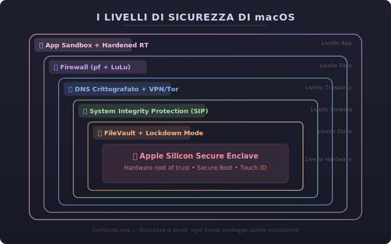
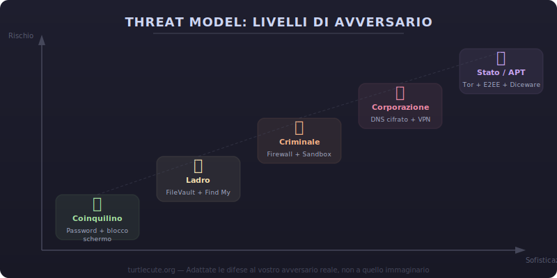
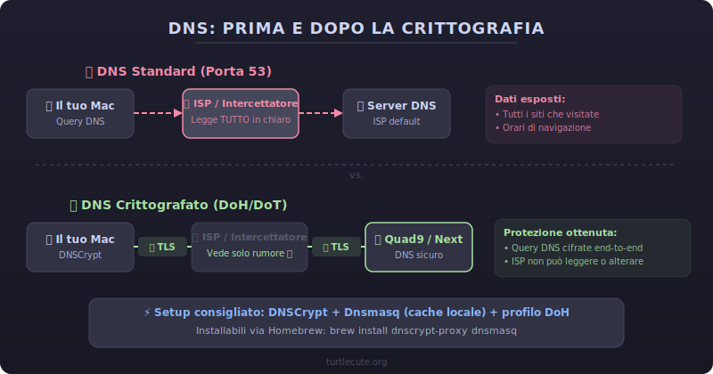
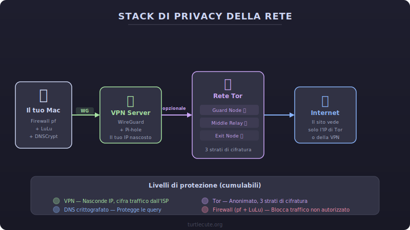
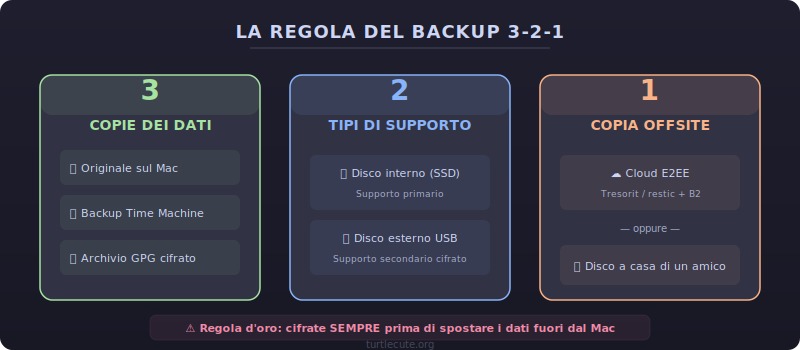

> **TL;DR** - In questa guida imparerete:
> - Come configurare un Mac Apple Silicon per massimizzare sicurezza e privacy fin dal primo avvio
> - Come proteggere il traffico di rete con firewall, DNS crittografato, VPN e Tor
> - Come blindare il browser, gestire password e crittografare i vostri dati con FileVault e GPG
> - Come monitorare il sistema, eliminare metadati e difendervi da malware e tracciamento

Il vostro Mac non è una fortezza impenetrabile appena uscito dalla scatola. macOS è un sistema operativo robusto, certo, ma senza le giuste configurazioni lascia aperte più porte di quante pensiate... e ogni porta aperta è un invito per chi vuole ficcare il naso nei vostri affari.

Questa guida è pensata per voi tartarughe che volete prendere sul serio la privacy e la sicurezza del vostro Mac. Non serve essere ingegneri informatici: basta la voglia di imparare e un po' di pazienza. Andremo passo dopo passo, dalla scelta dell'hardware fino al monitoraggio avanzato del sistema.

**ATTENZIONE!!** Questa guida è fornita così com'è, senza garanzie di alcun tipo. Siete voi gli unici responsabili delle modifiche che apportate al vostro sistema. Procedete con cautela e, nel dubbio, fate sempre un backup prima.



## Threat Modeling: Da Dove Partire {#threat-modeling style="color: white;"}

Il primo passo, e il più importante, è creare un **modello di minaccia** (threat model). Dovete capire da chi vi state difendendo per sapere come difendervi. Ogni persona ha esigenze diverse, quindi il vostro threat model sarà unico.

### Identificare le risorse da proteggere

Fate una lista di tutto ciò che volete proteggere: il portatile, le password, la cronologia di navigazione, i documenti finanziari, le foto personali... Categorizzateli in ordine di importanza: **pubblico**, **sensibile** o **segreto**.

### Identificare gli avversari

Da chi vi state difendendo? Un coinquilino curioso? Un ladro? Un'azienda che vuole i vostri dati per marketing? Un governo? La motivazione dell'avversario determina il livello di sofisticazione dell'attacco.

### Identificare le capacità

Cosa è in grado di fare il vostro avversario? Un ladro comune sarà fermato da una password e dalla crittografia del disco. Un attore statale potrebbe richiedere misure estreme come spegnere completamente il dispositivo quando non in uso per cancellare le chiavi dalla RAM.

### Identificare le mitigazioni

Ora è il momento di decidere come contrastare ogni minaccia. È fondamentale bilanciare sicurezza e usabilità: ogni mitigazione dovrebbe contrastare una capacità reale dei vostri avversari, altrimenti vi complicate la vita senza motivo.



Ecco un esempio di tabella che dovreste creare per ogni asset:

| Avversario | Motivazione | Capacità | Mitigazione |
|---|---|---|---|
| Coinquilino | Vedere chat o cronologia | Vicinanza fisica, può sbirciare lo schermo | Biometria, filtro privacy, blocco automatico |
| Ladro | Rubare dati personali e svuotare conti | Furto del dispositivo, sbirciare mentre digitate la password | Tenere il Mac sempre in vista, FileVault, Find My |
| Criminale | Guadagno economico | Ingegneria sociale, malware, password riusate | Sandboxing, aggiornamenti automatici, password uniche |
| Azienda | Marketing dati utente | Telemetria e raccolta dati comportamentali | Bloccare connessioni di rete, resettare identificativi |
| Stato/APT | Sorveglianza mirata | Sorveglianza passiva dell'infrastruttura internet | E2EE open source, password diceware lunghe, hardware con secure element |

## Hardware: Scegliere il Mac Giusto {#hardware style="color: white;"}

macOS è più sicuro quando gira su **hardware Apple con Apple Silicon** (M1, M2, M3, M4 e successivi). I Mac con processori Intel hanno [vulnerabilità hardware](https://github.com/axi0mX/ipwndfu) che Apple non può correggere con aggiornamenti software. Più recente è il chip, meglio è.

Evitate gli hackintosh e i Mac che non supportano l'ultima versione di macOS: Apple non corregge tutte le vulnerabilità nelle versioni più vecchie.

A seconda del vostro threat model, potreste voler acquistare il Mac **in contanti e di persona**, evitando ordini online o pagamenti con carta, così nessuna informazione identificativa sarà collegata all'acquisto.

Per accessori wireless (tastiera, mouse, cuffie), a mio parere i migliori sono quelli Apple: vengono aggiornati automaticamente dal sistema e supportano le ultime funzionalità Bluetooth come **BLE Privacy**, che randomizza l'indirizzo hardware Bluetooth per prevenire il tracciamento.

## Installazione di macOS {#installazione style="color: white;"}

Installate **sempre** l'ultima versione di macOS compatibile con il vostro Mac. Le versioni più recenti hanno patch di sicurezza e miglioramenti che le precedenti non hanno.

### Attivazione del sistema

Come parte del sistema antifurto di Apple, i Mac Apple Silicon devono attivarsi con i server Apple ogni volta che reinstallate macOS, per verificare che il dispositivo non sia rubato o bloccato.

### Apple Account

Creare un Apple Account **non è obbligatorio** per usare macOS. Sappiate però che un Apple Account sincronizza di default molti dati su iCloud. Potete disattivare la sincronizzazione successivamente o abilitare la **crittografia end-to-end** tramite [Advanced Data Protection](https://support.apple.com/guide/security/advanced-data-protection-for-icloud-sec973254c5f).

Un Apple Account è necessario solo per accedere all'App Store e ai servizi Apple come iCloud, Apple Music, ecc.

### Virtualizzazione

Su Apple Silicon, la virtualizzazione è integrata in macOS tramite il framework Virtualization di Apple. Potete eseguire macOS e Windows 11 ARM usando questi strumenti:

- **UTM** - Gratuito dal [sito web](https://mac.getutm.app). Supporta macOS e Windows 11 ARM
- **VirtualBuddy** - GUI per virtualizzare macOS 12+ su Apple Silicon. Gratuito al 100%. [GitHub](https://github.com/insidegui/VirtualBuddy)
- **VMware Fusion** - Ora gratuito sotto Broadcom. Interfaccia pulita, supporta Windows 11 ARM
- **tart** - Controllo VM da linea di comando, installabile via Homebrew. [tart.run](https://tart.run)
- **Parallels** (a pagamento) - Opzione commerciale con forte integrazione. [Sito web](https://www.parallels.com)

Consiglio caldamente di provare le vostre configurazioni di sicurezza prima in una VM, così potete sperimentare senza rischi.

## Primo Avvio {#primo-avvio style="color: white;"}

Al primo avvio, l'Assistente di Configurazione vi chiederà di creare un account. Usate una **password forte** e non impostate un suggerimento per la password: chiunque abbia accesso al Mac potrebbe vederlo.

Attenzione: il nome reale che inserite apparirà nel nome del computer e nell'hostname della rete locale. Per cambiarlo successivamente:

```zsh
sudo scutil --set ComputerName il_vostro_nome
sudo scutil --set LocalHostName il_vostro_nome
```

## Account Admin e Utente Standard {#account style="color: white;"}

Il primo account creato è sempre un account **amministratore**. Gli account admin hanno accesso a `sudo`, il che significa che possono modificare qualsiasi cosa nel sistema. Questo è un rischio di sicurezza significativo.

La buona pratica è usare un **account standard separato** per il lavoro quotidiano e tenere l'account admin solo per le operazioni che lo richiedono veramente.

### Come configurarlo

1. Accedete all'account admin
2. Create un nuovo account admin in **Impostazioni di Sistema > Utenti e Gruppi**
3. Disconnettetevi e accedete al nuovo account admin
4. Declassate il vostro account originale a standard con:

```zsh
sudo dscl . -delete /Groups/admin GroupMembership il_vostro_utente
```

**Limiti dell'account standard:** non potete installare app in `/Applications`, non potete usare `sudo`, alcune utility di sistema richiedono l'account admin. Piccoli inconvenienti per un grande guadagno di sicurezza.

## Firmware e FileVault {#firmware-filevault style="color: white;"}

### Firmware

Assicuratevi che la sicurezza del firmware sia impostata su **"Sicurezza Completa"** (Full Security), che è il valore predefinito. Questo impedisce la manomissione del sistema operativo.

### FileVault

I Mac Apple Silicon sono crittografati di default, ma **FileVault** aggiunge un livello ulteriore: richiede la password per accedere ai dati all'avvio. La password di FileVault funge anche da password del firmware, impedendo l'avvio da altri dischi e l'accesso alla modalità Recovery.

Per attivarlo: **Impostazioni di Sistema > Privacy e Sicurezza > FileVault > Attiva**

**!ATTENZIONE!** Conservate la chiave di recupero in un luogo sicuro. L'opzione di sblocco tramite iCloud esiste ma crea un rischio se il vostro iCloud viene compromesso.

## Modalità Lockdown {#lockdown style="color: white;"}

La **Modalità Lockdown** è una funzionalità potente di macOS che disabilita numerose funzionalità per ridurre drasticamente la superficie di attacco. È pensata per utenti che potrebbero essere bersaglio di attacchi sofisticati (giornalisti, attivisti, dissidenti), ma chiunque può attivarla.

Può essere disabilitata per singoli siti web in Safari, così non perdete funzionalità sui siti di cui vi fidate.

Per attivarla: **Impostazioni di Sistema > Privacy e Sicurezza > Modalità Lockdown**

## Firewall {#firewall style="color: white;"}

### Firewall a livello applicazione

macOS include un firewall integrato che blocca le **connessioni in entrata**. È fondamentale attivarlo:

```zsh
# Attivare il firewall
sudo /usr/libexec/ApplicationFirewall/socketfilterfw --setglobalstate on

# Attivare la modalità stealth (ignora ping e probe su porte chiuse)
sudo /usr/libexec/ApplicationFirewall/socketfilterfw --setstealthmode on

# Impedire alle app firmate di essere automaticamente autorizzate
sudo /usr/libexec/ApplicationFirewall/socketfilterfw --setallowsigned off
sudo /usr/libexec/ApplicationFirewall/socketfilterfw --setallowsignedapp off
```

### Firewall di terze parti

Il firewall integrato blocca solo le connessioni in entrata. Per controllare anche il **traffico in uscita** (e vedere quali app "telefonano a casa"), consiglio caldamente uno di questi:

- **[Little Snitch](https://www.obdev.at/products/littlesnitch/)** - Il più completo, a pagamento
- **[LuLu](https://objective-see.org/products/lulu.html)** - Open source e gratuito, di Objective-See
- **[Radio Silence](https://radiosilenceapp.com/)** - Semplice e leggero

Questi firewall possono essere aggirati da processi con privilegi root, ma restano uno strumento preziosissimo. Alcuni malware si autodistruggono quando rilevano la presenza di questi firewall.

### Packet filtering a livello kernel (pf)

Per un controllo ancora più granulare, macOS include **pf** (packet filter), un firewall a livello kernel altamente personalizzabile.

Ecco un esempio di configurazione base per `/etc/pf.rules`:

```
# Interfaccia di default
wifi = "en0"

# Bloccare tutto il traffico in entrata di default
block in all

# Permettere il traffico in uscita
pass out quick on $wifi proto { tcp, udp } from any to any

# Permettere il traffico loopback
pass quick on lo0

# Bloccare tutto il traffico in entrata su tutte le interfacce
block in quick on $wifi
```

Per attivare le regole:

```zsh
sudo pfctl -e -f /etc/pf.rules
```

Per verificare lo stato: `sudo pfctl -s info`

## Servizi e Daemon {#servizi style="color: white;"}

macOS usa **launchd** per gestire i servizi di sistema. Potete ispezionare i servizi attivi con:

```zsh
# Elencare tutti i servizi caricati
launchctl list

# Esaminare un servizio specifico
launchctl list | grep -i apple
```

I servizi di sistema sono protetti dal **System Integrity Protection (SIP)** - non disabilitate SIP per modificarli. È molto più sicuro lasciarli come sono.

Per esaminare cosa fa un servizio specifico, cercate il suo file `.plist` in:
- `/System/Library/LaunchDaemons/` (daemon di sistema)
- `/System/Library/LaunchAgents/` (agent di sistema)
- `/Library/LaunchDaemons/` (daemon di terze parti)
- `~/Library/LaunchAgents/` (agent dell'utente)

## Homebrew {#homebrew style="color: white;"}

[Homebrew](https://brew.sh) è il package manager più usato su macOS, ma occhi aperti: richiede **App Management** o **Full Disk Access**, che equivale praticamente a disabilitare le protezioni TCC (Transparency, Consent and Control).

```zsh
# Aggiornare periodicamente (su reti fidate!)
brew upgrade

# Disabilitare la telemetria di Homebrew
export HOMEBREW_NO_ANALYTICS=1
```

Aggiungete `export HOMEBREW_NO_ANALYTICS=1` al vostro `~/.zshrc` per renderlo permanente.



## DNS: Proteggere le Vostre Query {#dns style="color: white;"}

Le query DNS sono come cartoline postali: chiunque sulla rete può leggerle. Vediamo come proteggerle.



### Profili DNS crittografati

Da macOS 11 in poi, potete installare **profili di configurazione** per DNS crittografato (DoH/DoT). Alcuni provider consigliati:

- **[Quad9](https://www.quad9.net/)** - Blocca domini malevoli, no-profit
- **[AdGuard DNS](https://adguard-dns.io/)** - Blocca pubblicità e tracker
- **[NextDNS](https://nextdns.io/)** - Altamente personalizzabile, con blocklists

### File hosts

Potete bloccare domini aggiungendo voci al file `/etc/hosts`:

```zsh
# Bloccare un dominio
echo "0.0.0.0 facebook.com" | sudo tee -a /etc/hosts

# Applicare le modifiche
sudo dscacheutil -flushcache
```

Esistono blocklist mantenute dalla community che potete scaricare e integrare, come quella di [StevenBlack](https://github.com/StevenBlack/hosts) che blocca pubblicità, malware e tracker.

### DNSCrypt

**DNSCrypt** cifra il traffico DNS, impedendo intercettazioni e manomissioni:

```zsh
brew install dnscrypt-proxy
```

Configuratelo per ascoltare su una porta diversa dalla 53 se lo usate insieme a dnsmasq. Potete anche usare regole **pf** per bloccare tutto il traffico DNS non crittografato.

### Dnsmasq

**Dnsmasq** funziona come cache DNS locale e può essere combinato con DNSCrypt per una soluzione completa:

```zsh
brew install dnsmasq

# Configurare come DNS locale
sudo networksetup -setdnsservers "Wi-Fi" 127.0.0.1
```

Supporta **DNSSEC** per l'autenticazione dell'origine e l'integrità dei dati DNS.

## Autorità di Certificazione {#certificati style="color: white;"}

macOS viene fornito con oltre **100 certificati root CA** da aziende e governi di tutto il mondo. Questo significa che un gran numero di organizzazioni è tecnicamente in grado di emettere certificati validi per qualsiasi dominio.

Apple blocca le CA non affidabili e ha requisiti stringenti, ma il rischio di attacchi MITM (Man-in-the-Middle, ovvero un intercettatore che si mette "in mezzo" tra voi e il sito) tramite certificati fraudolenti, sebbene basso, esiste (ricordate il caso DigiNotar?).

Per rimuovere manualmente la fiducia da una CA: aprite **Accesso Portachiavi** (Keychain Access), trovate il certificato root, fate doppio clic e impostate "Non fidarsi mai" (Never Trust).

## Browser: La Vostra Finestra sul Mondo {#browser style="color: white;"}

Il browser è la **superficie di attacco più grande** del vostro sistema. Scegliete con cura e limitate le estensioni al minimo indispensabile.

### Firefox

A mio parere il miglior browser per la privacy tra quelli mainstream:

- **Open source**, con adozione crescente di Rust per la sicurezza della memoria
- **Protezione dal tracciamento** integrata
- **Randomizzazione del fingerprint**
- **Multi-Account Containers** per isolare sessioni
- Supporto per [arkenfox/user.js](https://github.com/arkenfox/user.js) per hardening avanzato
- Estensione **NoScript** per bloccare JavaScript selettivamente

### Chrome

Basato su Chromium con componenti proprietari di Google:

- **Sandboxing robusto** e aggiornamenti frequenti
- Bug bounty lucrativo che attrae ricercatori di sicurezza
- Disabilitate l'ottimizzatore V8 per maggiore sicurezza: `chrome://flags/#disable-javascript-harmony-shipping`
- Usate **uBlock Origin Lite** (la versione Manifest V3)
- Disabilitate il DNS prefetching in `chrome://settings/privacy`

**Contro:** Google. Il browser è progettato per raccogliere dati. Se la privacy è la vostra priorità, Firefox o Safari sono scelte migliori.

### Safari

Il browser nativo di macOS, basato su WebKit:

- **Migliore autonomia** batteria tra tutti i browser
- **Content Blockers** e **Intelligent Tracking Prevention** integrati
- **Randomizzazione del fingerprint** e Tab Private isolate
- Supporto alla **Modalità Lockdown**
- Sincronizzazione sicura tramite iCloud Keychain

**Contro:** meno estensioni disponibili (la licenza sviluppatore costa 100$/anno), quindi l'ecosistema è più limitato.

### Privacy del browser

Indipendentemente dal browser scelto, ricordate:

- La **Navigator API** rivela informazioni sul vostro sistema
- Il **canvas fingerprinting** può identificarvi univocamente
- Disabilitate i **cookie di terze parti** (ormai default nella maggior parte dei browser)
- **WebRTC** può rivelare il vostro indirizzo IP reale - disabilitatelo tramite estensioni o Modalità Lockdown

## Tor: Navigazione Anonima {#tor style="color: white;"}

Il [Tor Browser](https://www.torproject.org/) è un Firefox modificato che instrada il vostro traffico attraverso la rete Tor, cifrando i dati in strati successivi (come gli strati di una cipolla).

### Installazione e verifica

Dopo aver scaricato Tor Browser, è fondamentale **verificare la firma GPG** del download:

```zsh
# Importare la chiave di firma del Tor Project
gpg --keyserver hkps://keys.openpgp.org --recv-keys 0xEF6E286DDA85EA2A4BA7DE684E2C6E8793298290

# Verificare la firma
gpg --verify TorBrowser-*.asc TorBrowser-*.dmg
```

Verificate anche la firma del codice dell'applicazione:

```zsh
spctl --assess --verbose /Applications/Tor\ Browser.app
codesign -dvv /Applications/Tor\ Browser.app
```

### Cosa sapere su Tor

- Tor cifra il traffico fino al **nodo di uscita**, ma l'uso di Tor è identificabile tramite gli hostname TLS
- I **pluggable transports** possono offuscare il traffico Tor, mascherandolo come traffico normale
- Per sicurezza extra, usate Tor **dentro una VM**
- Tor protegge l'**anonimato** (chi siete), non necessariamente la **privacy** (cosa fate) - se fate login con il vostro account, Tor non vi protegge
- Tor è vulnerabile all'**analisi del traffico globale** da parte di avversari che controllano grandi porzioni della rete

> **Attenzione:** non confondete anonimato e privacy. Tor vi rende anonimi, ma se inserite dati personali su un sito, l'anonimato svanisce.

## VPN {#vpn style="color: white;"}



Una VPN cifra il traffico tra voi e il server VPN. Alcuni punti fondamentali:

- **Evitate PPTP** - è obsoleto e insicuro
- Preferite **WireGuard** o **OpenVPN**
- Attenzione alla **fuga di traffico** quando la VPN si disconnette - configurate un kill switch (interruttore di emergenza)
- Considerate la **giurisdizione** del provider VPN

Se volete il massimo controllo, consiglio caldamente di **hostare la vostra VPN**. WireGuard + Pi-hole su un VPS è un'ottima combinazione.

Ecco un esempio di regole **pf** per forzare tutto il traffico attraverso la VPN:

```
# Bloccare tutto tranne VPN
block all
pass on lo0
pass out on utun0   # interfaccia VPN
pass out on en0 proto udp to VPN_SERVER_IP port 51820  # porta WireGuard
```

## PGP/GPG: Crittografia delle Comunicazioni {#pgp style="color: white;"}

PGP (Pretty Good Privacy) è lo standard per la crittografia end-to-end di email e file. GPG (GNU Privacy Guard) è l'implementazione open source.

```zsh
# Installare GPG
brew install gnupg

# Generare una coppia di chiavi
gpg --full-generate-key

# Esportare la chiave pubblica
gpg --armor --export la_vostra_email@esempio.com
```

Per la massima sicurezza, conservate le chiavi private su una **YubiKey**: le chiavi non lasceranno mai il dispositivo hardware.

Consiglio caldamente di usare la [configurazione raccomandata di drduh](https://github.com/drduh/config/blob/master/gpg.conf) per il file `gpg.conf`.

## Messaggistica Sicura {#messaggistica style="color: white;"}

### XMPP

Protocollo aperto, federato e cross-platform. Non è crittografato end-to-end di default: usate l'estensione **OMEMO** per la crittografia.

### Signal

A mio parere il miglior protocollo di crittografia per messaggistica istantanea. Usa il **Double Ratchet Protocol** per crittografia end-to-end avanzata. Richiede un numero di telefono per la registrazione.

### iMessage

Richiede un Apple Account. Se lo usate, abilitate la **Verifica Chiave di Contatto** (Contact Key Verification) per verificare l'identità dei vostri contatti.

**!ATTENZIONE!** Se usate il backup iCloud **senza** Advanced Data Protection, Apple conserva le chiavi di crittografia dei vostri messaggi. Abilitatelo immediatamente se usate iMessage.



## Virus e Malware {#malware style="color: white;"}

I Mac **non sono immuni** al malware. Il numero di minacce è in costante aumento. Ecco come proteggervi.

### Scaricare software in sicurezza

- Preferite l'**App Store** o app **Notarizzate** da Apple
- Scaricate sempre dai siti **ufficiali** via HTTPS
- Evitate app che richiedono permessi eccessivi
- Preferite il **software open source** quando possibile

### App Sandbox

Verificate se un'app usa il sandboxing:

```zsh
codesign --entitlements - /Applications/NomeApp.app
```

Tutte le app dell'App Store sono obbligate ad usare il sandbox. Potete anche controllare la colonna "Sandbox" in **Monitoraggio Attività**.

### Hardened Runtime

Verificate se un'app usa il Hardened Runtime:

```zsh
codesign --display --verbose /Applications/NomeApp.app
```

Cercate `flags=0x10000(runtime)` nell'output. Le app notarizzate sono obbligate ad usarlo.

### Antivirus

- Usate [VirusTotal](https://www.virustotal.com/) per scansionare file sospetti prima di eseguirli
- macOS include **XProtect** che si aggiorna automaticamente in background
- **[BlockBlock](https://objective-see.org/products/blockblock.html)** rileva componenti di malware persistente
- Un antivirus locale è un'arma a doppio taglio: aumenta la superficie di attacco e spesso "telefona a casa" con i vostri dati

### Gatekeeper

Gatekeeper blocca le app non notarizzate. Potete autorizzare manualmente un'app da **Privacy e Sicurezza** nelle impostazioni, ma fatelo solo per app di cui vi fidate completamente.

Ricordate che Gatekeeper protegge solo i bundle `.app`, non tutti i binari eseguibili.

## System Integrity Protection (SIP) {#sip style="color: white;"}

SIP protegge i file di sistema da modifiche, anche da utente root. Verificate che sia attivo:

```zsh
csrutil status
```

Se risulta disabilitato, riattivatelo dalla modalità Recovery. **Non disabilitate mai SIP** a meno che non sappiate esattamente cosa state facendo e perché.

## Metadati e Tracce Digitali {#metadati style="color: white;"}

macOS conserva una quantità sorprendente di metadati. Ecco i principali e come eliminarli.

### Metadati dei download

APFS salva attributi estesi che rivelano da dove avete scaricato un file:

```zsh
# Vedere i metadati di un file scaricato
xattr -l ~/Downloads/file_scaricato

# Rimuovere i metadati di provenienza
xattr -d com.apple.metadata:kMDItemWhereFroms ~/Downloads/file_scaricato
xattr -d com.apple.quarantine ~/Downloads/file_scaricato
```

### Cronologia Bluetooth

La storia dei dispositivi Bluetooth collegati è salvata in `com.apple.Bluetooth.plist`.

### Cache QuickLook

QuickLook genera anteprime dei file che vengono conservate in cache. Per pulirla:

```zsh
qlmanage -r cache
```

### Credenziali Wi-Fi nella NVRAM

Le credenziali Wi-Fi possono essere salvate nella NVRAM. Per cancellarle:

```zsh
sudo nvram -d 36C28AB5-6566-4C50-9EBD-CBB920F83843:current-network
```

### Dati di tastiera e digitazione

macOS conserva dati sulla vostra digitazione in queste directory:
- `~/Library/LanguageModeling/`
- `~/Library/Spelling/`
- `~/Library/Suggestions/`

Potete cancellare queste directory e bloccarle per impedire la riscrittura:

```zsh
rm -rf ~/Library/LanguageModeling ~/Library/Spelling ~/Library/Suggestions
chmod -R 000 ~/Library/LanguageModeling ~/Library/Spelling ~/Library/Suggestions
```

### Siri Analytics

`SiriAnalytics.db` viene creato anche se Siri è disabilitato. Cancellabile ma si ricrea.

### Stato delle applicazioni salvato

macOS salva lo stato delle app per ripristinarle al riavvio:

```zsh
rm -rf ~/Library/Saved\ Application\ State/*
chmod -R 000 ~/Library/Saved\ Application\ State
```

## Password e Autenticazione {#password style="color: white;"}

### Gestione password

L'app **Password** integrata in macOS genera credenziali sicure e supporta le **passkey** (FIDO). Per password memorizzabili, usate il metodo **diceware** (parole casuali dal dizionario).

Per i più tecnici, **GnuPG** può gestire file di password crittografati.

### Autenticazione a più fattori (MFA)

È fondamentale abilitare l'MFA su tutti i vostri account. In ordine di sicurezza:

1. **WebAuthn/FIDO2** (hardware key come YubiKey) - il più sicuro
2. **TOTP** (app come Aegis, 2FAS) - molto buono
3. **HOTP** - buono
4. **SMS** - meglio di niente, ma vulnerabile al SIM swapping (clonazione della SIM)

Consiglio caldamente una **YubiKey** per WebAuthn e come chiave GPG/SSH hardware.

## Backup {#backup style="color: white;"}



**Crittografate sempre i backup prima di salvarli.** Seguite la regola **3-2-1**: 3 copie, 2 tipi di supporto diversi, 1 copia offsite.

### Time Machine

Usate Time Machine con un disco esterno **crittografato**:

**Impostazioni di Sistema > Generali > Time Machine > Aggiungi disco di backup** (selezionate "Cifra backup")

### Backup manuali con GPG

```zsh
# Creare un archivio crittografato
tar czf - ~/Documents | gpg --encrypt --recipient la_vostra_email > backup_docs.tar.gz.gpg

# Decrittare il backup
gpg --decrypt backup_docs.tar.gz.gpg | tar xzf -
```

### Immagini disco crittografate

```zsh
hdiutil create -size 500m -encryption AES-256 -volname "Backup Sicuro" -fs APFS ~/backup_sicuro.dmg
```

Altre opzioni: **[restic](https://restic.net/)** per backup incrementali crittografati, **[Tresorit](https://tresorit.com/)** per cloud storage E2EE.

## Wi-Fi {#wifi style="color: white;"}

- **Evitate le reti nascoste**: il vostro dispositivo deve inviare probe con il nome della rete, rivelando potenzialmente la cronologia delle reti a cui vi siete connessi
- Impostate la rete di casa su **WPA3**
- Abilitate l'**indirizzo MAC casuale** per ogni rete: **Impostazioni Wi-Fi > Dettagli della rete > Indirizzo Wi-Fi privato**

## SSH {#ssh style="color: white;"}

### Connessioni in uscita

Usate chiavi SSH protette da password (o ancora meglio, su YubiKey). Nel file `~/.ssh/config`:

```
Host *
    HashKnownHosts yes
    IdentitiesOnly yes
```

### Tunnel SSH come alternativa alla VPN

SSH può funzionare come una VPN leggera:

```zsh
# Port forwarding locale
ssh -L 8080:sito_interno:80 utente@server

# Proxy SOCKS
ssh -D 1080 utente@server
```

Poi configurate il vostro browser per usare `localhost:1080` come proxy SOCKS.

### Server SSH (sshd)

macOS ha sshd disabilitato di default (Login Remoto). Se dovete abilitarlo:

- **Disabilitate l'autenticazione con password**
- Usate solo chiavi SSH
- Configurate fail2ban o simili

## Sicurezza Fisica {#fisico style="color: white;"}

- **Non lasciate mai il Mac incustodito** - i keylogger hardware esistono (mitigati usando tastiera integrata o Bluetooth)
- Strumenti anti-forensics come **[BusKill](https://www.buskill.in/)** e **[swiftGuard](https://github.com/Lennolium/swiftGuard)** possono spegnere automaticamente il sistema quando rilevano eventi USB non autorizzati o separazione fisica
- Usate un **filtro privacy** sullo schermo quando lavorate in pubblico
- Considerate lo **smalto per unghie** o sigilli antimanomissione sulle viti del case per rilevare accessi fisici

## Monitoraggio del Sistema {#monitoraggio style="color: white;"}

### OpenBSM Audit

macOS include OpenBSM per monitorare l'esecuzione dei processi e l'attività di rete:

```zsh
# Seguire i log di audit in tempo reale
sudo praudit -l /dev/auditpipe
```

Attenzione: le modifiche alla configurazione richiedono un riavvio.

### Esecuzione dei processi

```zsh
# Elencare tutti i processi
ps -ef

# Elencare tutti i servizi caricati
launchctl list
```

Usate **Monitoraggio Attività** per una vista grafica.

### Rete

```zsh
# Vedere tutte le connessioni di rete attive
lsof -Pni

# Elencare le porte in ascolto
netstat -atln
```

Per analisi approfondite del traffico, usate **Wireshark** o **tshark** per monitorare query DNS, richieste HTTP e certificati TLS.

## Varie e Consigli Finali {#varie style="color: white;"}

Ecco una raccolta di configurazioni aggiuntive per rafforzare il vostro Mac:

```zsh
# Disabilitare i report diagnostici ad Apple
sudo defaults write /Library/Application\ Support/CrashReporter/DiagnosticMessagesHistory.plist AutoSubmit -bool false

# Bloccare lo schermo immediatamente con lo screensaver
defaults write com.apple.screensaver askForPassword -int 1
defaults write com.apple.screensaver askForPasswordDelay -int 0

# Mostrare i file nascosti nel Finder
defaults write com.apple.finder AppleShowAllFiles -bool true

# Mostrare tutte le estensioni dei file
defaults write NSGlobalDomain AppleShowAllExtensions -bool true

# Non salvare di default su iCloud
defaults write NSGlobalDomain NSDocumentSaveNewDocumentsToCloud -bool false

# Abilitare l'input sicuro della tastiera nel Terminale
defaults write com.apple.terminal SecureKeyboardEntry -bool true

# Disabilitare il crash reporter dialog
defaults write com.apple.CrashReporter DialogType -string "none"

# Disabilitare gli annunci multicast Bonjour
sudo defaults write /Library/Preferences/com.apple.mDNSResponder.plist NoMulticastAdvertisements -bool true

# Impostare umask a 077 (file accessibili solo dal proprietario)
sudo launchctl config user umask 077
```

Ricordate anche di:
- Usare **QuickTime Player** per i media (è sandboxato e usa l'Hardened Runtime)
- Disabilitare **Handoff** e **Bluetooth** se non li usate
- Abilitare **Secure Keyboard Entry** nel Terminale per impedire ad altre app di intercettare i tasti

## Software Correlato {#software style="color: white;"}

- **[Lynis](https://cisofy.com/lynis/)** - Audit di sicurezza cross-platform
- **[osquery](https://osquery.io/)** - Interrogate il vostro sistema con query SQL
- **[Pareto Security](https://paretosecurity.com/)** - App nella barra dei menu per controlli base di sicurezza

---

Bravissimo eroe! Se siete arrivati fin qui, avete trasformato il vostro Mac da un sistema "così com'è" a una vera fortezza digitale. Non è stata una passeggiata, ma ne è valsa la pena. Ora avete gli strumenti e le conoscenze per navigare, lavorare e comunicare con un livello di privacy e sicurezza che pochissimi utenti Mac raggiungono.

Grazie mille per la lettura! Se questa guida vi è stata utile, condividetela con altre tartarughe che vogliono proteggere il proprio Mac. La privacy è un diritto, non qualcosa da nascondere.



## Guide Correlate

- **[Guida al Threat Model](/threat-model)** - Approfondite il concetto di modello di minaccia per prendere decisioni di sicurezza più consapevoli
- **[VPN Self-Hosted con WireGuard e Pi-hole](/vpn)** - Hostate la vostra VPN personale per il massimo controllo sulla rete
- **[Guida alla Sicurezza Email](/email-security)** - Proteggete le vostre comunicazioni email con DMARC, SPF e crittografia
- **[Guida alla Privacy di Android e De-Google](/android)** - Applicate gli stessi principi di privacy anche al vostro telefono Android

<div style="text-align: center; margin-top: 2em;">
<a href="bitcoin:bc1qfundaddresshere" style="text-decoration: none;">

</a>
</div>
