> **TL;DR** - In questa guida imparerai:
> - Come generare 256 bit di entropia reale usando dei semplici dadi
> - Come calcolare il checksum per completare la 24a parola del seed
> - Come convertire i numeri binari in parole BIP39 a mano
> - Le precauzioni di sicurezza per generare chiavi su un computer air-gapped

Quando crei un wallet Bitcoin, il software genera il tuo seed in modo automatico. Ma ti sei mai chiesto: quanto è davvero casuale quel processo? E se il software fosse compromesso? Generare il seed manualmente con i dadi ti dà la certezza matematica che nessun software, malware o backdoor possa mai conoscere le tue chiavi private. In questa guida imparerai a farlo passo dopo passo.

Guida per calcolare una frase mnemonica di 24 parole usando dadi, carta e penna.

[Tedesco](https://aprycot.media/blog/diy-private-schluessel-fuer-bitcoin-erstellen/)
[Inglese](https://armantheparman.com/dicev2/)

## Introduzione

Questo progetto ti aiuterà a comprendere meglio il funzionamento delle chiavi Bitcoin e a generarle in autonomia. Avrai bisogno di una matita, carta, qualcosa per generare un output casuale binario (come una moneta o un dado) e un computer. Invece di studiare gli aspetti teorici del funzionamento dei seed, in questa guida adotteremo un approccio pratico e metteremo le mani in pasta.

## Importante Preambolo

Prima di utilizzare direttamente le chiavi generate, è consigliabile fare un po' di pratica seguendo i passi di questa guida.  
Quando crei la tua vera chiave, quella che userai per custodire i tuoi Bitcoin, devi generarla su un computer isolato (air-gapped). Il dispositivo non deve avere la capacità di connettersi a Internet. Non è sufficiente disattivare temporaneamente la connessione Wi-Fi se sei seriamente interessato alla sicurezza; esistono tecniche sofisticate che consentono di estrarre le tue chiavi private anche se sei temporaneamente disconnesso da Internet.

Ok, iniziamo...

## Passo 1 – Crea Numeri Binari con Entropia

È possibile generare entropia lanciando una moneta 256 volte, ma è più casuale e veloce usare i dadi. Puoi acquistare dadi da casinò per garantire tiri equi e casuali, ma va benissimo usare qualsiasi dado comune. Anche se i tuoi dadi non sono perfetti e hanno qualche difetto, fintanto che ne usi diversi alla volta, otterrai una casualità sufficiente.

Questa è la procedura (una delle tante possibili):

- Prendi circa quattro dadi (ad esempio da un vecchio gioco da tavolo).
- Considera i numeri 1, 2 o 3 come zero, mentre 4, 5 o 6 saranno uno. In questo modo otterrai un output binario (solo zeri e uno) con i dadi (ad esempio: tiri un 3, registra uno zero; tiri un 6, registra un uno).
- Crea 23 righe di 11 cifre. La 24ª riga avrà bisogno solo di tre cifre. Per ogni riga, raggruppa le cifre in gruppi di 4-4-3 (vedi immagine sotto) per facilitare la lettura e il calcolo. Mantieni le colonne verticali allineate il più possibile e lascia spazio tra ogni riga per i calcoli manuali. Tutto avrà più senso tra poco.

Esempio:

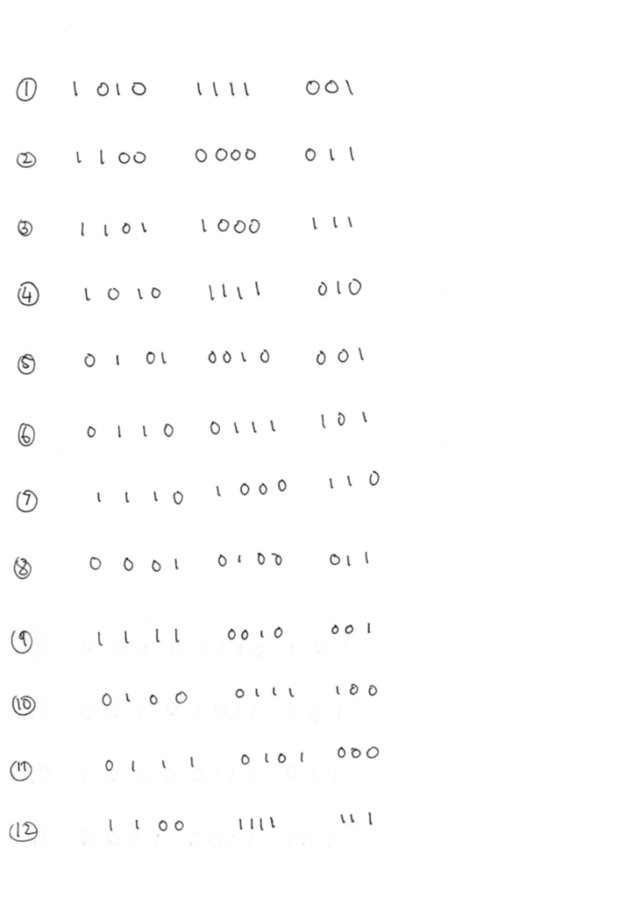

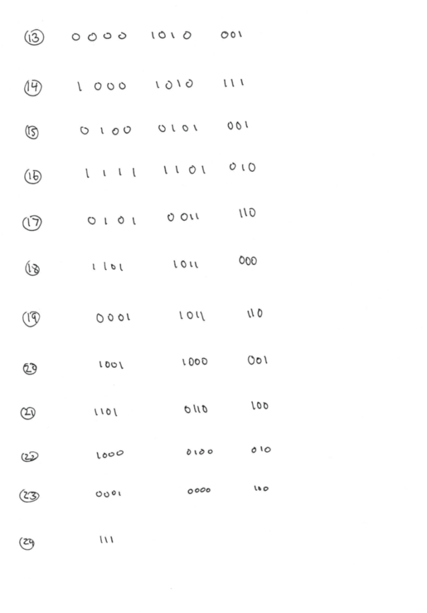

> Ci sono 256 cifre binarie: 23 serie complete di 11 cifre con la 24ª riga che ne richiede solo tre.

Per ora, tieni presente che le 11 cifre binarie verranno tradotte in una parola della frase mnemonica che rappresenterà il tuo seed. Poiché stiamo utilizzando un totale di 256 cifre casuali come entropia e stiamo dividendo le cifre in gruppi di 11, se dividiamo 256 per 11 otteniamo 23 con un resto di 3.

Abbiamo bisogno di altre 8 cifre, ossia 8 bit, per creare la nostra 24ª parola. Una volta che abbiamo 264 bit in totale, tutto si divide in 24 gruppi di 11 cifre, da cui ricavare una frase mnemonica di 24 parole. Come vedremo in seguito, questi ultimi 8 bit extra avranno un ruolo importante.

**Una nota sulla casualità:**

Possiamo creare questi 256 bit di dati casuali come preferiamo, purché siano effettivamente entropici. Se non sono casuali, qualcuno potrebbe essere in grado di riprodurre i dati, ricreare la tua chiave privata e prendere tutti i tuoi Bitcoin. Ad esempio, se crei 256 bit di tutti zeri (chiaramente non casuali), qualcuno sarà in grado di indovinare la tua chiave privata. Ecco la prova: ho generato una chiave privata da quella terribile casualità di tutti zeri e ho trovato il portafoglio esistente di qualcuno. Se non fosse già stato svuotato, avrei potuto rubare i fondi.

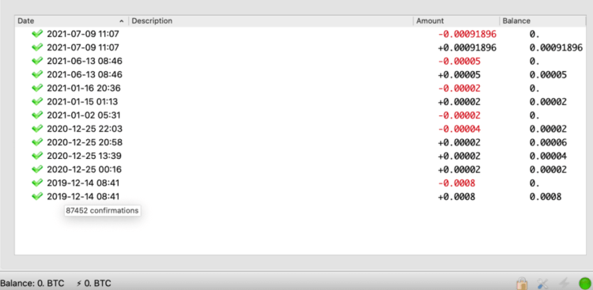

> Sapevano chiaramente cosa stavano facendo perché si trattava di una piccola somma che non è stata lasciata lì per molto tempo. Potrebbe essere stata una dimostrazione, chissà. Ma altre persone hanno creato chiavi private non casuali facilmente indovinabili e di conseguenza hanno perso i loro Bitcoin. Ma non preoccuparti, se crei una chiave privata veramente casuale, qualcuno dovrebbe ripetere esattamente i tuoi lanci di dadi binari o lanci di monete e, grazie alla matematica esponenziale, ciò non accadrà prima della fine dell'universo.



## Passo 2 – Calcolare il Checksum

Questi ultimi 8 bit mancanti devono essere calcolati per formare quello che viene chiamato "checksum".

[Cos'è un checksum](https://en.wikipedia.org/wiki/Checksum)? Un checksum è il modo in cui i computer sanno che hai commesso un errore di battitura quando inserisci dati come il numero della tua carta di credito, del tuo conto bancario o il tuo codice fiscale. Può essere davvero utile che il computer ti avverta se hai commesso un errore di battitura nella tua chiave privata!

Per calcolare il checksum avrai bisogno di un computer Linux o Mac [(la procedura può essere fatta a mano, ma è molto complicata – ecco una guida)](https://armantheparman.com/sha256/). Se usi Windows, oggi la soluzione più pratica è installare **WSL** dal Microsoft Store o dalle funzionalità di sistema e poi aggiungere Ubuntu. Utilizzerai quel terminale Linux per eseguire i comandi che seguono.

Agli utenti Windows consiglio di adottare questa soluzione alternativa. Ne ho provate altre ma ho sempre riscontrato dei problemi. Un'altra soluzione potrebbe essere usare il tool di Massimo Musumeci che però altererebbe l'ordine con cui stiamo facendo le cose in questa guida: [Tool di Massimo](https://github.com/massmux/bip39checksum)

Ora che hai un terminale sul tuo computer Mac, Linux o Windows con WSL, digita il comando seguente. Sostituisci le mie cifre binarie con le tue cifre binarie casuali (nota che dovrebbe essere tutta una riga molto lunga, anche se il modo in cui viene visualizzato qui potrebbe sembrare diverso):

> echo 10101111001110000000111101100011 1101011110100101001000101100111101111 0100011000010100011111100100010100011 1100011101010001100111111100001010001 1000101011101000101001111111010100101 0011110110110110000001101111010011000 0011101011010010000100010000100001001 11 | shasum -a 256 -0

**Spiegazione del codice**: il comando `echo` mostrerà il risultato dell'operazione nel terminale; il comando `shasum -a 256` comunica al PC di eseguire la funzione di hash SHA256 sui dati da noi inseriti. Il flag `-0` non è strettamente necessario: il comando calcola l'hash della rappresentazione testuale della stringa binaria che abbiamo inserito.

Eseguendo questo comando, l'hash risultante viene visualizzato nella riga seguente, che inizierà con "b184":

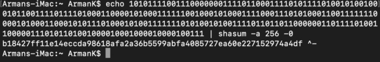

Ora possiamo iniziare a calcolare il checksum. Prendiamo le prime due cifre dell'output dell'hash, in questo caso "b" e "1". Questi sono numeri esadecimali. In esadecimale, invece di utilizzare le cifre da 0 a 9, contiamo fino a 15 utilizzando le lettere dell'alfabeto per rappresentare i numeri maggiori di nove:

> 0, 1, 2, 3, 4, 5, 6, 7, 8, 9, a, b, c, d, e, f

Simile a come le carte da poker contano da 1 a 13 usando le figure:

> Asso, 2, 3, 4, 5, 6, 7, 8, 9, 10, Fante, Regina, Re

Nel mio hash, la prima cifra "b" corrisponde a 11; "1" equivale a 1.

Ora convertiamo questi due numeri nelle loro rappresentazioni binarie a quattro cifre. Puoi farlo facendo riferimento alla tabella qui sotto:

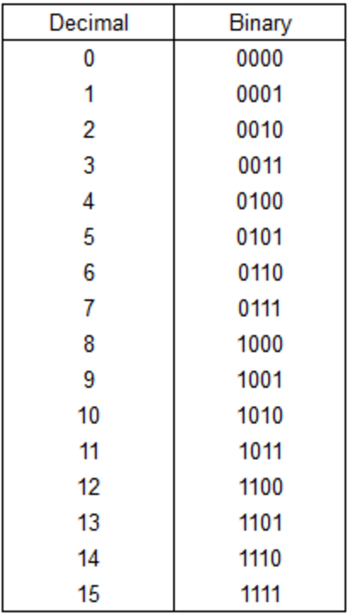

> '11' in binario è '1011', '1' è '0001'. Siamo passati da "b" e "1", a 11 e 1, e infine a 1011 e 0001.

Questi numeri a quattro cifre sono il checksum che aggiungeremo ai nostri bit per completare la nostra 24ª parola!

Aggiungili alla 24ª riga per completare la serie finale di 11 cifre binarie. Ora hai 264 cifre in totale (vedi come viene completata la 24ª riga nel diagramma più in basso).

## Passo 3 – Conversione da Binario a Decimale

Ciascuno dei gruppi di 11 cifre binarie deve essere convertito in un numero decimale.

Puoi inserirli in un calcolatore binario-decimale online, ma sarebbe estremamente rischioso per la sicurezza. Ti mostrerò come farlo manualmente.

In un sistema numerico binario, ci sono solo 0 e 1. Le altre cifre che conosci (2, 3, 4, 5, 6, 7, 8, 9) non esistono. Dovremo quindi convertire le nostre cifre binarie in numeri decimali.

Con undici cifre binarie, il numero più piccolo possibile è zero (00000000000), il più grande è 2047 (11111111111).

Prendiamo ciascun gruppo di undici cifre binarie sulla nostra pagina (ogni riga) e convertiamolo in un numero decimale. Puoi farlo manualmente o convertirli dalla riga di comando in Linux, Mac o nell'app Ubuntu.

Per il numero 10101111001, devi digitare:

> echo "$((2#10101111001))"

Otterrai come output "1401". A questo punto, calcola il decimale di tutti i tuoi 24 gruppi di 11 cifre binarie.

Fare questa conversione esclusivamente a mano è più difficile, ma possibile.

Nella parte superiore della pagina, scrivi questa sequenza esatta di numeri da sinistra a destra, sopra le cifre binarie sottostanti: "1024" sopra la prima colonna di cifre binarie, poi "512" sulla colonna successiva, poi "256", e così via, dimezzando il numero ogni volta finché non si finisce con "1" sopra l'ultima (undicesima) colonna delle cifre binarie.

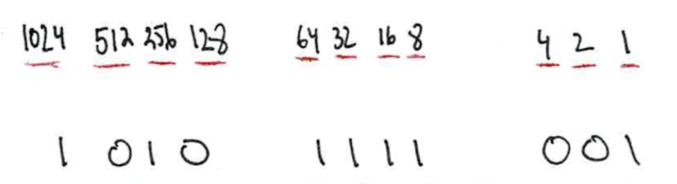

Ora, osserva la tua prima riga di cifre binarie. Ovunque ci sia un "1", aggiungi il numero decimale che si trova direttamente sopra di esso e registralo sotto la cifra binaria. Dove c'è uno "0" ignora il numero sopra. In questo modo:

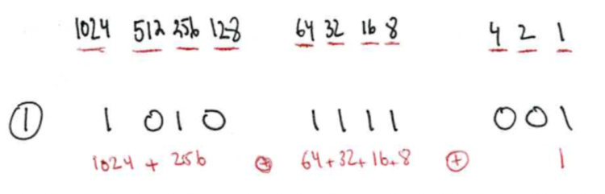

> In questo esempio, c'è un "1" sotto la colonna 1024, la colonna 256, il 64, il 32, il 16, l'8 e l'1.

Aggiungi i numeri decimali per ottenere il totale:

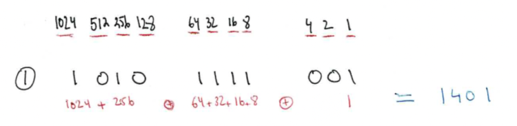

Ora ripeti questo processo per tutte le 24 righe:

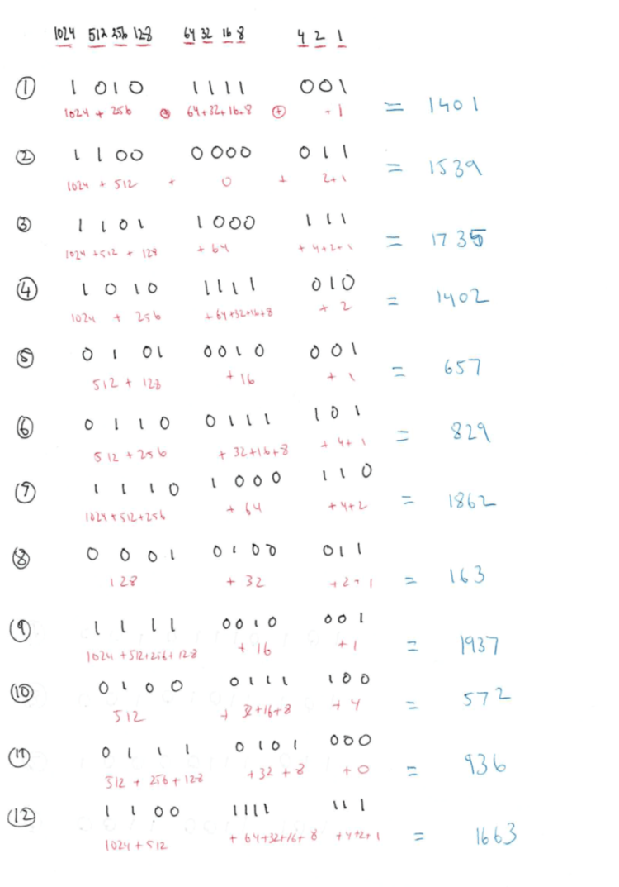 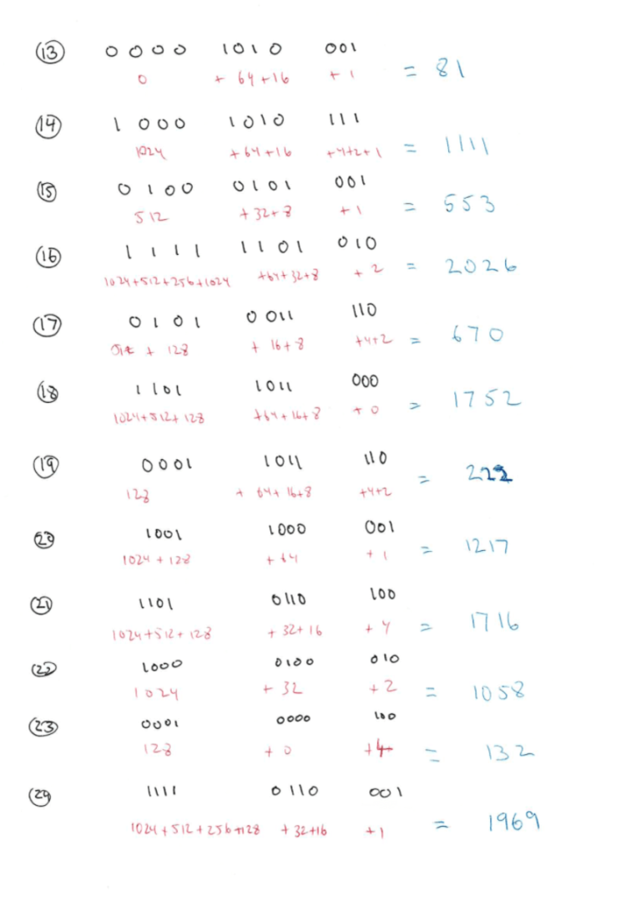

Ora avrai 24 numeri decimali che vanno da 0 a 2047.

## Passo 4 – Cerca il BIP 39

Il protocollo BIP 39 (Bitcoin Improvement Proposal numero 39) specifica 2048 parole diverse, elencate in ordine alfabetico. Quando questo elenco viene letto, ogni parola può essere identificata dalla sua posizione numerica nell'elenco. I numeri appena calcolati vengono utilizzati per cercare la parola corrispondente. Ad esempio, la prima riga ha prodotto il numero 1401 che equivale alla parola "quality" nell'elenco di parole BIP 39 ordinato.

Zero è il valore più piccolo possibile che puoi calcolare per una riga (dal binario 00000000000). In tal caso, selezionerai "abandon", la prima parola nell'elenco.

Il numero più grande possibile è 2047 (ottenuto dal binario 11111111111). La parola corrispondente è "zoo", l'ultima parola della lista.

C'è un aspetto da tenere presente: i computer contano gli elementi a partire da 0. Quindi il quinto elemento in un elenco è il numero 4 per il computer.

[La specifica ufficiale delle parole BIP 39 è su GitHub](https://github.com/bitcoin/bips/blob/master/bip-0039/english.txt), ma l'elenco delle parole viene visualizzato con numeri di riga che iniziano con uno anziché zero. Quindi, mentre "abstract" è l'ottava parola ed è elencata nella riga numero 8, il suo effettivo equivalente numerico BIP 39 è 7.

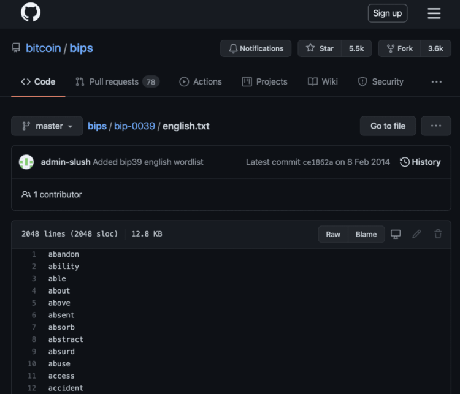

La mia prima riga di 11 cifre binarie dà come risultato 1401 in decimale. Quindi nell'elenco GitHub, devo trovare la parola sulla riga 1402 (1401 + 1). Otterrò la parola "quality". Procedi a cercare ogni decimale, avendo cura di aggiungere 1 al risultato calcolato in modo che corrisponda alla numerazione delle righe di GitHub e trova la parola per ciascuna delle 24 righe.

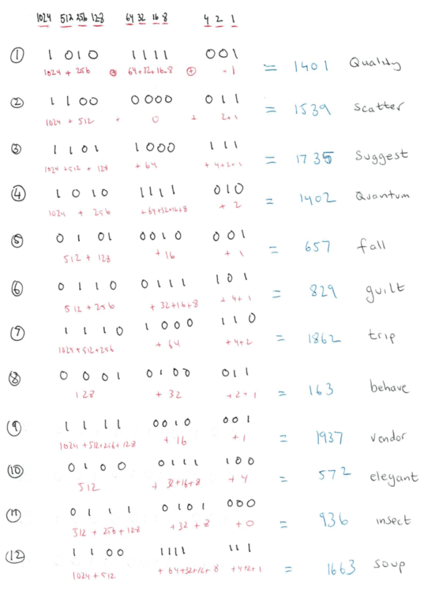 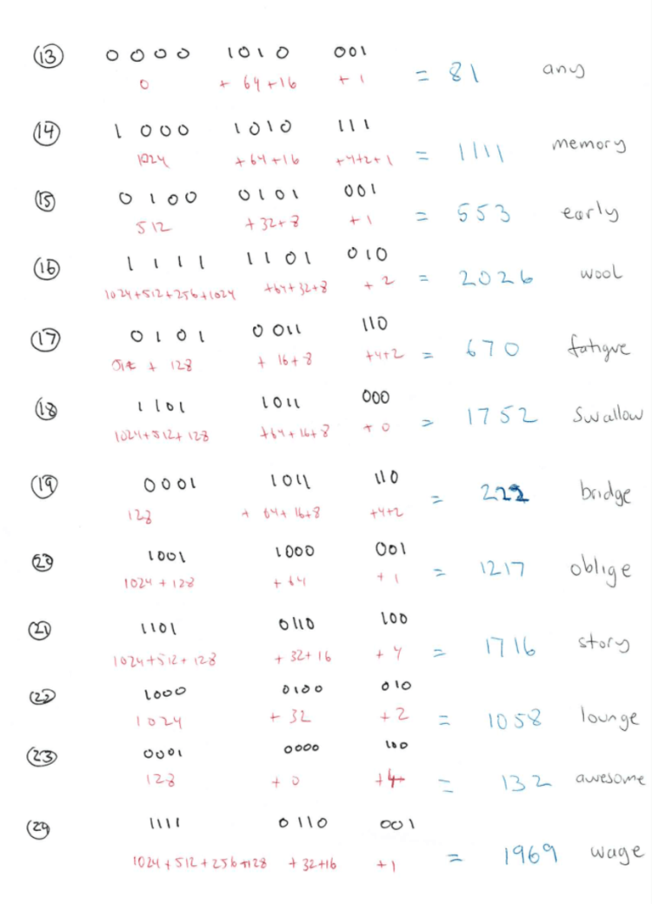

Ben fatto! Se sei arrivato fin qui, ora hai una frase mnemonica Bitcoin valida di 24 parole. Ora puoi buttarla via. A meno che tu non abbia utilizzato l'approccio completamente manuale, non puoi usarla per i tuoi Bitcoin perché non è stata creata in un ambiente sicuro!

In realtà, prima di buttarla, potresti provare a inserire le parole in un portafoglio hardware o in un portafoglio software e vedere se vengono accettate. Se vengono rifiutate, hai commesso un errore da qualche parte, il che è molto facile da fare con l'approccio manuale. Se c'è qualche errore, il checksum non corrisponderà e tutti i portafogli segnaleranno immediatamente un errore.

## Per le Tue Chiavi Reali

Genera assolutamente le tue chiavi usando un procedimento il più possibile manuale e, nelle parti in cui ti appoggi a un dispositivo elettronico, sfrutta sistemi sicuri, sistemi operativi vergini e valuta di smontare la scheda wireless dal tuo PC. Un'opzione potrebbe essere installare TailsOS su un disco esterno, smontare la scheda wireless dal tuo PC, avviare il sistema operativo e mantenerlo disconnesso da Internet fino alla fine della procedura. Una volta calcolato il seed, spegni il PC e riavvialo con la scheda wireless rimontata. È possibile anche usare dei Raspberry Pi come PC air-gapped.

**ATTENZIONE**: TailsOS è un sistema operativo amnesico, ovvero cancella automaticamente tutti i dati allo spegnimento. Assicuratevi di aver scritto il seed su carta **prima** di spegnere il PC, altrimenti lo perderete per sempre.



---

## Guide Correlate

- **[Usare Bitcoin in Modo Privato](/bitcoin)** - La guida completa alla privacy su Bitcoin: dove custodire il seed che hai appena generato
- **[JoinMarket: Guida Completa ai CoinJoin](/joinmarket)** - Proteggi la privacy dei tuoi UTXO con il mixing decentralizzato
- **[Come Utilizzare RoboSats](/robosats)** - Acquista Bitcoin senza KYC per riceverli sul wallet generato con il tuo seed
- **[Come Creare un Threat Model](/threat-model)** - Valuta le minacce prima di decidere come custodire le tue chiavi

